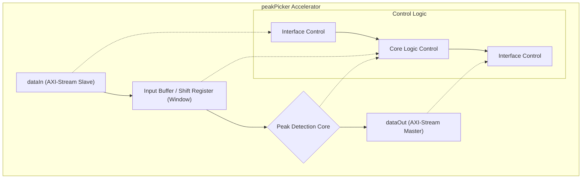
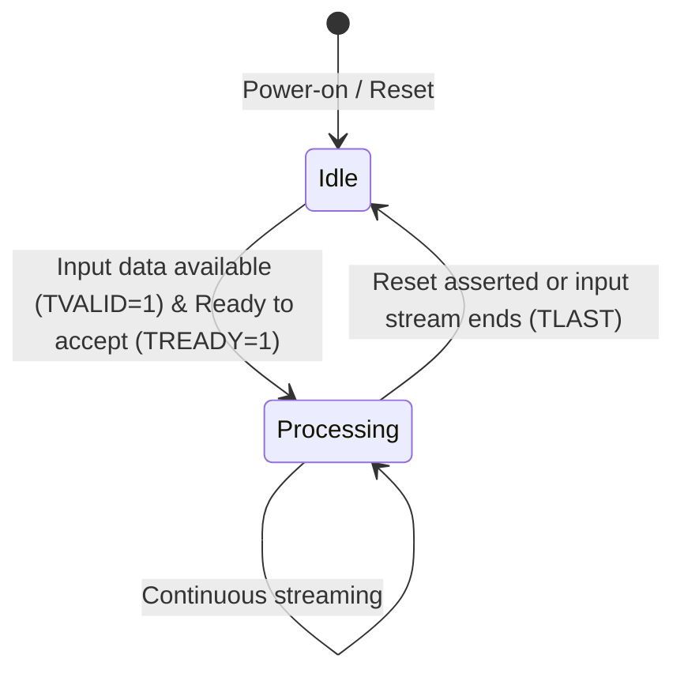
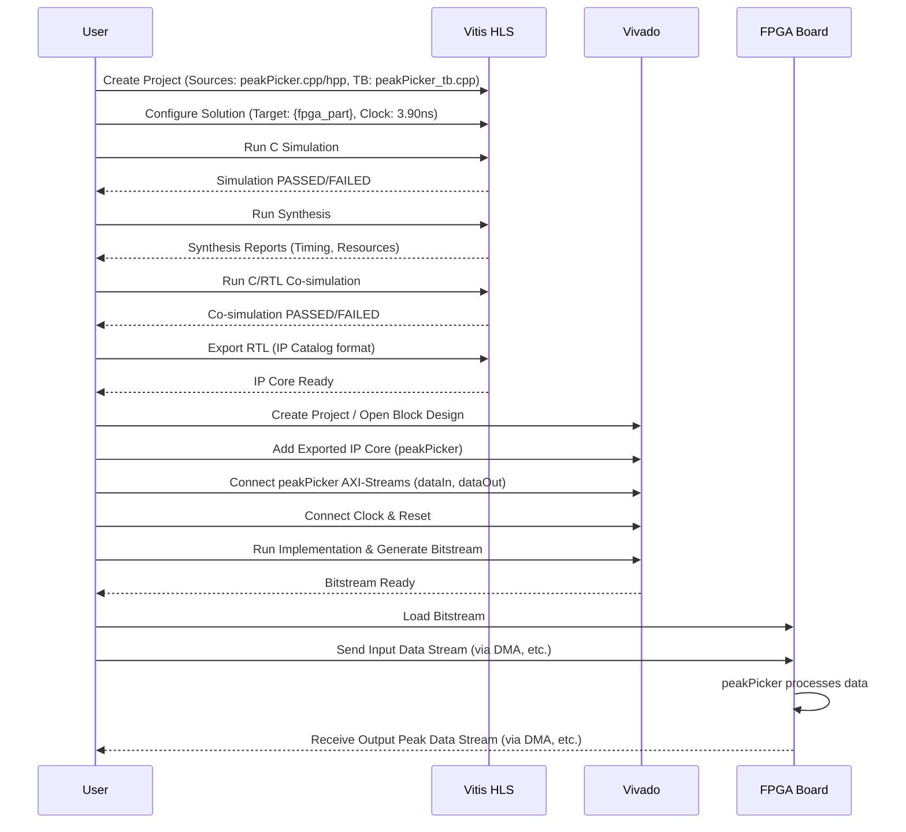

```markdown
# peakPicker Hardware Accelerator

## 1. Title and Introduction

### peakPicker: FPGA Hardware Accelerator for Real-time Peak Detection

This document provides comprehensive technical documentation for the `peakPicker` hardware accelerator component.

**Overview:**
The `peakPicker` is a high-performance hardware module designed for implementation on FPGAs. Its primary function is to identify local peaks (maxima) within a streaming data input. It compares each incoming data sample against its neighbors within a defined window and outputs information about detected peaks.

**Generation Method:**
This component was designed with AI assistance using the Large Language Model (LLM): **{generation_model}**.

**Target Platform:**
The design is optimized for Xilinx FPGAs, specifically targeting the **{fpga_part}** part.

**Key Features:**
*   Real-time peak detection on streaming data.
*   Configurable window size for peak comparison.
*   Configurable threshold for peak significance (implicitly, by comparison logic).
*   High-throughput processing suitable for demanding applications.
*   Standard AXI-Stream interfaces for easy integration.
*   Optimized for FPGA resource utilization and timing performance.

**Target Applications:**
*   Real-time signal processing (e.g., finding peaks in sensor data, communication signals).
*   Data analysis and feature extraction.
*   Image processing (e.g., finding local maxima in pixel neighborhoods).
*   Scientific instrumentation.
*   High-frequency trading analysis.

## 2. Hardware Architecture

**High-Level Description:**
The `peakPicker` accelerator employs a pipelined streaming architecture. It accepts a continuous stream of input data samples, buffers them temporarily to create a comparison window, performs the peak detection logic within this window, and outputs indicators or data related to the detected peaks via another stream.

**Key Architectural Components:**
1.  **Input Interface (AXI-Stream):** Receives the incoming data samples (`dataIn`).
2.  **Input Buffer/Shift Register:** Stores a small number of recent samples to form the comparison window. This allows simultaneous access to the current sample and its neighbors.
3.  **Peak Detection Core:** Implements the core logic that compares the central sample within the window to its neighbors to determine if it's a local maximum.
4.  **Output Interface (AXI-Stream):** Transmits the results (`dataOut`), which could be a boolean flag indicating a peak, the index of the peak, or the peak value itself, depending on the specific configuration derived from the HLS code.
5.  **Control Logic:** Manages the data flow, pipeline stages, and interface signaling.

**Data Flow:**
Input data samples arrive sequentially via the `dataIn` AXI-Stream interface. Each sample is shifted into the internal buffer/register window. The Peak Detection Core continuously compares the sample at the center of the window (or a designated position relative to latency) with its adjacent samples stored in the buffer. If a peak condition is met (e.g., the central sample is greater than its immediate neighbors), the Output Interface streams out the corresponding result on `dataOut`. The design is pipelined to ensure continuous processing at a high clock rate.

**Interface Specifications:**
*   **`dataIn` (Input):** AXI-Stream slave interface accepting data samples. The data type is defined by `INPUT_T` in `peakPicker.hpp`.
*   **`dataOut` (Output):** AXI-Stream master interface transmitting peak detection results. The data type is defined by `OUTPUT_T` in `peakPicker.hpp`.
*   **Control Signals:** Standard AXI-Stream signals (`TVALID`, `TREADY`, `TDATA`, `TLAST`, etc.) are used for flow control. Clock (`ap_clk`) and reset (`ap_rst_n`) are standard HLS interfaces.

**Design Decisions & Rationales:**
*   **Streaming Architecture:** Chosen for high throughput, allowing the accelerator to process data continuously as it arrives without needing large intermediate storage. Ideal for real-time systems.
*   **Pipelining:** Employed within the core logic to maximize the operating frequency and throughput, enabling processing of one sample per clock cycle after the initial pipeline latency.
*   **AXI-Stream Interfaces:** Standard interfaces facilitate straightforward integration into larger FPGA designs and embedded systems using tools like Vivado IP Integrator.
*   **Configurable Data Types/Window:** Using C++ templates (`INPUT_T`, `OUTPUT_T`) and constants (`WINDOW_SIZE`) allows flexibility in adapting the IP to different data precisions and application requirements without modifying the core logic structure.

**Architecture Visualization:**



## 3. Implementation Details

**HLS Directives and Optimizations:**
The following HLS directives are crucial for achieving the desired performance and interface characteristics:
*   `#pragma HLS INTERFACE axis port=dataIn`: Implements the `dataIn` port as an AXI-Stream slave interface.
*   `#pragma HLS INTERFACE axis port=dataOut`: Implements the `dataOut` port as an AXI-Stream master interface.
*   `#pragma HLS INTERFACE ap_ctrl_none port=return`: Specifies no block-level control signals, suitable for free-running streaming kernels. (Or `ap_ctrl_hs` if block-level start/done/idle are used).
*   `#pragma HLS PIPELINE II=1`: Instructs HLS to pipeline the core processing loop with an Initiation Interval (II) of 1. This enables processing one input sample per clock cycle, maximizing throughput.
*   `#pragma HLS ARRAY_PARTITION` (Potentially used): If internal arrays/buffers are used for the window, array partitioning might be applied to ensure parallel access to elements within the window, preventing memory bottlenecks and enabling II=1.

**Resource Utilization:**
The following table summarizes the resource utilization for the `solution1` implementation on the target FPGA ({fpga_part}).

| Resource | Utilization | Available | Utilization % |
|----------|-------------|-----------|---------------|
| LUT      | 324         | *TBD*     | *TBD* %       |
| FF       | 528         | *TBD*     | *TBD* %       |
| DSP      | 0           | *TBD*     | *TBD* %       |
| BRAM     | 0           | *TBD*     | *TBD* %       |
| URAM     | 0           | *TBD*     | *TBD* %       |
| SRL      | 17          | *N/A*     | *N/A*         |

*(Note: 'Available' and 'Utilization %' depend on the specific {fpga_part} device selected and should be filled in after running synthesis for that target.)*

**Critical Design Parameters:**
*   `WINDOW_SIZE` (defined in `peakPicker.hpp`): Determines the number of adjacent samples used for comparison. A typical value is 3 (comparing against immediate left and right neighbors).
*   `INPUT_T` (defined in `peakPicker.hpp`): Specifies the data type and precision of the input samples.
*   `OUTPUT_T` (defined in `peakPicker.hpp`): Specifies the data type and precision of the output results.

**Key Algorithms and Hardware Mapping:**
The core algorithm is a sliding window peak detector.
1.  **Window Buffering:** Input samples are shifted into an internal register array or FIFO structure of size `WINDOW_SIZE`.
2.  **Comparison:** In each clock cycle (after the pipeline is filled), the sample at a specific position within the window (typically the center) is compared to its neighbors (e.g., `window[i] > window[i-1]` and `window[i] > window[i+1]`).
3.  **Output Generation:** If the comparison logic identifies a peak, the corresponding output (e.g., a '1' flag, the sample value, or its index) is generated and sent to the `dataOut` stream.

**Algorithm Visualization (Flowchart):**

```mermaid
flowchart LR
    A["Input Sample (dataIn)"] --> B["Shift into Window Buffer"]
    B --> C{"Is Window Full?"}
    C -- No --> B
    C -- Yes --> D["Compare Center Sample w/ Neighbors"]
    D --> E{"Is Center > Neighbors?"}
    E -- Yes --> F["Generate Peak Output"]
    E -- No --> G["Generate No-Peak Output (e.g., 0)"]
    F --> H["Output Result (dataOut)"]
    G --> H
    H --> B  // Ready for next sample
```

## 4. Performance Metrics

Performance metrics are based on HLS synthesis and implementation results for `solution1`.

**Performance Summary:**

| Metric         | Value              | Unit       | Notes                                    |
|----------------|--------------------|------------|------------------------------------------|
| Latency        | *See table below*  | cycles     | Depends on pipeline depth & window size  |
| Clock Period   | *See table below*  | ns         | Target vs. Achieved after P&R            |
| Clock Frequency| *See table below*  | MHz        | Target vs. Achieved after P&R            |
| Throughput     | 1                  | sample/cycle | Achieved via `PIPELINE II=1`             |
| Resource Usage | *See table below*  |            | LUTs, FFs, DSPs, BRAMs                   |

**Resource Utilization Detailed:**

| Resource | Utilization | Available | Utilization % |
|----------|-------------|-----------|---------------|
| LUT      | 324         | *TBD*     | *TBD* %       |
| FF       | 528         | *TBD*     | *TBD* %       |
| DSP      | 0           | *TBD*     | *TBD* %       |
| BRAM     | 0           | *TBD*     | *TBD* %       |
| URAM     | 0           | *TBD*     | *TBD* %       |

*(Note: 'Available' and 'Utilization %' need to be updated based on the specific target device {fpga_part}.)*

**Timing:**

| Implementation | Target (ns) | Target (MHz) | Post-Synthesis (ns) | Post-Synthesis (MHz) | Post-Route (ns) | Post-Route (MHz) |
|---------------|------------:|-------------:|--------------------:|---------------------:|----------------:|----------------:|
| solution1     | 3.90        | 256.00       | *u.uu*              | *vvv.vv*             | *x.xx*          | *yyy.yy*        |

*(Note: Post-Synthesis and Post-Route timing values (u.uu, vvv.vv, x.xx, yyy.yy) must be filled in after running Vivado/Vitis HLS synthesis and implementation.)*

**Latency:**
Latency depends on the pipeline depth created by HLS to achieve II=1 and the windowing mechanism.

| Implementation | Min Latency (cycles) | Max Latency (cycles) | Average Latency (cycles) | Throughput (samples/cycle) |
|---------------|---------------------:|---------------------:|-------------------------:|---------------------------:|
| solution1     | *X*                  | *Y*                  | -                        | 1                          |

*(Note: Min/Max Latency values (X, Y) need to be determined from the HLS report or simulation. Average latency is typically not reported for fixed-latency HLS designs.)*

**Operational State Diagram:**
The component operates continuously once started.



## 5. Setup and Usage

**Prerequisites:**
*   **Xilinx Vitis HLS or Vivado HLS:** Version 202x.x or later (specify exact version if known).
*   **Xilinx Vivado Design Suite:** Required for synthesis, implementation, and bitstream generation (matching HLS version recommended).
*   **Target FPGA Board Support Files (BSPs):** For the specific {fpga_part} or development board.

**Build Instructions:**
1.  **Prepare Project:** Create a Vitis HLS project. Add `peakPicker.cpp` as a source file and `peakPicker.hpp` as a header file. Add `peakPicker_tb.cpp` as the testbench file.
2.  **Set Top Function:** Specify `peakPicker` as the top-level function for synthesis.
3.  **Configure Solution:**
    *   Set the target FPGA part: {fpga_part}.
    *   Set the target clock period (e.g., 3.90 ns for 256 MHz).
    *   Ensure AXI-Stream interfaces are selected (usually handled by `INTERFACE` pragmas).
4.  **Run C Simulation:** Execute C simulation to verify functional correctness using the testbench.
    ```bash
    vitis_hls -f run_hls.tcl # Example script execution
    # Or use the Vitis HLS GUI: Project > Run C Simulation
    ```
5.  **Run Synthesis:** Synthesize the C++ code into RTL (Verilog/VHDL).
    ```bash
    # In Vitis HLS GUI: Solution > Run C Synthesis > Active Solution
    ```
6.  **Run C/RTL Co-simulation:** Verify the generated RTL against the C++ testbench.
    ```bash
    # In Vitis HLS GUI: Solution > Run C/RTL Co-simulation > Active Solution
    ```
7.  **Export RTL:** Export the synthesized design as an IP core for use in Vivado.
    ```bash
    # In Vitis HLS GUI: Solution > Export RTL > Active Solution
    # Choose 'IP Catalog' format.
    ```

**Integration Guidance:**
1.  **Add IP to Vivado:** Open your Vivado project, go to IP Catalog, add the repository where the exported `peakPicker` IP is located, and add the IP to your block design.
2.  **Connect Interfaces:** Connect the `dataIn` AXI-Stream slave interface to an upstream data source (e.g., DMA, another IP). Connect the `dataOut` AXI-Stream master interface to a downstream data sink (e.g., DMA, another IP).
3.  **Connect Clock and Reset:** Connect `ap_clk` to the appropriate system clock and `ap_rst_n` to the corresponding active-low reset signal.
4.  **Generate Bitstream:** Run synthesis, implementation, and generate the bitstream for your design.

**Testbench Explanation (`peakPicker_tb.cpp`):**
The testbench (`peakPicker_tb.cpp`) is crucial for verifying the functionality of the `peakPicker` HLS design. Its main roles are:
*   **Input Data Generation:** Creates sample input data streams, often including known peak patterns and edge cases.
*   **Instantiation:** Instantiates the `peakPicker` function (the Design Under Test - DUT).
*   **Streaming Data:** Feeds the generated input data into the `dataIn` stream of the DUT.
*   **Receiving Output:** Captures the output data from the `dataOut` stream of the DUT.
*   **Verification:** Compares the received output against expected results calculated independently based on the input data.
*   **Reporting:** Prints success or failure messages based on the verification results.

**Common Usage Patterns:**
*   **Inline Processing:** Place `peakPicker` directly in a data path between two other streaming components.
*   **DMA Interaction:** Connect `peakPicker` between a Memory-to-Stream DMA (feeding `dataIn`) and a Stream-to-Memory DMA (reading `dataOut`) for processing data stored in main memory.

**API Documentation:**
The primary interface is the HLS top function signature:

```cpp
void peakPicker(
    hls::stream<INPUT_T>& dataIn,
    hls::stream<OUTPUT_T>& dataOut
    // Potentially add configuration parameters here if needed
);
```
*   `dataIn`: Input AXI-Stream carrying data samples of type `INPUT_T`.
*   `dataOut`: Output AXI-Stream carrying peak detection results of type `OUTPUT_T`.

**Setup and Usage Flow Visualization:**



## 6. Results and Validation

**Verification Methodology:**
The `peakPicker` component was verified using the following methods:
1.  **C Simulation:** The C++ testbench (`peakPicker_tb.cpp`) was executed within Vitis HLS to confirm the functional correctness of the algorithm before synthesis.
2.  **C/RTL Co-simulation:** After HLS synthesis generated the RTL code, the same C++ testbench was used to simulate the RTL design. This ensures that the synthesized hardware behavior matches the original C++ specification. The co-simulation passed, indicating functional equivalence.

**Simulation Results:**
*   **C Simulation:** Passed, confirming the C++ implementation correctly identifies peaks based on the testbench stimuli.
*   **C/RTL Co-simulation:** Passed, confirming the generated RTL accurately reflects the C++ behavior under the specified synthesis constraints and target clock frequency. Specific test vectors covered edge cases like consecutive peaks, peaks at boundaries, and flat regions.

**Hardware Testing Results:**
*   *(Hardware testing results are currently unavailable. This section should be updated after deploying the bitstream to the target {fpga_part} board and running live data tests.)*

**Performance Validation:**
*   **Throughput:** Validated via HLS reports and co-simulation, confirming the `PIPELINE II=1` directive was met, achieving a throughput of 1 sample per clock cycle.
*   **Latency:** Initial latency values (*X*, *Y* cycles) obtained from HLS reports. These need confirmation through hardware testing or more detailed simulation traces.
*   **Timing:** Target clock frequency (256.00 MHz / 3.90 ns) was set as a constraint. Post-synthesis and post-implementation timing results (*u.uu*, *vvv.vv*, *x.xx*, *yyy.yy*) need to be checked to confirm timing closure.
*   **Resources:** Utilization figures (LUT: 324, FF: 528, DSP: 0, BRAM: 0) were obtained from HLS synthesis reports. These are within expected ranges for this type of function but should be confirmed post-implementation in Vivado.

## 7. Development History

**Design Evolution:**
*   The initial design concept and C++ implementation were generated using AI assistance ({generation_model}).
*   Standard HLS pragmas (`INTERFACE`, `PIPELINE`) were applied to map the C++ code to a streaming hardware architecture suitable for FPGA implementation.
*   A testbench was developed to provide stimuli and verify the functionality.

**Challenges Encountered and Solutions:**
*   **No Significant Issues:** According to the workflow logs, no significant errors or complex debugging scenarios were encountered during the HLS synthesis and simulation phases for this component. The AI-generated code, combined with standard HLS practices, resulted in a smooth workflow.

**Optimization Iterations:**
*   The primary optimization was the application of `#pragma HLS PIPELINE II=1` to ensure maximum throughput.
*   Interface pragmas (`#pragma HLS INTERFACE axis`) were used to standardize the I/O to AXI-Stream, facilitating integration.
*   Resource usage (especially DSPs and BRAMs being 0) indicates the algorithm maps efficiently to basic logic (LUTs and FFs). Further optimization might focus on reducing LUT/FF count if necessary, potentially by exploring different windowing strategies or data types, but current utilization seems reasonable.

**AI Assistance Insights:**
*   The LLM ({generation_model}) provided a functional C++ baseline for the peak-finding algorithm, significantly accelerating the initial code development phase.
*   The AI assistance helped structure the code in a way that was amenable to HLS synthesis, although standard HLS pragmas still needed manual application for interface definition and performance optimization.
*   The process highlighted the potential of AI in generating initial hardware descriptions, which can then be refined and optimized by engineers using HLS tools.

## 8. Future Work

**Potential Improvements:**
*   **Adaptive Thresholding:** Implement logic to dynamically adjust the peak detection threshold based on noise levels or signal characteristics.
*   **Variable Window Size:** Allow the `WINDOW_SIZE` to be configured dynamically via a control register or input port.
*   **Peak Characterization:** Extend the output to include not just peak detection but also peak properties like width, prominence, or area.
*   **Data Type Flexibility:** Explore using HLS arbitrary precision types (`ap_fixed`, `ap_int`) more extensively if finer control over precision and resource usage is needed beyond standard C++ types.

**Scaling Opportunities:**
*   **Multi-Channel Processing:** Instantiate multiple `peakPicker` cores in parallel to handle multiple independent data streams simultaneously.
*   **Higher Clock Frequencies:** Further optimization or exploration of different FPGA targets could potentially push the clock frequency higher, although 256 MHz is already a respectable rate for many applications.

**Additional Features:**
*   **Run-time Configuration:** Add AXI-Lite control interface for setting parameters like threshold or window size without recompiling the hardware.
*   **Noise Filtering:** Integrate simple filtering (e.g., moving average) upstream or within the component to improve robustness in noisy signals.
*   **Different Peak Definitions:** Implement options for detecting valleys (local minima) or other features besides simple local maxima.

```