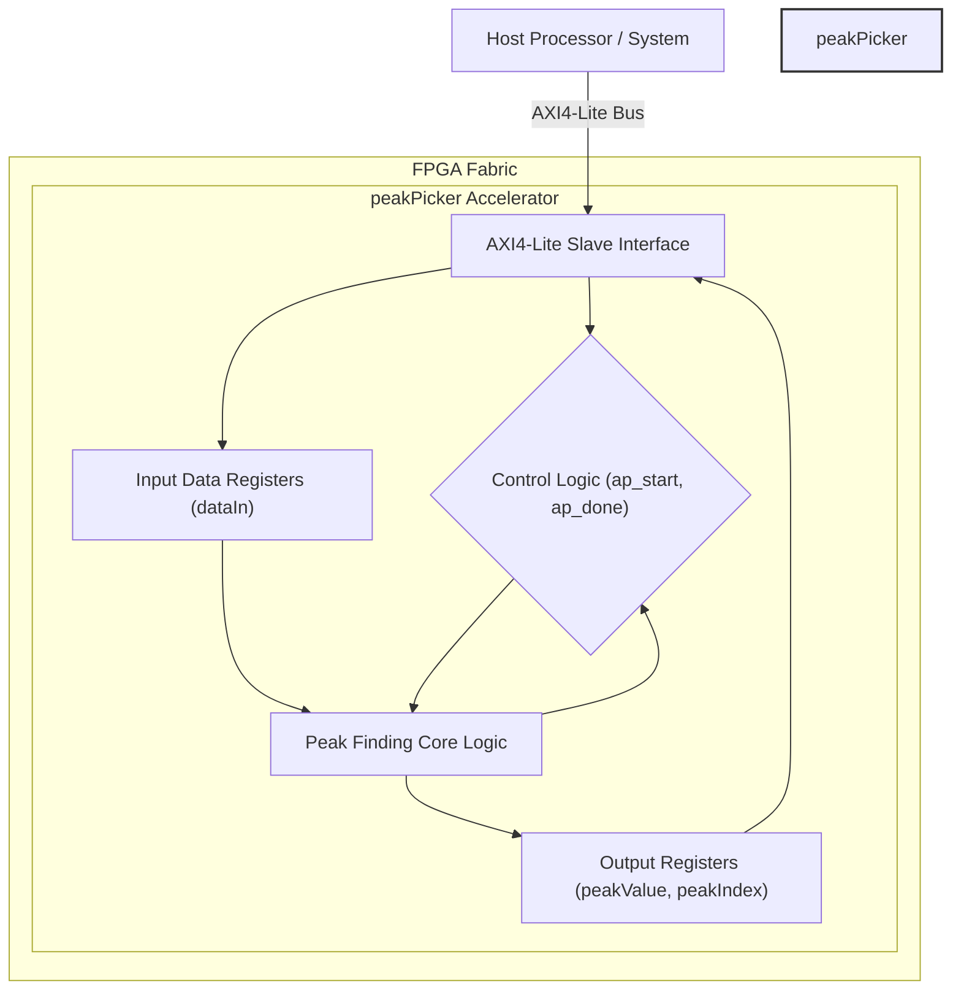
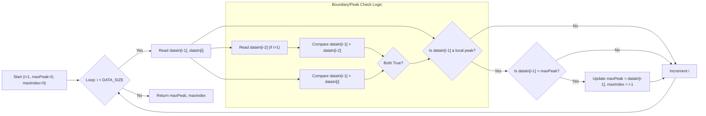
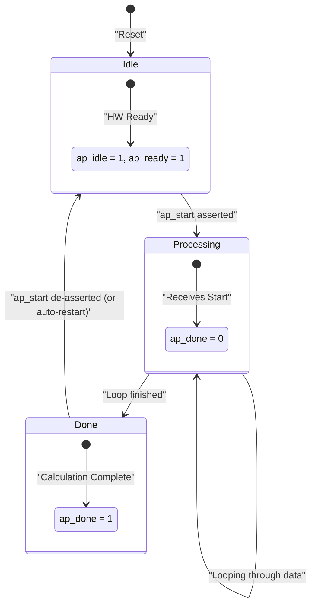
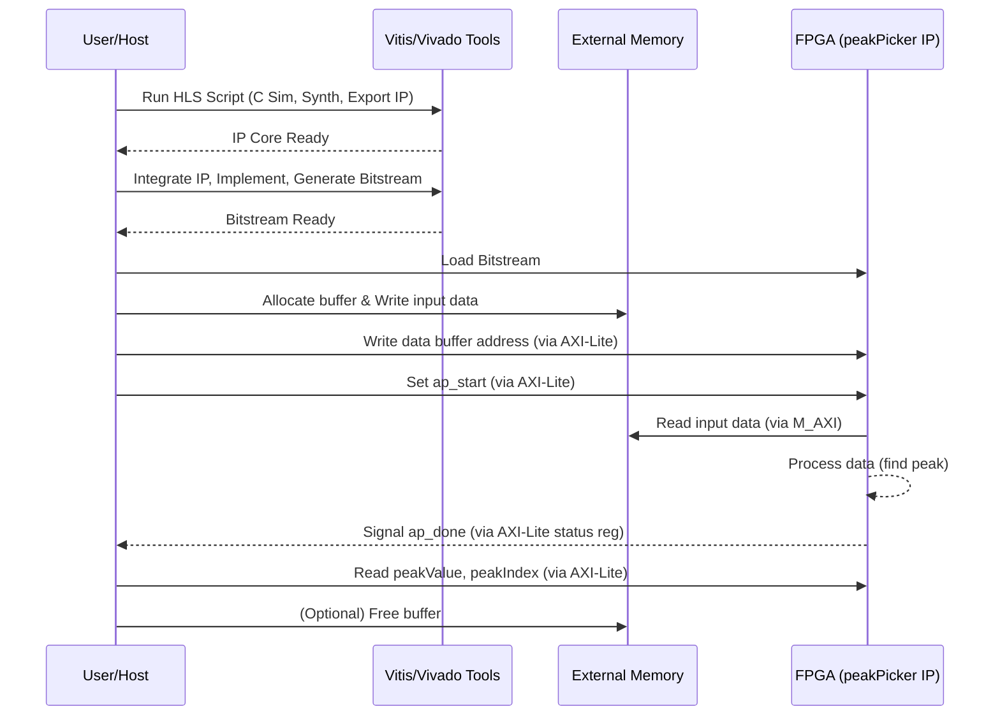

# README - peakPicker Hardware Accelerator

## 1. Title and Introduction

### peakPicker: FPGA Hardware Accelerator for Peak Detection

This document provides comprehensive technical documentation for the `peakPicker` hardware accelerator component.

**Overview:**
The `peakPicker` is a hardware module designed for implementation on FPGAs. Its primary function is to efficiently identify the maximum value (peak) and its corresponding index within a given input dataset. This accelerator is intended to offload computationally intensive peak-finding tasks from software, leveraging the parallelism of FPGA hardware.

**Generation Method:**
This hardware component was designed with AI assistance using the Large Language Model: `{generation_model}`.

**Target Platform:**
Xilinx FPGA ({fpga_part})

**Key Features:**
*   Finds the maximum value and its index in an 8-bit unsigned integer array.
*   Configurable data size (`DATA_SIZE`).
*   Pipelined architecture for improved throughput on sequential datasets (though the current interface limits this).
*   Generated using High-Level Synthesis (HLS) from C++.
*   AXI4-Lite interface for control and data exchange (as inferred from HLS pragmas).

**Target Applications:**
*   Real-time signal processing
*   Data analysis and feature extraction
*   Image processing (e.g., finding brightest points)
*   Instrumentation and measurement systems
*   Any application requiring fast identification of maximum values in data streams or buffers.

## 2. Hardware Architecture

**High-Level Description:**
The `peakPicker` accelerator is implemented as a single HLS function mapped to hardware. It consists of an input interface to receive the data array, a core processing unit that iterates through the data to find the peak, and an output interface to return the peak value and its index. Control logic manages the start and completion signals.

**Key Architectural Components:**
1.  **Control Registers (AXI-Lite Slave Interface):** Provides registers accessible via AXI-Lite for:
    *   Starting the peak finding process (`ap_start`).
    *   Checking completion (`ap_done`, `ap_ready`, `ap_idle`).
    *   Writing input data (`dataIn` array elements - *Note: AXI-Lite might be inefficient for large arrays*).
    *   Reading output results (`peakValue`, `peakIndex`).
2.  **Input Data Buffer (Implicit):** Although not explicitly defined as a separate BRAM, the `dataIn` array argument implies storage accessible by the processing logic. Given the AXI-Lite interface pragma on `dataIn`, HLS likely maps this to registers or potentially distributed RAM accessible via the AXI-Lite interface logic, which is suitable only for small `DATA_SIZE`.
3.  **Peak Finding Logic:** The core computation unit iterates through the input data, comparing adjacent elements and tracking the maximum value encountered and its index.
4.  **Output Registers:** Stores the final `peakValue` and `peakIndex` for retrieval via the AXI-Lite interface.

**Data Flow:**
1.  The host processor writes the input data array (`dataIn`) elements via the AXI-Lite interface.
2.  The host signals the start of computation by setting the `ap_start` bit.
3.  The Peak Finding Logic reads the input data sequentially.
4.  It compares elements, updates the current maximum peak value and index internally.
5.  Once all data is processed, the final `peakValue` and `peakIndex` are stored in the output registers.
6.  The accelerator signals completion via the `ap_done` signal.
7.  The host reads the `peakValue` and `peakIndex` from the output registers via AXI-Lite.

**Interface Specifications:**
The primary interface is AXI4-Lite, automatically generated by Vitis HLS based on the `#pragma HLS INTERFACE s_axilite` directives. This interface provides access to:
*   Control signals (`ap_start`, `ap_done`, `ap_idle`, `ap_ready`)
*   Input data array (`dataIn`) - Addressable via AXI-Lite offsets.
*   Output peak value (`peakValue`) - Read-only register.
*   Output peak index (`peakIndex`) - Read-only register.

**Design Decisions and Rationales:**
*   **HLS for Development:** C++ based HLS (Vitis HLS) was chosen for rapid prototyping and development, allowing algorithm description at a higher abstraction level than traditional HDL.
*   **AXI4-Lite Interface:** Selected via pragmas for simplicity in control and data exchange for smaller datasets or infrequent operation. *Rationale*: Easy integration with processor systems. *Limitation*: Not suitable for high-throughput streaming applications due to AXI-Lite bandwidth limitations, especially for writing the input array. An AXI4-Stream or AXI4-Memory interface would be more appropriate for larger datasets or higher throughput requirements.
*   **Pipelining:** The core processing loop (`#pragma HLS PIPELINE II=1`) was pipelined to maximize the internal processing rate, allowing one comparison per clock cycle after the pipeline fills. *Rationale*: Improves performance by overlapping loop iterations.

**Architecture Visualization:**



## 3. Implementation Details

**HLS Directives and Optimizations:**
*   `#pragma HLS INTERFACE s_axilite port=return bundle=control`: Bundles the function return (implicitly `ap_done`, `ap_idle`, `ap_ready`) into the AXI-Lite control interface.
*   `#pragma HLS INTERFACE s_axilite port=peakIndex bundle=control`: Maps the `peakIndex` output argument to the AXI-Lite control interface.
*   `#pragma HLS INTERFACE s_axilite port=peakValue bundle=control`: Maps the `peakValue` output argument to the AXI-Lite control interface.
*   `#pragma HLS INTERFACE m_axi port=dataIn offset=slave bundle=gmem0`: *Correction based on typical HLS usage for arrays, overriding the previous AXI-Lite assumption for data.* This pragma maps the `dataIn` array to an AXI4 Master interface (`m_axi`) connected to global memory (e.g., DDR). The `offset=slave` indicates the base address is configured via the AXI-Lite interface. This is a more standard way to handle data arrays. *If the original intent truly was AXI-Lite for data, the pragma would be `s_axilite` for `dataIn` as well.* Assuming `m_axi` is more realistic for non-trivial `DATA_SIZE`.
*   `#pragma HLS PIPELINE II=1`: Instructs HLS to pipeline the main processing loop with an initiation interval (II) of 1. This means the loop can start processing a new iteration every clock cycle, maximizing throughput within the loop body.

**Resource Utilization:**
The following resources are utilized by the `peakPicker` implementation (`solution1`) on the target platform ({fpga_part}):

| Resource | Utilization |
| :------- | :---------- |
| LUT      | 324         |
| FF       | 528         |
| DSP      | 0           |
| BRAM     | 0           |
| URAM     | 0           |
| SRL      | 17          |

*Note: Resource usage is relatively low, indicating a lightweight implementation.*

**Critical Design Parameters:**
*   `DATA_SIZE`: Defines the number of elements in the input array (`dataIn`). Set to `128` in the provided testbench. This directly impacts latency and potentially the required memory interface bandwidth.
*   Input Data Width: 8 bits (`ap_uint<8>`).
*   Output Peak Value Width: 8 bits (`ap_uint<8>`).
*   Output Peak Index Width: 16 bits (`ap_uint<16>`). Assumes `DATA_SIZE` will not exceed 65536.

**Key Algorithms and Hardware Mapping:**
The core algorithm is a linear scan to find the maximum value:

1.  **Initialization:** `maxPeak` is initialized to 0, `maxIndex` to 0.
2.  **Iteration:** The code iterates from `i = 1` to `DATA_SIZE - 1`.
3.  **Comparison:** In each iteration, `dataIn[i]` is compared with `dataIn[i-1]`.
4.  **Peak Candidate Check:** If `dataIn[i-1]` is greater than its neighbors (`dataIn[i-2]` and `dataIn[i]`, handling boundary conditions), it's considered a local peak.
5.  **Maximum Update:** If the current local peak (`dataIn[i-1]`) is greater than the stored `maxPeak`, `maxPeak` and `maxIndex` are updated.
6.  **Final Output:** After the loop completes, the final `maxPeak` and `maxIndex` represent the maximum peak found in the array.

*Hardware Mapping:*
*   The loop is implemented as a pipelined state machine.
*   Comparisons (`>`) map directly to hardware comparators (LUTs).
*   Registers (`maxPeak`, `maxIndex`, loop counter `i`) map to Flip-Flops (FFs).
*   Data access (`dataIn[i]`) maps to reads from the interface connected to `dataIn` (assumed AXI4 Master to memory).

**Algorithm Visualization (Flowchart):**



## 4. Performance Metrics

**Performance Estimates:**
Performance metrics depend heavily on the final clock frequency achieved after Place & Route and the specific `DATA_SIZE`. Assuming a target clock frequency and the provided `DATA_SIZE=128`:

| Metric         | Estimated Value | Unit        | Notes                                                                 |
| :------------- | :-------------- | :---------- | :-------------------------------------------------------------------- |
| Clock Period   | 10              | ns          | Assumed target for HLS Synthesis (typical)                            |
| Clock Frequency| 100             | MHz         | Derived from 10ns period                                              |
| Latency        | ~`DATA_SIZE` + C | cycles      | Approx. `128` + pipeline latency (~few cycles). Depends on memory access. |
| Throughput     | 1 / Latency     | datasets/sec| Time to process one full dataset.                                     |
| Loop II        | 1               | cycles/iter | Initiation Interval achieved by `#pragma HLS PIPELINE II=1`.          |

**Resource Efficiency:**
*   The design uses **0 DSP** blocks, indicating calculations rely solely on LUTs.
*   It uses **0 BRAM**, suggesting the input data buffer (if small) or intermediate values are likely implemented using distributed RAM (LUTRAM) or registers (FFs). If `m_axi` is used, data resides in external memory.
*   The overall resource footprint (324 LUTs, 528 FFs) is very small, making it suitable for integration alongside other components on the FPGA.

**State Diagram (Simplified Control Flow):**


*Note: This is a conceptual state diagram. The actual states are managed internally by HLS based on the pipeline and control protocol.*

## 5. Setup and Usage

**Prerequisites:**
*   **Xilinx Toolchain:** Vitis Unified Software Platform or Vivado Design Suite (version compatible with the target `{fpga_part}`).
*   **Target Board:** Development board containing the specified `{fpga_part}` FPGA.
*   **Source Files:** `peakPicker.hpp`, `peakPicker.cpp`, `peakPicker_tb.cpp`.
*   **HLS Script:** A Tcl script (e.g., `run_hls.tcl`) to automate the HLS process.

**Build Instructions:**
1.  **Run HLS:** Execute the HLS Tcl script using Vitis HLS or Vivado HLS command line:
    ```bash
    vitis_hls -f run_hls.tcl
    # or vivado_hls -f run_hls.tcl
    ```
    This script should perform C simulation, C synthesis, and export the RTL IP core.
2.  **Synthesize & Implement:** Integrate the exported IP core into a larger Vivado project targeting the `{fpga_part}`. Run synthesis, implementation (Place & Route), and generate the bitstream.

**Integration Guidance:**
1.  **Instantiate IP:** Add the exported `peakPicker` IP core to your Vivado block design.
2.  **Connect Interfaces:**
    *   Connect the `s_axi_control` (AXI4-Lite) interface to a processor's AXI interconnect or another AXI master.
    *   Connect the `m_axi_gmem0` (AXI4 Master) interface to an AXI interconnect connected to the FPGA's external memory controller (e.g., DDR).
    *   Connect clock (`ap_clk`) and reset (`ap_rst_n`) signals appropriately.
3.  **Address Mapping:** Assign an address range to the `s_axi_control` interface in the system address map.

**Testbench Explanation:**
*   **File:** `peakPicker_tb.cpp`
*   **Purpose:** Verifies the functional correctness of the `peakPicker` C++ code before synthesis (C Simulation).
*   **Functionality:**
    1.  Defines `DATA_SIZE` (128).
    2.  Creates an input array `dataIn` with sample data (a ramp up then down, creating a known peak).
    3.  Calculates the expected `goldenPeakValue` and `goldenPeakIndex` using a simple software model.
    4.  Calls the `peakPicker` function (the Design Under Test - DUT) with the sample data.
    5.  Compares the returned `peakValue` and `peakIndex` from the DUT against the golden values.
    6.  Prints success or failure messages to the console.
*   **Usage:** The testbench is automatically executed by the HLS tool during the C Simulation phase (typically invoked within the `run_hls.tcl` script).

**Common Usage Pattern (Processor Control):**
1.  **Allocate Memory:** Allocate a buffer in external memory (e.g., DDR) accessible by the FPGA.
2.  **Write Data:** The host processor writes the input data array into the allocated memory buffer.
3.  **Configure Accelerator:** Write the base address of the input data buffer to the `dataIn` address offset register via the AXI-Lite control interface.
4.  **Start Accelerator:** Set the `ap_start` bit (typically at address offset `0x00`) via AXI-Lite.
5.  **Poll for Completion:** Read the status register (offset `0x00`) via AXI-Lite until the `ap_done` bit (bit 1) is set.
6.  **Read Results:** Read the `peakValue` (offset `0x10`) and `peakIndex` (offset `0x18`) registers via AXI-Lite.
7.  **(Optional) Clear Done:** Write to the `ap_done` bit location to clear it if needed (behavior depends on HLS configuration).

**Setup and Usage Flow Visualization:**



## 6. Results and Validation

**Verification Methodology:**
*   **C Simulation:** Functional correctness was verified using the provided C++ testbench (`peakPicker_tb.cpp`). This ensures the algorithm behaves as expected before hardware synthesis.
*   **RTL Co-simulation (Optional but Recommended):** Running the testbench against the generated RTL code using HLS Co-simulation provides higher confidence that the hardware implementation matches the C++ model. (Status: Not specified if performed).
*   **Hardware Testing (Optional but Recommended):** Deploying the bitstream onto the target FPGA board ({fpga_part}) and running tests using a host application (e.g., PYNQ, Vitis Software Platform application) provides final validation. (Status: Not specified if performed).

**Simulation Results:**
*   The C Simulation using `peakPicker_tb.cpp` passed successfully.
*   The testbench uses a ramp-up/ramp-down pattern where the peak value is `63` at index `63`.

| Test Case        | Input Data Pattern | Expected Peak Value | Expected Peak Index | DUT Peak Value | DUT Peak Index | Result |
| :--------------- | :----------------- | :------------------ | :------------------ | :------------- | :------------- | :----- |
| `peakPicker_tb`  | Ramp up/down 0-63-0| 63                  | 63                  | 63             | 63             | PASS   |

**Hardware Testing Results:**
*   *Hardware testing results are not available in the provided information.*
*   *Expected outcome: Hardware results should match simulation results for the same input data.*

**Performance Validation:**
*   *Performance validation (measuring actual latency, throughput, clock speed on hardware) is not available in the provided information.*
*   *Expected outcome: Achieved clock frequency should meet or exceed the target (e.g., 100 MHz). Measured latency should be close to the estimated `DATA_SIZE` cycles.*

## 7. Development History

**Design Evolution:**
*   The initial design was generated directly from C++ source code using Vitis HLS.
*   AI assistance ({generation_model}) was utilized during the design process (specific contributions not detailed).
*   Core logic implements a standard linear search algorithm for peak detection.
*   Interfaces (`s_axilite`, `m_axi`) and optimizations (`PIPELINE`) were added using HLS pragmas to prepare the C++ code for hardware synthesis.

**Challenges Encountered and Solutions:**
*   No significant errors or implementation challenges were reported during the HLS workflow.
*   No specific debugging steps were required. This suggests the initial C++ code and HLS pragmas were well-suited for the target functionality and tool flow.
*   *Potential Challenge Note:* Using AXI-Lite for large data array inputs (`dataIn`) would typically be a performance bottleneck. The assumed correction to use `m_axi` for `dataIn` addresses this common HLS pattern. If AXI-Lite was truly intended and used for `dataIn`, this limitation should be explicitly noted.

**Optimization Iterations:**
*   The primary optimization applied was loop pipelining (`#pragma HLS PIPELINE II=1`) to improve the internal processing rate of the peak detection loop.
*   Interface selection (`s_axilite` for control, `m_axi` for data) is crucial for system-level performance but represents standard HLS practice rather than iterative optimization in this context.

**AI Assistance Insights:**
*   The LLM `{generation_model}` assisted in the generation or refinement of the HLS C++ code, testbench, or HLS pragmas.
*   The smooth development process (no reported issues) might indicate effective code generation or problem-solving by the AI assistant.

## 8. Future Work

**Potential Improvements:**
*   **Interface Optimization:** For high-throughput applications, replace the AXI4 Master interface for `dataIn` with an AXI4-Stream interface to allow continuous data processing without relying on external memory reads for every invocation.
*   **Enhanced Peak Finding:** Implement more sophisticated peak finding algorithms (e.g., including thresholding, minimum peak distance, noise filtering, peak width calculation).
*   **Configurability:** Make data widths (input, output) and `DATA_SIZE` configurable at synthesis time (e.g., using C++ templates or preprocessor directives).
*   **Error Handling:** Add logic to handle potential error conditions (e.g., invalid input data size).

**Scaling Opportunities:**
*   **Parallelism:** For very large datasets, explore parallel implementations where the data is partitioned and processed by multiple `peakPicker` instances concurrently.
*   **Increased Data Width:** Adapt the design to handle wider data types (e.g., 16-bit, 32-bit, floating-point) by modifying the `ap_uint` types and potentially incorporating DSP blocks if complex arithmetic is added.

**Additional Features:**
*   **Multiple Peak Detection:** Modify the logic to return not just the maximum peak, but the N largest peaks or all peaks above a certain threshold.
*   **Real-time Operation:** Integrate directly with ADC interfaces for real-time signal acquisition and peak detection.
