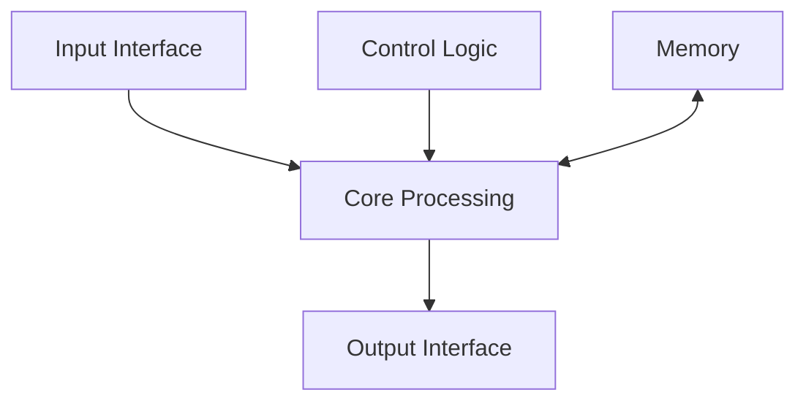
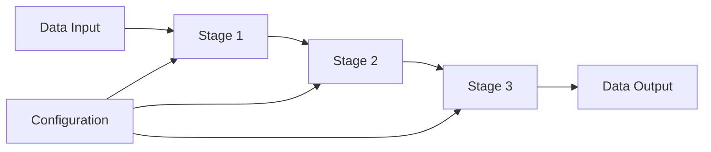
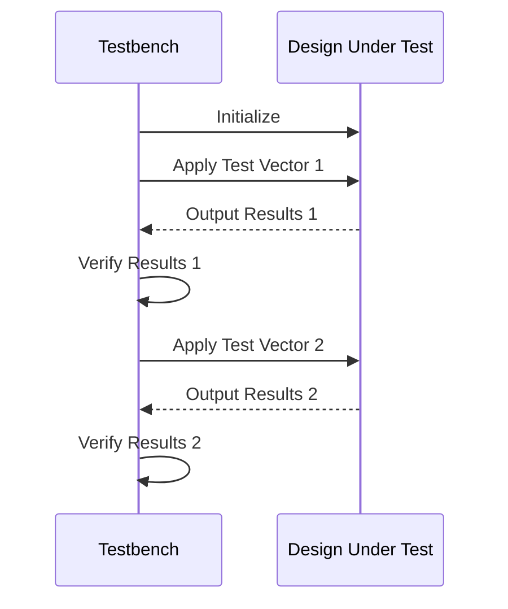
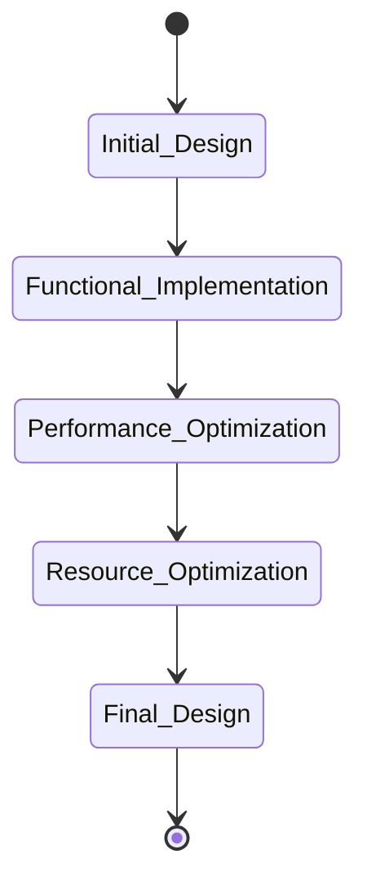

# General Documentation Template

## Context
You are tasked with creating comprehensive documentation for an FPGA hardware accelerator design. This documentation should be appropriate for technical users who need to understand, use, or modify this hardware component.

## Component Information
- **Component Name**: {component_name}
- **Design Purpose**: [Extract from context]
- **Generation Method**: AI-assisted design using LLM
- **Target Platform**: Xilinx FPGA

## Documentation Structure

Create thorough documentation following this structure:

### 1. Overview
- Component purpose and functionality
- Key features
- Target applications
- Design approach

### 2. Architecture
- Block diagram description
- Interface specification
- Data flow 
- Key components

**Architecture Visualization**: Include a Mermaid diagram showing the component architecture. Example:



### 3. Implementation Details
- Algorithm description
- HLS optimizations
- Resource utilization
- Performance characteristics

**Algorithm Visualization**: Include appropriate diagrams showing the algorithm implementation:



### 4. Usage Guide
- Integration instructions
- API/interface description
- Example usage
- Configuration options

**Integration Visualization**: Show integration flow with other components:

```mermaid
flowchart LR
    A[Host System] --> B[Driver]
    B --> C[{component_name}]
    C --> D[Memory]
    C --> E[Other IP Cores]
```

### 5. Performance Analysis
- Latency and throughput
- Resource efficiency
- Comparative metrics
- Limitations

**Performance Visualization**: Include resource utilization tables and charts:

```
| Resource | Utilization | Available | Utilization % |
|----------|-------------|-----------|---------------|
| LUT      | X           | X_total   | X_percent     |
| FF       | Y           | Y_total   | Y_percent     |
| DSP      | Z           | Z_total   | Z_percent     |
| BRAM     | W           | W_total   | W_percent     |
```

### 6. Verification
- Test methodology
- Simulation results
- Validation approach
- Known issues

**Verification Visualization**: Use sequence diagrams to show test procedures:



### 7. Development Process
- Design evolution
- Challenges and solutions
- AI assistance insights
- Optimization history

**Development Visualization**: Use a state or flowchart diagram to show the design evolution:



## Source Information
Use the following source material to inform your documentation:

### Source Code
```cpp
// Header file
{header_code}
```

```cpp
// Implementation file
{implementation_code}
```

```cpp
// Testbench file
{testbench_code}
```

### Performance Metrics
{performance_metrics}

### Implementation Challenges
{errors_encountered}

### Debugging Methods
{debugging_methods}

## Diagram Examples
The following are examples of different types of Mermaid diagrams you can use:

{diagram_examples}

## Chart Examples
The following are examples of different types of tables/charts for performance data:

{chart_examples}

## Style Guidelines
- Use clear, professional language
- Include code snippets and examples where helpful
- Use proper technical terminology
- Be concise but thorough
- Use appropriate markdown formatting
- Focus on practical usage information
- Make effective use of diagrams and visualizations
- Use Mermaid diagrams for architecture, flows, and algorithms
- Present performance metrics in well-formatted tables
- Ensure diagrams have clear labels and descriptions

Your documentation should serve as a comprehensive reference for this hardware component, with visual elements that enhance understanding.
