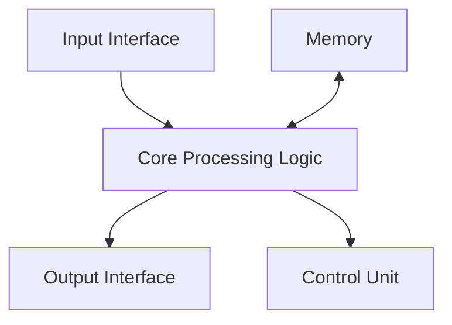
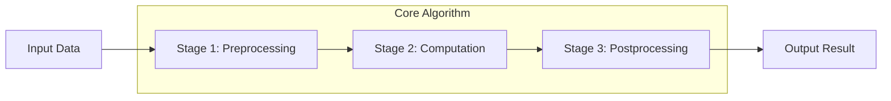
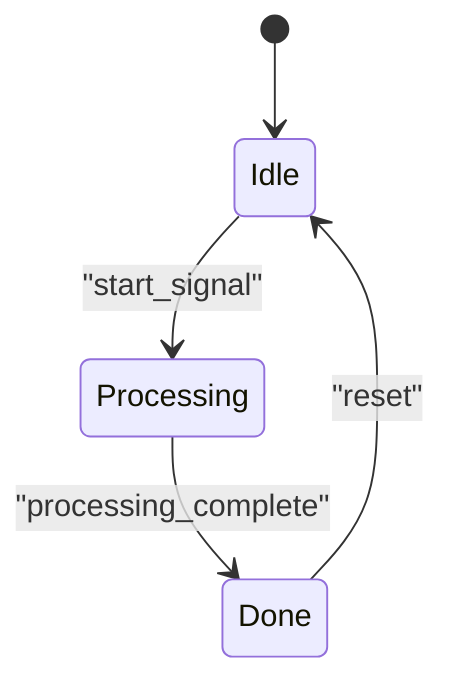
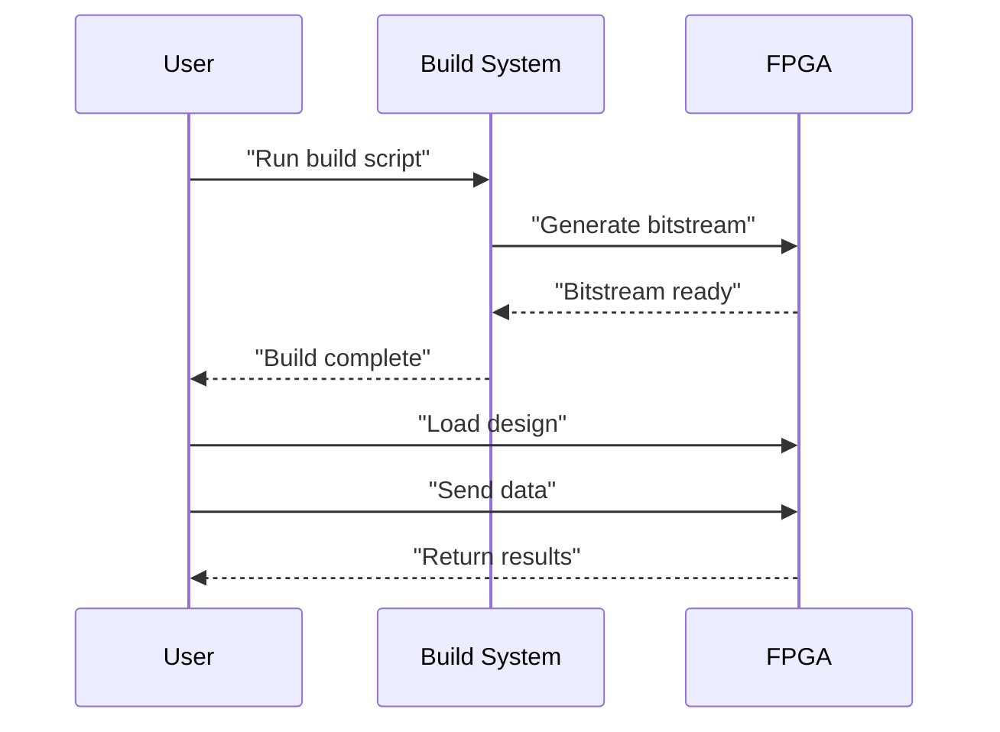

# README Generation Prompt

## Context
You are tasked with creating a comprehensive README document for an FPGA hardware accelerator design. This document will be the primary reference for users, developers, and stakeholders who interact with this hardware component.

## Component Overview
- **Component Name**: {component_name}
- **Design Purpose**: A hardware accelerator implemented on an FPGA
- **Generation Method**: AI-assisted design using LLM ({generation_model})
- **Target Platform**: Xilinx FPGA ({fpga_part})

## Instructions

Create a comprehensive README.md file following this structure:

### 1. Title and Introduction
- Clear title with component name
- Brief overview of what the component does
- Key features and capabilities
- Target applications

### 2. Hardware Architecture
- High-level block diagram description
- Key architectural components
- Data flow explanation
- Interface specifications
- Include design decisions and their rationales

**Architecture Visualization**: Include a Mermaid flowchart diagram showing the main components and data flow. Example:



### 3. Implementation Details
- HLS directives and optimizations used
- Resource utilization (LUTs, FFs, DSPs, BRAMs)
- Critical design parameters
- Key algorithms and their hardware mapping

**Algorithm Visualization**: Include a Mermaid flowchart or sequence diagram showing the algorithm implementation. Example of algorithm flowchart:



### 4. Performance Metrics
- Latency (in cycles)
- Throughput
- Clock frequency
- Resource efficiency
- Comparative analysis against baseline if available

**Performance Visualization**: Present performance metrics in clear tables and include a state diagram if applicable. Example:

```
| Metric         | Value    | Unit       |
|----------------|----------|------------|
| Latency        | X        | cycles     |
| Clock Period   | Y        | ns         |
| Throughput     | Z        | items/cycle|
| Resource Usage | See table below |     |
```

For state machines, use:



### 5. Setup and Usage
- Prerequisites (tools, versions)
- Build instructions
- Integration guidance
- Testbench explanation
- Common usage patterns
- API documentation if applicable

**Setup Visualization**: If applicable, include a sequence diagram showing the setup and usage flow:



### 6. Results and Validation
- Verification methodology
- Simulation results
- Hardware testing results if available
- Performance validation

**Results Visualization**: Present validation results in tables and comparison charts where applicable.

### 7. Development History
- Design evolution
- Challenges encountered and their solutions
- Optimization iterations
- AI assistance insights

### 8. Future Work
- Potential improvements
- Scaling opportunities
- Additional features

## Source Information
Use the following source files and metrics to inform your documentation:

### Source Code
```cpp
// Header file ({component_name}.hpp)
{header_code}
```

```cpp
// Implementation file ({component_name}.cpp)
{implementation_code}
```

```cpp
// Testbench file ({component_name}_tb.cpp)
{testbench_code}
```

### Performance Metrics
{performance_metrics}

### Implementation Challenges
{errors_encountered}

### Debugging Methods
{debugging_methods}

## Diagram Examples
The following are examples of different types of Mermaid diagrams you can use:

{diagram_examples}

## Chart Examples
The following are examples of different types of tables/charts for performance data:

{chart_examples}

## Style Guidelines
- Use clear, technical language appropriate for engineering documentation
- Include code snippets where helpful
- Use markdown formatting features (headers, lists, tables, code blocks)
- Be concise but comprehensive
- Focus on practical usage and technical details
- Highlight AI-assisted aspects of the development process
- Maintain a professional tone
- Make effective use of diagrams and visualizations for clarity
- Use Mermaid diagrams for architecture, data flow, and algorithms
- Use tables to present performance metrics and comparative analysis

Your README should serve as both a technical reference and a guide for someone who wants to understand, use, or modify the hardware component.

## BEST PRACTICES

- Successfully generated documentation on 2025-04-06
- Successfully generated documentation on 2025-04-06
- Successfully generated documentation on 2025-04-06
