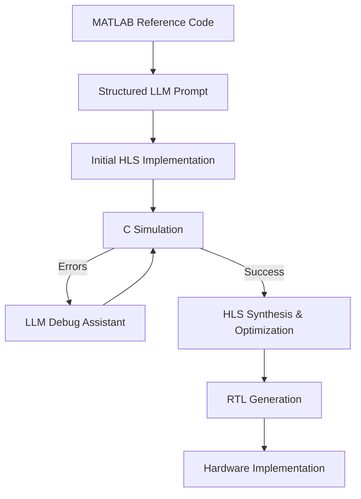

# LLM-Aided FPGA Design Flow

[](https://opensource.org/licenses/MIT)
[](https://www.xilinx.com/products/design-tools/vitis/vitis-hls.html)

## Overview

This repository demonstrates a modern approach to FPGA design using Large Language Models (LLMs) to automate and enhance the design workflow from MATLAB algorithms to optimized hardware implementations. By leveraging LLMs like Claude 3.7 Sonnet, GPT-4, or GitHub Copilot, we significantly reduce development time while maintaining design quality.

The repository showcases:

1. Conversion of MATLAB reference algorithms to HLS C++ 
2. Automated debugging of C simulation errors
3. Prompt engineering techniques for hardware design tasks
4. Performance optimization through LLM-guided directives

## Case Study: 5G NR Peak Picker

Our primary example is a peak picker algorithm for 5G NR Synchronization Signal Block (SSB) detection, which demonstrates the complete LLM-assisted workflow from MATLAB specification to optimized HLS implementation.

### Algorithm Description

The peak picker algorithm:
- Takes PSS (Primary Synchronization Signal) correlation magnitude squared values as input
- Compares values against thresholds to identify candidate peaks
- Applies filtering to identify true peaks
- Returns the locations (indices) of detected peaks

## LLM-Aided Design Workflow

Our methodology follows these key steps:



### 1. Prompt Engineering for Code Generation

We've developed specialized prompt templates for effective code generation:

1. **Context Section**: Explains the algorithm purpose and background
2. **Task Description**: Clearly defines what the LLM needs to implement
3. **Implementation Requirements**: Specifies coding standards, interfaces, and optimizations
4. **Deliverables**: Clearly states what files should be produced

Example from our peak picker implementation:

```markdown
# Copilot Instructions for Peak Picker Implementation

## Project Context
This project implements a critical component of a 5G NR SSB detection application. 
The peak picker algorithm identifies SSB signals by locating peaks where the 
magnitude squared of the PSS correlation (`xcorr`) exceeds a predefined threshold.

## Task Description
Your task is to translate the MATLAB peak picker algorithm into efficient HLS C++ 
code while preserving exact functionality. The implementation should be optimized 
for FPGA deployment using Xilinx HLS directives.

[Additional sections...]
```

### 2. LLM-Aided Debugging

When C simulation fails, we use structured prompts to help LLMs diagnose and fix errors:

1. Provide the error message and relevant code
2. Ask for analysis of potential causes
3. Request specific fixes for the identified issues

Example debugging workflow:

```markdown
C simulation failed with error: 'Size mismatch! Result: 0, Reference: 1
Test FAILED: Output does not match reference.'

[LLM analyzes the code and identifies incorrect comparison logic]

Fix: Replace `if (maxCheckCount == windowLength)` with 
`if (maxCheckCount == validSeqCount)` to correctly check if the candidate 
point is a maximum for all sequences that exceeded the threshold.
```

### 3. LLM Selection and Integration

Our tools support multiple LLM providers with different capabilities:

- **Gemini Pro/Flash**: Offers strong reasoning about code structures and efficient debugging
- **GPT-3.5/4**: Provides detailed code generation with comprehensive comments
- **Claude Sonnet**: Excels at understanding complex algorithms and providing thorough explanations

The framework automatically selects appropriate models based on task complexity, or allows specifying a model for specific use cases.

### 4. Automated File Generation and Management

The `generate_hls_code.py` tool implements sophisticated code extraction algorithms to:

- Parse LLM responses for code blocks
- Identify appropriate file types (header, implementation, testbench)
- Generate properly formatted HLS C++ files
- Maintain correct dependencies between files
- Create project structures compatible with Vitis HLS

## Getting Started

### Prerequisites

- Vitis HLS 2023.2 or newer
- MATLAB R2023a or newer (for reference models)
- Python 3.8+ with necessary libraries for data handling
- API keys for supported LLM services (at least one of the following):
  - Google Gemini API key (recommended)
  - OpenAI API key
  - Anthropic Claude API key

### Installation

```bash
# Clone this repository
git clone https://github.com/rockyco/llm-fpga-design.git
cd llm-fpga-design

# Set up your environment
source /path/to/Vitis/settings64.sh

# Install required Python packages
pip install -r requirements.txt

# Add your API keys to the .bashrc or .env file
echo "GEMINI_API_KEY=your_gemini_api_key" >> ~/.bashrc
echo "OPENAI_API_KEY=your_openai_api_key" >> ~/.bashrc
echo "CLAUDE_API_KEY=your_claude_api_key" >> ~/.bashrc
source ~/.bashrc
```

### Usage

1. **Generate HLS C++ from MATLAB reference**:
   Supported models: `gemini-2.0-flash-thinking-exp`, `gemini-2.0-pro-exp`, `gpt-4`, `gpt-3.5-turbo`, `claude-sonnet`
   ```bash
   python3 scripts/generate_hls_code.py --matlab_file algorithms/peakPicker.m algorithms/peakPicker_tb.m --prompt prompts/hls_conversion.md --model gemini-2.0-flash-thinking-exp
   ```

2. **Run C simulation**:
   ```bash
   cd implementations/peakPicker
   make csim
   ```

3. **Debug errors with LLM assistance**:
   ```bash
   cd ../../
   python3 scripts/debug_assistant.py --error_log implementations/peakPicker/proj_peakPicker/solution1/csim/report/peakPicker_csim.log --source_file implementations/peakPicker/peakPicker.cpp implementations/peakPicker/peakPicker.hpp implementations/peakPicker/peakPicker_tb.cpp
   ```

4. **Synthesize and export RTL**:
   ```bash
   make csynth
   make export_ip
   ```

## How the Debug Assistant Works

The `debug_assistant.py` script implements a sophisticated debugging workflow:

1. **Error Analysis**: Extracts meaningful error patterns from C simulation logs
2. **Context Collection**: Gathers relevant source files to provide complete context
3. **Specialized Prompting**: Creates detailed debugging prompts with structured sections
4. **LLM Consultation**: Sends prompts to your chosen LLM service through their API
5. **Fix Extraction**: Parses responses to identify code corrections
6. **Report Generation**: Creates detailed markdown reports of the debugging session
7. **Fix Application**: Optionally applies changes while creating backups

The tool is designed to handle common HLS errors including:
- Interface mismatches between implementation and testbench
- Data type inconsistencies
- Indexing errors
- Algorithmic logical errors
- Misunderstandings of HLS-specific behaviors

## Code Generation Process

The `generate_hls_code.py` script implements a comprehensive code generation pipeline:

1. **Code Analysis**: Examines MATLAB reference to understand algorithm function
2. **Prompt Construction**: Combines specialized templates with example code
3. **Model Selection**: Uses the most appropriate LLM based on task needs
4. **Response Processing**: Implements robust parsing to extract code blocks
5. **Code Organization**: Creates properly structured HLS project files
6. **Documentation**: Automatically preserves explanations from the LLM

Key features include:
- Support for multi-file MATLAB input
- Robust code block extraction with multiple fallback strategies
- File type identification based on content patterns
- Project structure generation following HLS best practices

## Repository Structure

```
llm-fpga-design/
├── algorithms/                  # MATLAB reference implementations
├── implementations/             # Generated HLS C++ implementations
│   └── peakPicker/              # Peak Picker implementation case study
├── prompts/                     # LLM prompt templates
├── scripts/                     # Automation scripts
│   ├── generate_hls_code.py     # Code generation script
│   └── debug_assistant.py       # Debugging assistant script
├── data/                        # Test data files
└── docs/                        # Documentation
```

## Best Practices

Based on our experience, we recommend these best practices for LLM-assisted FPGA design:

1. **Structured Prompts**: Use clear, detailed prompts with specific sections for context, requirements, and deliverables
2. **Iterative Refinement**: Start with high-level requirements, then refine implementation details
3. **Input/Output Examples**: Provide concrete examples of expected behavior
4. **Domain-Specific Knowledge**: Include relevant HLS and FPGA concepts in prompts
5. **Error Analysis**: When debugging, provide complete error messages and surrounding context
6. **Model Selection**: Choose appropriate models for different tasks:
   - Use Gemini Flash for quick iterations and debugging
   - Use GPT-4 for complex algorithms needing careful implementation
   - Use Claude for detailed explanations and educational contexts
7. **Prompt Templates**: Maintain a library of effective prompt templates for reuse
8. **Human Review**: Always review and understand generated code before synthesis

## Limitations and Considerations

- LLMs may not be aware of the latest HLS features or hardware-specific optimizations
- Complex timing constraints might require manual refinement
- While LLMs can generate optimized code, expert review is still recommended for critical applications
- Actual hardware performance should be verified through physical implementation
- LLMs may occasionally:
  - Generate incorrect pragma syntax that needs manual correction
  - Not fully understand resource vs. performance tradeoffs
  - Struggle with very complex interface requirements
  - Need help with target-specific optimizations

## Contributing

Contributions are welcome! Please feel free to submit a Pull Request.

1. Fork the repository
2. Create your feature branch (`git checkout -b feature/amazing-feature`)
3. Commit your changes (`git commit -m 'Add some amazing feature'`)
4. Push to the branch (`git push origin feature/amazing-feature`)
5. Open a Pull Request

## License

This project is licensed under the MIT License - see the LICENSE file for details.

## Acknowledgments

- Thanks to the open-source HLS and FPGA design communities
- Special thanks to the developers of Google Gemini 2.5 pro API, Claude 3.7 Sonnet, and GitHub Copilot for enabling this workflow

