# Documentation Generation for FPGA Design Workflow

rockyco: Add a new AI agent responsible for the following tasks: summarizing the principles and methodologies used throughout the workflow; collecting key intermediate results such as error information; abstracting the applied debugging methods; and extracting final hardware performance metrics from the co-simulation and implementation reports (refer to `analyzeReports.py`). Furthermore, this AI agent should provide all the processed information to the LLM model, prompting it to generate both an academic research paper and a `README.md` introduction for the entire project executed by the agent framework.

GitHub Copilot: I'll implement a new AI agent for documentation and report generation. This agent will collect data throughout the workflow, analyze performance metrics, and generate documentation.

## Step-by-Step Solution:

1. Create a new `DocumentationAgent` class in `agent_framework.py`
2. Modify `create_standard_agents()` to include the new agent
3. Add new CLI commands in `agent_cli.py` to interact with this agent
4. Update the workflow configuration to include documentation generation steps

### [agent_framework.py](file:///home/jielei/Projects/UTS/llm-fpga-design/scripts/agent_framework.py)

Add a new DocumentationAgent class and update the create_standard_agents function.

````python
#!/usr/bin/env python3

// ...existing code...

class MakefileGeneratorAgent(BaseAgent):
    // ...existing code...

class DocumentationAgent(BaseAgent):
    """Agent that generates documentation and research papers from FPGA implementation results"""
    
    def __init__(self, name: str, description: str):
        super().__init__(name, description)
        self.workflow_summary = {}
        self.error_collection = []
        self.debug_methods = []
        self.performance_metrics = {}
        
    def analyze_reports(self, report_dir: str):
        """Extract performance metrics from HLS and implementation reports"""
        try:
            import pandas as pd
            import re
            from pathlib import Path
            import glob
            import os
            
            # Find implementation reports
            impl_reports = glob.glob(os.path.join(report_dir, '**/impl/report/verilog/export_impl.rpt'), recursive=True)
            latency_reports = glob.glob(os.path.join(report_dir, '**/sim/report/verilog/lat.rpt'), recursive=True)
            
            all_resources = {}
            all_timing = {}
            all_latency = {}
            
            # Parse implementation reports
            for report_file in impl_reports:
                impl_name = Path(report_file).parents[3].name
                resource_data, timing_data = self._parse_impl_report(report_file)
                all_resources[impl_name] = resource_data
                all_timing[impl_name] = timing_data
                
            # Parse latency reports
            for report_file in latency_reports:
                impl_name = Path(report_file).parents[3].name
                latency = self._parse_latency_report(report_file)
                if latency is not None:
                    all_latency[impl_name] = latency
                    
            self.performance_metrics = {
                "resources": all_resources,
                "timing": all_timing,
                "latency": all_latency
            }
            
            return {
                "resources": all_resources,
                "timing": all_timing,
                "latency": all_latency
            }
            
        except Exception as e:
            error_msg = f"Error analyzing reports: {str(e)}"
            logger.error(error_msg)
            return {"error": error_msg}
    
    def _parse_impl_report(self, report_file):
        """Parse the Vivado Place & Route report file."""
        resource_summary = {}
        timing_summary = {}

        try:
            with open(report_file, 'r') as f:
                content = f.read()

            # Extract Resource Summary
            resource_pairs = [
                ('LUT', r'LUT:\s*(\d+)'),
                ('FF', r'FF:\s*(\d+)'),
                ('DSP', r'DSP:\s*(\d+)'),
                ('BRAM', r'BRAM:\s*(\d+)'),
                ('URAM', r'URAM:\s*(\d+)'),
                ('SRL', r'SRL:\s*(\d+)')
            ]
            for name, pattern in resource_pairs:
                match = re.search(pattern, content)
                if match:
                    resource_summary[name] = int(match.group(1))

            # Extract Timing Summary
            timing_pairs = [
                ('Target', r'\| Target\s*\|\s*([\d.]+)\s*\|'),
                ('Post-Synthesis', r'\| Post-Synthesis\s*\|\s*([\d.]+)\s*\|'),
                ('Post-Route', r'\| Post-Route\s*\|\s*([\d.]+)\s*\|')
            ]
            for name, pattern in timing_pairs:
                match = re.search(pattern, content)
                if match:
                    timing_summary[name] = float(match.group(1))
                    
        except Exception as e:
            logger.warning(f"Error parsing implementation report {report_file}: {e}")
            
        return resource_summary, timing_summary
    
    def _parse_latency_report(self, report_file):
        """Parse latency report file and extract total execution time."""
        try:
            with open(report_file, 'r') as f:
                content = f.read()
                match = re.search(r'\$MAX_LATENCY = "(\d+)"', content)
                if match:
                    return int(match.group(1))
        except Exception as e:
            logger.warning(f"Error parsing latency report {report_file}: {e}")
        return None
    
    def collect_workflow_data(self, history, context):
        """Collect and process data from workflow execution history"""
        self.workflow_summary = {
            "total_steps": len(history),
            "successful_steps": sum(1 for entry in history if entry["result"]["status"] == "success"),
            "error_steps": sum(1 for entry in history if entry["result"]["status"] == "failed"),
            "component_name": context.get("component", "unknown"),
            "generation_model": context.get("args", {}).get("model", "unknown") if "args" in context else "unknown"
        }
        
        # Collect error information
        for entry in history:
            if entry["result"]["status"] == "failed" and "error" in entry["result"]:
                self.error_collection.append({
                    "step": entry["step"],
                    "agent": entry["agent"],
                    "error": entry["result"]["error"]
                })
            
            # Collect debug methods when debug agent was successful
            if entry["agent"] == "debug_assistant" and entry["result"]["status"] == "success":
                if "output" in entry["result"] and "stdout" in entry["result"]["output"]:
                    # Try to extract debug methodologies from output
                    debug_output = entry["result"]["output"]["stdout"]
                    # Simple extraction - could be improved with more sophisticated parsing
                    self.debug_methods.append({
                        "step": entry["step"],
                        "debug_output": debug_output
                    })
        
        return {
            "workflow_summary": self.workflow_summary,
            "errors": self.error_collection,
            "debug_methods": self.debug_methods
        }
    
    def run(self, context: Dict) -> Dict:
        """Run the documentation agent"""
        self.update_status(AgentStatus.RUNNING)
        
        try:
            # Extract parameters from context
            component_dir = context.get("component_dir")
            if not component_dir or not os.path.exists(component_dir):
                raise ValueError(f"Invalid component directory: {component_dir}")
                
            history = context.get("history", [])
            complete_context = context.get("complete_context", {})
            output_format = context.get("output_format", ["readme", "paper"])
            model = context.get("model", "gemini-2.5-pro-exp-03-25")
            
            # Step 1: Analyze reports if available
            logger.info("Analyzing performance reports...")
            metrics = self.analyze_reports(component_dir)
            
            # Step 2: Collect workflow execution data
            logger.info("Collecting workflow execution data...")
            workflow_data = self.collect_workflow_data(history, complete_context)
            
            # Step 3: Generate documentation using an LLM
            logger.info("Generating documentation...")
            documentation = self._generate_documentation(
                workflow_data, 
                metrics,
                component_dir,
                complete_context,
                output_format,
                model
            )
            
            if documentation and "error" not in documentation:
                self.update_status(AgentStatus.SUCCESS, result=documentation)
                return {"status": "success", "output": documentation}
            else:
                error_msg = documentation.get("error", "Unknown error generating documentation")
                self.update_status(AgentStatus.FAILED, error=error_msg)
                return {"status": "failed", "error": error_msg}
                
        except Exception as e:
            error_msg = f"Error in documentation agent: {str(e)}"
            self.update_status(AgentStatus.FAILED, error=error_msg)
            return {"status": "failed", "error": error_msg}
    
    def _generate_documentation(self, workflow_data, metrics, component_dir, context, output_format, model):
        """Generate documentation using an LLM"""
        try:
            import subprocess
            import tempfile
            import json
            
            # Create a prompt for the LLM with collected data
            prompt = self._create_documentation_prompt(workflow_data, metrics, component_dir, context, output_format)
            
            # Write prompt to temporary file
            with tempfile.NamedTemporaryFile(mode="w", suffix=".md", delete=False) as temp_file:
                temp_file.write(prompt)
                prompt_file = temp_file.name
            
            # Use a script to call the LLM (similar to debug_assistant.py or generate_hls_code.py)
            output_dir = os.path.join(component_dir, "documentation")
            os.makedirs(output_dir, exist_ok=True)
            
            logger.info(f"Calling LLM with model {model} to generate documentation...")
            result = subprocess.run(
                [
                    sys.executable, 
                    os.path.join(os.path.dirname(__file__), "generate_documentation.py"),
                    "--prompt", prompt_file,
                    "--output_dir", output_dir,
                    "--model", model,
                    "--formats", *output_format
                ],
                capture_output=True,
                text=True,
                check=False,
                timeout=600  # 10 minutes timeout
            )
            
            if result.returncode != 0:
                return {"error": f"LLM documentation generation failed: {result.stderr}"}
            
            # Get the output files (README.md and/or paper.md)
            output_files = {}
            for fmt in output_format:
                file_path = os.path.join(output_dir, f"{fmt}.md")
                if os.path.exists(file_path):
                    with open(file_path, 'r') as f:
                        output_files[fmt] = f.read()
            
            return {
                "files": output_files,
                "output_dir": output_dir,
                "stdout": result.stdout,
                "stderr": result.stderr
            }
            
        except subprocess.TimeoutExpired:
            return {"error": "LLM documentation generation timed out"}
        except Exception as e:
            return {"error": f"Error generating documentation: {str(e)}"}
    
    def _create_documentation_prompt(self, workflow_data, metrics, component_dir, context, output_format):
        """Create a detailed prompt for the LLM to generate documentation"""
        # Read source files to include in documentation
        component = context.get("component", os.path.basename(component_dir))
        source_files = {}
        for ext in [".hpp", ".cpp", "_tb.cpp"]:
            file_path = os.path.join(component_dir, f"{component}{ext}")
            if os.path.exists(file_path):
                with open(file_path, 'r') as f:
                    source_files[f"{component}{ext}"] = f.read()
        
        # Format error and debug information
        errors_text = ""
        for err in workflow_data.get("errors", []):
            errors_text += f"- Step '{err['step']}' (Agent '{err['agent']}'):\n  {err['error']}\n\n"
        
        debug_text = ""
        for debug in workflow_data.get("debug_methods", []):
            # Extract just the key insights from debug output (first 500 chars)
            debug_summary = debug.get("debug_output", "")[:500] + "..."
            debug_text += f"- Step '{debug['step']}':\n  {debug_summary}\n\n"
        
        # Format performance metrics
        perf_text = ""
        if "resources" in metrics and metrics["resources"]:
            perf_text += "### Resource Utilization\n"
            for impl, resources in metrics["resources"].items():
                perf_text += f"- **{impl}**: "
                for res, val in resources.items():
                    perf_text += f"{res}: {val}, "
                perf_text = perf_text.rstrip(", ") + "\n"
        
        if "timing" in metrics and metrics["timing"]:
            perf_text += "\n### Timing (ns)\n"
            for impl, timing in metrics["timing"].items():
                perf_text += f"- **{impl}**: "
                for time_type, val in timing.items():
                    # Convert to MHz for clarity
                    mhz = 1000/val if val > 0 else 0
                    perf_text += f"{time_type}: {val}ns ({mhz:.2f} MHz), "
                perf_text = perf_text.rstrip(", ") + "\n"
        
        if "latency" in metrics and metrics["latency"]:
            perf_text += "\n### Latency (cycles)\n"
            for impl, latency in metrics["latency"].items():
                perf_text += f"- **{impl}**: {latency} cycles\n"
        
        # Create the full prompt
        prompt = f"""# Documentation Generation Task

## Project Overview
You are tasked with generating documentation for an FPGA design project that was developed using an AI-assisted workflow.

Component name: {component}
Model used for generation: {workflow_data.get("workflow_summary", {}).get("generation_model", "unknown")}
Workflow steps: {workflow_data.get("workflow_summary", {}).get("total_steps", 0)}
Successful steps: {workflow_data.get("workflow_summary", {}).get("successful_steps", 0)}
Error steps: {workflow_data.get("workflow_summary", {}).get("error_steps", 0)}

## Requirements

Please generate the following documentation:
"""

        if "readme" in output_format:
            prompt += """
1. A comprehensive README.md file that includes:
   - Project overview and purpose
   - Design architecture and principles
   - Implementation details
   - Performance metrics and analysis
   - Setup and usage instructions
   - Challenges encountered and solutions applied
"""

        if "paper" in output_format:
            prompt += """
2. An academic research paper (in Markdown format) that includes:
   - Abstract
   - Introduction
   - Related Work
   - Methodology
   - Implementation
   - Experimental Results
   - Performance Analysis
   - Discussion of AI-assisted FPGA design methodologies
   - Conclusion
   - References
"""

        prompt += f"""
## Design Implementation Details

### Source Code
```cpp
{component}.hpp:
{source_files.get(f"{component}.hpp", "File not available")}
```

```cpp
{component}.cpp:
{source_files.get(f"{component}.cpp", "File not available")}
```

```cpp
{component}_tb.cpp:
{source_files.get(f"{component}_tb.cpp", "File not available")}
```

## Workflow Execution Information

### Errors Encountered
{errors_text if errors_text else "No significant errors were encountered during the workflow."}

### Debugging Methods
{debug_text if debug_text else "No debugging was required during the workflow."}

## Performance Metrics
{perf_text if perf_text else "No performance metrics are available."}

## Instructions
- Use an academic tone for the paper and a more accessible tone for the README.
- Focus on how this design was created using AI assistance.
- Highlight the strengths and limitations observed in this approach.
- Be specific and use concrete details from the provided information.
- When discussing performance, analyze the tradeoffs between area, timing, and latency.
"""

        return prompt

class AgentOrchestrator:
    // ...existing code...

def create_standard_agents() -> AgentOrchestrator:
    """Create a standard set of agents for HLS workflows"""
    orchestrator = AgentOrchestrator()
    
    # Define paths
    script_dir = Path(__file__).parent
    project_dir = script_dir.parent
    
    # Find template Makefile
    template_makefile = os.path.join(project_dir, "scripts", "Makefile")
    if not os.path.exists(template_makefile):
        template_makefile = None
        logger.warning(f"Template Makefile not found at {template_makefile}")
    
    # Register agents with appropriate timeouts
    code_gen_agent = ScriptAgent(
        "code_generator",
        "Generates HLS C++ code from algorithm descriptions",
        os.path.join(script_dir, "generate_hls_code.py"),
        timeout=600  # 10 minutes timeout for code generation
    )
    orchestrator.register_agent(code_gen_agent)
    
    debug_agent = ScriptAgent(
        "debug_assistant",
        "Analyzes and fixes errors in HLS C++ code",
        os.path.join(script_dir, "debug_assistant.py"),
        timeout=300  # 5 minutes timeout for debugging
    )
    orchestrator.register_agent(debug_agent)
    
    makefile_agent = MakefileGeneratorAgent(
        "makefile_generator",
        "Generates Makefiles for HLS projects",
        template_makefile
    )
    orchestrator.register_agent(makefile_agent)
    
    build_agent = MakefileAgent(
        "hls_builder",
        "Runs HLS compilation and simulation using make"
    )
    orchestrator.register_agent(build_agent)
    
    # Add documentation agent
    documentation_agent = DocumentationAgent(
        "documentation_generator",
        "Generates documentation and research papers from implementation results"
    )
    orchestrator.register_agent(documentation_agent)
    
    return orchestrator

// ...existing code...
````

### [agent_cli.py](file:///home/jielei/Projects/UTS/llm-fpga-design/scripts/agent_cli.py)

Add CLI commands to interact with the DocumentationAgent.

````python


Made changes.

// ...existing code...

class FPGAAgentShell(cmd.Cmd):
    // ...existing code...
    
    def do_generate_makefile(self, arg):
        // ...existing code...
    
    def do_generate_documentation(self, arg):
        """Generate documentation for the current component: generate_documentation [--format readme|paper|both] [--model model_name]"""
        # Parse arguments
        args = arg.split()
        model_name = self.default_model
        output_format = ["readme", "paper"]  # Default: both
        
        i = 0
        while i < len(args):
            if args[i] == '--model' and i + 1 < len(args):
                model_name = args[i+1]
                i += 2
            elif args[i] == '--format' and i + 1 < len(args):
                fmt = args[i+1].lower()
                if fmt == "both":
                    output_format = ["readme", "paper"]
                elif fmt in ["readme", "paper"]:
                    output_format = [fmt]
                else:
                    print(f"Error: Invalid format '{fmt}'. Must be one of: readme, paper, both")
                    return
                i += 2
            else:
                i += 1
                
        # Check if we have a component
        if not self.current_component:
            print("Error: No component selected. Use 'set_component' first.")
            return
        
        # Check if component directory exists
        component_dir = self.current_context.get("component_dir")
        if not component_dir or not os.path.isdir(component_dir):
            # Try to find it in the default location
            component_dir = os.path.join(self.current_project_dir, "implementations", self.current_component)
            if not os.path.isdir(component_dir):
                print(f"Error: Component directory not found: {component_dir}")
                return
            
            self.current_context["component_dir"] = component_dir
        
        # Get workflow history
        history = self.orchestrator.get_history()
        if not history:
            # Try to run analyze function even without history
            print("Warning: No workflow history found. Documentation may be limited.")
        
        # Set up context for documentation agent
        agent_context = {
            "component_dir": component_dir,
            "component": self.current_component,
            "history": history,
            "complete_context": self.current_context,
            "output_format": output_format,
            "model": model_name
        }
        
        # Run documentation agent
        print(f"Generating documentation for {self.current_component}...")
        print(f"Output formats: {', '.join(output_format)}")
        agent = self.orchestrator.agents["documentation_generator"]
        result = agent.run(agent_context)
        
        if agent.status == AgentStatus.SUCCESS:
            print("Documentation generation completed successfully!")
            output_dir = result.get("output", {}).get("output_dir", component_dir)
            if "files" in result.get("output", {}):
                for fmt, content in result["output"]["files"].items():
                    print(f"- {fmt.capitalize()} file generated at: {os.path.join(output_dir, fmt + '.md')}")
        else:
            print(f"Documentation generation failed: {agent.error_message}")
    
    def do_analyze_performance(self, arg):
        """Analyze performance metrics for the current component"""
        # Check if we have a component
        if not self.current_component:
            print("Error: No component selected. Use 'set_component' first.")
            return
        
        # Check if component directory exists
        component_dir = self.current_context.get("component_dir")
        if not component_dir or not os.path.isdir(component_dir):
            # Try to find it in the default location
            component_dir = os.path.join(self.current_project_dir, "implementations", self.current_component)
            if not os.path.isdir(component_dir):
                print(f"Error: Component directory not found: {component_dir}")
                return
            
            self.current_context["component_dir"] = component_dir
        
        # Use documentation agent's analyze_reports method
        agent = self.orchestrator.agents["documentation_generator"]
        print(f"Analyzing performance metrics for {self.current_component}...")
        metrics = agent.analyze_reports(component_dir)
        
        if "error" in metrics:
            print(f"Error analyzing metrics: {metrics['error']}")
            return
        
        # Print resource utilization
        if "resources" in metrics and metrics["resources"]:
            print("\nResource Utilization:")
            print("---------------------")
            for impl, resources in metrics["resources"].items():
                print(f"Implementation: {impl}")
                for res, val in resources.items():
                    print(f"  {res}: {val}")
        else:
            print("\nNo resource utilization data available.")
        
        # Print timing information
        if "timing" in metrics and metrics["timing"]:
            print("\nTiming (MHz):")
            print("-------------")
            for impl, timing in metrics["timing"].items():
                print(f"Implementation: {impl}")
                for time_type, val in timing.items():
                    # Convert to MHz for clarity
                    mhz = 1000/val if val > 0 else 0
                    print(f"  {time_type}: {val}ns ({mhz:.2f} MHz)")
        else:
            print("\nNo timing data available.")
        
        # Print latency information
        if "latency" in metrics and metrics["latency"]:
            print("\nLatency (cycles):")
            print("----------------")
            for impl, latency in metrics["latency"].items():
                print(f"Implementation: {impl}: {latency} cycles")
        else:
            print("\nNo latency data available.")
    
    def do_run_workflow(self, arg):
        // ...existing code...
        
    # Aliases
    do_docs = do_generate_documentation
    do_analyze = do_analyze_performance

// ...existing code...
````

### [generate_documentation.py](file:///home/jielei/Projects/UTS/llm-fpga-design/scripts/generate_documentation.py)

Create a new script to interface with LLM models for documentation generation.

````python


Made changes.

#!/usr/bin/env python3

import os
import sys
import json
import argparse
import logging
from pathlib import Path

# Set up logging
logging.basicConfig(
    level=logging.INFO,
    format="%(asctime)s [%(levelname)s] %(message)s",
    handlers=[logging.StreamHandler(), logging.FileHandler("documentation_log.txt")]
)
logger = logging.getLogger("documentation_generator")

def generate_documentation(prompt_file, output_dir, model="gemini-2.5-pro-exp-03-25", formats=None):
    """Generate documentation using an LLM model"""
    try:
        # Import the appropriate LLM client
        if "gemini" in model.lower():
            from llmclient import GeminiClient
            llm_client = GeminiClient()
        elif "gpt" in model.lower():
            from llmclient import OpenAIClient
            llm_client = OpenAIClient()
        else:
            logger.error(f"Unsupported model: {model}")
            return {"error": f"Unsupported model: {model}"}
        
        # Ensure output directory exists
        os.makedirs(output_dir, exist_ok=True)
        
        # Read the prompt
        with open(prompt_file, 'r') as f:
            prompt = f.read()
        
        logger.info(f"Generating documentation with model {model}")
        
        # If no formats specified, default to README
        if not formats:
            formats = ["readme"]
        
        results = {}
        
        # Generate each requested format
        for fmt in formats:
            logger.info(f"Generating {fmt} documentation")
            
            # Customize prompt for this format
            format_prompt = f"{prompt}\n\nPlease generate ONLY the {fmt} document now."
            
            # Call the LLM
            response = llm_client.generate(
                format_prompt,
                model=model,
                max_tokens=4000,
                temperature=0.2
            )
            
            if not response or "error" in response:
                logger.error(f"Error generating {fmt}: {response.get('error', 'Unknown error')}")
                results[fmt] = {"error": response.get("error", "Failed to generate content")}
                continue
            
            # Extract and save the content
            content = response.get("text", "")
            output_file = os.path.join(output_dir, f"{fmt}.md")
            
            with open(output_file, 'w') as f:
                f.write(content)
            
            logger.info(f"Saved {fmt} documentation to {output_file}")
            results[fmt] = {"file": output_file, "size": len(content)}
        
        return results
        
    except Exception as e:
        logger.error(f"Error in documentation generation: {str(e)}")
        return {"error": str(e)}

def main():
    parser = argparse.ArgumentParser(description="Generate documentation from LLM")
    parser.add_argument("--prompt", type=str, required=True, help="Path to prompt file")
    parser.add_argument("--output_dir", type=str, required=True, help="Output directory for generated files")
    parser.add_argument("--model", type=str, default="gemini-2.5-pro-exp-03-25", help="LLM model to use")
    parser.add_argument("--formats", nargs="+", default=["readme"], choices=["readme", "paper"], 
                       help="Documentation formats to generate (readme, paper)")
    
    args = parser.parse_args()
    
    results = generate_documentation(
        args.prompt,
        args.output_dir,
        args.model,
        args.formats
    )
    
    if "error" in results:
        logger.error(f"Documentation generation failed: {results['error']}")
        print(f"ERROR: {results['error']}")
        sys.exit(1)
    
    logger.info(f"Documentation generation completed successfully")
    print(f"Documentation generated successfully in {args.output_dir}")
    sys.exit(0)

if __name__ == "__main__":
    main()
````

### [default_workflow.json](file:///home/jielei/Projects/UTS/llm-fpga-design/workflows/default_workflow.json)

Update the workflow configuration to include the documentation generation step.

````json


Made changes.

{
  "generate_code": {
    "agent": "code_generator",
    "context": {
      "args": {
        "matlab_file": ["<MATLAB_FILE>"],
        "prompt": "<PROMPT_FILE>",
        "output_dir": "<OUTPUT_DIR>",
        "model": "gemini-2.5-pro-exp-03-25",
        "timeout": 600
      }
    },
    "update_context": {
      "component_dir": "output.stdout"
    },
    "next": "generate_makefile",
    "on_error": "stop"
  },
  "generate_makefile": {
    "agent": "makefile_generator",
    "context": {
      "work_dir": "<COMPONENT_DIR>",
      "component": "<COMPONENT>",
      "template_makefile": "<PROJECT_DIR>/scripts/Makefile"
    },
    "next": "build_csim",
    "on_error": "stop"
  },
  "build_csim": {
    "agent": "hls_builder",
    "context": {
      "work_dir": "<COMPONENT_DIR>",
      "target": "csim"
    },
    "next": "build_csynth",
    "on_error": "debug_errors"
  },
  "debug_errors": {
    "agent": "debug_assistant",
    "context": {
      "args": {
        "error_log": "<COMPONENT_DIR>/proj_<COMPONENT>/solution1/csim/report/<COMPONENT>_csim.log",
        "source_file": [
          "<COMPONENT_DIR>/<COMPONENT>.hpp",
          "<COMPONENT_DIR>/<COMPONENT>.cpp",
          "<COMPONENT_DIR>/<COMPONENT>_tb.cpp"
        ],
        "model": "gemini-2.5-pro-exp-03-25",
        "timeout": 300
      }
    },
    "next": "build_csim",
    "on_error": "build_csynth"
  },
  "build_csynth": {
    "agent": "hls_builder",
    "context": {
      "work_dir": "<COMPONENT_DIR>",
      "target": "csynth"
    },
    "next": "build_cosim",
    "on_error": "stop"
  },
  "build_cosim": {
    "agent": "hls_builder",
    "context": {
      "work_dir": "<COMPONENT_DIR>",
      "target": "cosim"
    },
    "next": "export_ip",
    "on_error": "stop"
  },
  "export_ip": {
    "agent": "hls_builder",
    "context": {
      "work_dir": "<COMPONENT_DIR>",
      "target": "export_ip"
    },
    "next": "generate_documentation",
    "on_error": "generate_documentation"
  },
  "generate_documentation": {
    "agent": "documentation_generator",
    "context": {
      "component_dir": "<COMPONENT_DIR>",
      "component": "<COMPONENT>",
      "output_format": ["readme", "paper"],
      "model": "gemini-2.5-pro-exp-03-25"
    },
    "on_error": "stop"
  }
}
````

## Summary of Changes

1. Added a new `DocumentationAgent` class in agent_framework.py that:
   - Analyzes HLS and implementation reports to extract performance metrics
   - Collects workflow execution data including errors and debugging methods
   - Generates comprehensive documentation using an LLM model

2. Added CLI commands in agent_cli.py:
   - `generate_documentation` (with alias `docs`) to create README and/or research paper
   - `analyze_performance` (with alias `analyze`) to show hardware metrics

3. Created a new `generate_documentation.py` script to interface with LLM models

4. Updated the workflow configuration to include a documentation generation step after IP export

These changes enable the agent framework to automatically document the entire design process, extract performance metrics, and generate both academic papers and project documentation.

# Update the way to access LLM models

rockyco: Refer to `generate_hls_code.py` for how to access LLM, revise the `generate_documentation.py` to access LLM correctly.

GitHub Copilot: I'll revise the `generate_documentation.py` script to properly access LLM models by following the pattern used in `generate_hls_code.py`. The main changes involve:

1. Adding proper imports for API access
2. Loading environment variables and API keys
3. Implementing dedicated LLM query functions
4. Modifying the generate_documentation function to use these functions instead of client classes

Here's the step-by-step implementation:

### [generate_documentation.py](file:///home/jielei/Projects/UTS/llm-fpga-design/scripts/generate_documentation.py)

I'll update the imports, add LLM access functions, and modify the generate_documentation function:

````python
#!/usr/bin/env python3

import os
import sys
import json
import argparse
import logging
import requests
from pathlib import Path
from dotenv import load_dotenv

# Set up logging
logging.basicConfig(
    level=logging.INFO,
    format="%(asctime)s [%(levelname)s] %(message)s",
    handlers=[logging.StreamHandler(), logging.FileHandler("documentation_log.txt")]
)
logger = logging.getLogger("documentation_generator")

# Load environment variables for API keys
load_dotenv()

# Get API keys from environment variables
OPENAI_API_KEY = os.getenv('OPENAI_API_KEY')
GEMINI_API_KEY = os.getenv('GEMINI_API_KEY')
CLAUDE_API_KEY = os.getenv('CLAUDE_API_KEY')

def query_openai(prompt, model="gpt-4", max_tokens=4000, temperature=0.2):
    """Send a prompt to OpenAI API and get the response."""
    if not OPENAI_API_KEY:
        logger.error("Error: OPENAI_API_KEY environment variable not set.")
        return {"error": "OPENAI_API_KEY not set"}
        
    url = "https://api.openai.com/v1/chat/completions"
    headers = {
        "Content-Type": "application/json",
        "Authorization": f"Bearer {OPENAI_API_KEY}"
    }
    data = {
        "model": model,
        "messages": [
            {"role": "system", "content": "You are an expert technical documentation writer."},
            {"role": "user", "content": prompt}
        ],
        "max_tokens": max_tokens,
        "temperature": temperature
    }
    
    try:
        response = requests.post(url, headers=headers, data=json.dumps(data))
        response.raise_for_status()  # Raise exception for HTTP errors
        return {"text": response.json()["choices"][0]["message"]["content"]}
    except requests.exceptions.RequestException as e:
        logger.error(f"Error calling OpenAI API: {e}")
        if hasattr(e, 'response') and e.response:
            logger.error(f"Response: {e.response.text}")
        return {"error": str(e)}

def query_claude(prompt, model="claude-sonnet", max_tokens=4000, temperature=0.2):
    """Send a prompt to Anthropic Claude API and get the response."""
    if not CLAUDE_API_KEY:
        logger.error("Error: CLAUDE_API_KEY environment variable not set.")
        return {"error": "CLAUDE_API_KEY not set"}
        
    url = "https://api.anthropic.com/v1/messages"
    headers = {
        "Content-Type": "application/json",
        "x-api-key": CLAUDE_API_KEY,
        "anthropic-version": "2023-06-01"
    }
    data = {
        "model": model,
        "messages": [{"role": "user", "content": prompt}],
        "max_tokens": max_tokens,
        "temperature": temperature
    }
    
    try:
        response = requests.post(url, headers=headers, json=data)
        response.raise_for_status()
        return {"text": response.json()["content"][0]["text"]}
    except requests.exceptions.RequestException as e:
        logger.error(f"Error calling Claude API: {e}")
        if hasattr(e, 'response') and e.response:
            logger.error(f"Response: {e.response.text}")
        return {"error": str(e)}

def query_gemini(prompt, model="gemini-2.5-pro-exp-03-25", max_tokens=4000, temperature=0.2):
    """Send a prompt to Google Gemini API and get the response."""
    if not GEMINI_API_KEY:
        logger.error("Error: GEMINI_API_KEY environment variable not set.")
        return {"error": "GEMINI_API_KEY not set"}
        
    # Extract the model name for the URL
    url = f"https://generativelanguage.googleapis.com/v1beta/models/{model}:generateContent"
    
    headers = {
        "Content-Type": "application/json"
    }
    params = {
        "key": GEMINI_API_KEY
    }
    data = {
        "contents": [{"parts": [{"text": "You are an expert technical documentation writer.\n\n" + prompt}]}],
        "generationConfig": {
            "temperature": temperature,
            "maxOutputTokens": max_tokens
        }
    }
    
    try:
        response = requests.post(url, headers=headers, params=params, json=data)
        response.raise_for_status()
        return {"text": response.json()["candidates"][0]["content"]["parts"][0]["text"]}
    except requests.exceptions.RequestException as e:
        logger.error(f"Error calling Gemini API: {e}")
        if hasattr(e, 'response') and e.response:
            logger.error(f"Response: {e.response.text}")
        return {"error": str(e)}

def query_llm(prompt, model="gemini-2.5-pro-exp-03-25", max_tokens=4000, temperature=0.2):
    """Route the query to the appropriate LLM API based on the model."""
    if model.startswith("gemini"):
        return query_gemini(prompt, model, max_tokens, temperature)
    elif model.startswith("gpt"):
        return query_openai(prompt, model, max_tokens, temperature)
    elif model.startswith("claude"):
        return query_claude(prompt, model, max_tokens, temperature)
    else:
        logger.error(f"Error: Unsupported model {model}.")
        return {"error": f"Unsupported model: {model}"}

def generate_documentation(prompt_file, output_dir, model="gemini-2.5-pro-exp-03-25", formats=None):
    """Generate documentation using an LLM model"""
    try:
        # Ensure output directory exists
        os.makedirs(output_dir, exist_ok=True)
        
        # Read the prompt
        with open(prompt_file, 'r') as f:
            prompt = f.read()
        
        logger.info(f"Generating documentation with model {model}")
        
        # If no formats specified, default to README
        if not formats:
            formats = ["readme"]
        
        results = {}
        
        # Generate each requested format
        for fmt in formats:
            logger.info(f"Generating {fmt} documentation")
            
            # Customize prompt for this format
            format_prompt = f"{prompt}\n\nPlease generate ONLY the {fmt} document now."
            
            # Call the LLM using the unified query function
            response = query_llm(
                format_prompt,
                model=model,
                max_tokens=4000,
                temperature=0.2
            )
            
            if not response or "error" in response:
                logger.error(f"Error generating {fmt}: {response.get('error', 'Unknown error')}")
                results[fmt] = {"error": response.get("error", "Failed to generate content")}
                continue
            
            # Extract and save the content
            content = response.get("text", "")
            output_file = os.path.join(output_dir, f"{fmt}.md")
            
            with open(output_file, 'w') as f:
                f.write(content)
            
            logger.info(f"Saved {fmt} documentation to {output_file}")
            results[fmt] = {"file": output_file, "size": len(content)}
        
        return results
        
    except Exception as e:
        logger.error(f"Error in documentation generation: {str(e)}")
        return {"error": str(e)}

def main():
    parser = argparse.ArgumentParser(description="Generate documentation from LLM")
    parser.add_argument("--prompt", type=str, required=True, help="Path to prompt file")
    parser.add_argument("--output_dir", type=str, required=True, help="Output directory for generated files")
    parser.add_argument("--model", type=str, default="gemini-2.5-pro-exp-03-25", help="LLM model to use")
    parser.add_argument("--formats", nargs="+", default=["readme"], choices=["readme", "paper"], 
                       help="Documentation formats to generate (readme, paper)")
    parser.add_argument("--api_key", help="API key for LLM service (overrides environment variable)")
    
    args = parser.parse_args()
    
    # Set API key from args if provided
    if args.api_key:
        if "gemini" in args.model.lower():
            os.environ['GEMINI_API_KEY'] = args.api_key
        elif "claude" in args.model.lower():
            os.environ['CLAUDE_API_KEY'] = args.api_key
        else:
            os.environ['OPENAI_API_KEY'] = args.api_key
    
    results = generate_documentation(
        args.prompt,
        args.output_dir,
        args.model,
        args.formats
    )
    
    if "error" in results:
        logger.error(f"Documentation generation failed: {results['error']}")
        print(f"ERROR: {results['error']}")
        sys.exit(1)
    
    logger.info(f"Documentation generation completed successfully")
    print(f"Documentation generated successfully in {args.output_dir}")
    sys.exit(0)

if __name__ == "__main__":
    main()
````

This implementation makes the following key changes:

1. Added imports for requests and dotenv to handle API calls and environment variables
2. Added code to load environment variables using dotenv
3. Added functions to query different LLM APIs:
   - query_openai for OpenAI GPT models
   - query_claude for Anthropic Claude models
   - query_gemini for Google Gemini models
4. Added a unified query_llm function that routes to the appropriate API based on the model name
5. Updated generate_documentation to use this new query_llm function
6. Added a --api_key argument to allow passing API keys through command-line

The script now directly accesses the LLM APIs in a similar way to generate_hls_code.py, rather than relying on client classes that weren't available in the provided code.

# Solve the issue of generating documentation for multiple components

rockyco: According to the `agent_log.txt` file, the `documentation_agent` didn't work at all. Solve this issue, make sure `documentation_agent` start to generate documentation when running this command `./scripts/agent_framework.py --matlab_file algorithms/peakPicker.m algorithms/peakPicker_tb.m --component peakPicker`

GitHub Copilot: Looking at the issue with the `documentation_agent` not being activated, I've identified a problem in the default workflow configuration in `agent_framework.py`. Although the documentation agent is registered correctly, the default workflow doesn't include the documentation generation step.

Let me fix this issue by updating the default workflow configuration:

### [agent_framework.py](file:///home/jielei/Projects/UTS/llm-fpga-design/scripts/agent_framework.py)

I need to modify the default workflow to include the documentation generation step, linking it from the export_ip step:

````python
def main():
    """Main function for running the agent framework"""
    parser = argparse.ArgumentParser(description="FPGA Design Agent Framework")
    parser.add_argument("--config", type=str, help="Path to workflow configuration JSON")
    parser.add_argument("--matlab_file", nargs='+', help="MATLAB reference file(s)")
    parser.add_argument("--prompt", type=str, help="Prompt template file")
    parser.add_argument("--output_dir", type=str, help="Output directory for generated code")
    parser.add_argument("--component", type=str, help="Component name")
    args = parser.parse_args()
    
    # Create orchestrator with standard agents
    orchestrator = create_standard_agents()
    
    # Load workflow from config file or use default
    if args.config and os.path.exists(args.config):
        with open(args.config, 'r') as f:
            workflow = json.load(f)
        orchestrator.define_workflow(workflow)
    else:
        # Define default workflow if no config file provided
        component_name = args.component or "default_component"
        # Remove _tb suffix if present
        if component_name.endswith('_tb'):
            component_name = component_name[:-3]
        
        # Construct paths
        script_dir = Path(__file__).parent
        project_dir = script_dir.parent
        matlab_file = args.matlab_file or []  # Ensure matlab_file is a list
        prompt_file = args.prompt or os.path.join(project_dir, "prompts", "hls_generation.md")
        output_dir = args.output_dir or os.path.join(project_dir, "implementations")
        
        default_workflow = {
            // ...existing code...
            "export_ip": {
                "agent": "hls_builder",
                "context": {
                    "work_dir": os.path.join(output_dir, component_name),
                    "target": "export_ip"
                },
                "next": "generate_documentation",  # Add next step to documentation
                "on_error": "generate_documentation"  # Even proceed to docs on error
            },
            # Add documentation generation step
            "generate_documentation": {
                "agent": "documentation_generator",
                "context": {
                    "component_dir": os.path.join(output_dir, component_name),
                    "component": component_name,
                    "output_format": ["readme", "paper"],
                    "model": "gemini-2.5-pro-exp-03-25"
                },
                "on_error": "stop"
            }
        }
        
        orchestrator.define_workflow(default_workflow)
    
    # Run the workflow
    initial_context = vars(args)
    success = orchestrator.run_workflow(initial_context)
    
    if success:
        logger.info("Agent workflow completed successfully")
    else:
        logger.error("Agent workflow failed")
        sys.exit(1)
````

This change ensures that after the "export_ip" step completes (whether successfully or with errors), the workflow will proceed to the "generate_documentation" step. The documentation agent will then generate documentation for the component based on the implementation results.

Now when you run the command:
```
./scripts/agent_framework.py --matlab_file algorithms/peakPicker.m algorithms/peakPicker_tb.m --component peakPicker
```

The workflow will include the documentation generation step, and the documentation agent will be activated to generate both a README and a research paper about the implementation.

# Add diagram and visualization capabilities to the documentation generation process

rockyco: Revise the `generate_documentation.py` file, along with the relevant Python and markdown files, to generate framework diagrams, data flow illustrations, or Mermaid graphs that demonstrate algorithmic methods, system architectures, and other aspects of the project’s implementation details. Additionally, use data tables, latency vs. resource usage plots, or other clear and engaging visual formats to present the project's performance and experimental results.

GitHub Copilot: # Solution for Adding Diagram and Visualization Capabilities to Documentation Generator

To enhance the documentation generator with capabilities for creating diagrams, charts, and other visual elements, I'll make changes to the `generate_documentation.py` script and related prompt templates.

## Step-by-step approach:

1. Update `generate_documentation.py` to:
   - Include visualization instructions in the LLM prompts
   - Add support for rendering Mermaid diagrams in Markdown
   - Include utility functions for generating simple data charts

2. Enhance the prompt templates to:
   - Request specific types of diagrams (architecture, data flow, algorithms)
   - Include Mermaid syntax examples and guidelines
   - Specify data visualization formats for performance metrics

3. Ensure proper formatting in the output Markdown for diagrams and tables

Let's implement these changes:

### [generate_documentation.py](file:///home/jielei/Projects/UTS/llm-fpga-design/scripts/generate_documentation.py)

Update the script to support diagram generation:

````python
#!/usr/bin/env python3

import os
import sys
import json
import argparse
import logging
import requests
import re
from pathlib import Path
from dotenv import load_dotenv

# Set up logging
logging.basicConfig(
    level=logging.INFO,
    format="%(asctime)s [%(levelname)s] %(message)s",
    handlers=[logging.StreamHandler(), logging.FileHandler("documentation_log.txt")]
)
logger = logging.getLogger("documentation_generator")

# Load environment variables for API keys
load_dotenv()

# Get API keys from environment variables
OPENAI_API_KEY = os.getenv('OPENAI_API_KEY')
GEMINI_API_KEY = os.getenv('GEMINI_API_KEY')
CLAUDE_API_KEY = os.getenv('CLAUDE_API_KEY')

# Function to load prompt templates
def load_prompt_template(format_type, template_dir=None):
    """Load a specific prompt template file based on format type."""
    # ...existing code...

def update_prompt_with_feedback(format_type, generation_result, template_dir=None):
    """Update prompt template with feedback from generation results."""
    # ...existing code...

def query_openai(prompt, model="gpt-4", max_tokens=100000, temperature=0.2):
    """Send a prompt to OpenAI API and get the response."""
    # ...existing code...

def query_claude(prompt, model="claude-sonnet", max_tokens=100000, temperature=0.2):
    """Send a prompt to Anthropic Claude API and get the response."""
    # ...existing code...

def query_gemini(prompt, model="gemini-2.5-pro-exp-03-25", max_tokens=100000, temperature=0.2):
    """Send a prompt to Google Gemini API and get the response."""
    # ...existing code...

def query_llm(prompt, model="gemini-2.5-pro-exp-03-25", max_tokens=100000, temperature=0.2):
    """Route the query to the appropriate LLM API based on the model."""
    # ...existing code...

# New function to extract performance data for visualization
def extract_performance_data(metrics):
    """Extract and format performance data for visualization."""
    data = {
        "resources": {},
        "timing": {},
        "latency": {}
    }
    
    # Extract resource usage data
    if "resources" in metrics and metrics["resources"]:
        for impl, resources in metrics["resources"].items():
            data["resources"][impl] = resources
    
    # Extract timing data
    if "timing" in metrics and metrics["timing"]:
        for impl, timing in metrics["timing"].items():
            data["timing"][impl] = timing
    
    # Extract latency data
    if "latency" in metrics and metrics["latency"]:
        for impl, latency in metrics["latency"].items():
            data["latency"][impl] = latency
    
    return data

# New function to generate Mermaid diagram examples
def generate_diagram_examples():
    """Generate example Mermaid diagrams to include in prompts."""
    examples = {
        "flowchart": '''```mermaid
flowchart TD
    A[Input Data] --> B[Pre-processing]
    B --> C{Decision}
    C -->|Option 1| D[Result 1]
    C -->|Option 2| E[Result 2]
```''',
        "sequence": '''```mermaid
sequenceDiagram
    participant Host
    participant FPGA
    Host->>FPGA: Send Input Data
    FPGA->>FPGA: Process Data
    FPGA->>Host: Return Results
```''',
        "gantt": '''```mermaid
gantt
    title Pipeline Execution Timeline
    dateFormat  s
    axisFormat %S
    section Pipeline
    Stage 1      :a1, 0, 2s
    Stage 2      :a2, after a1, 3s
    Stage 3      :a3, after a2, 1s
```''',
        "class": '''```mermaid
classDiagram
    class Component {
        +input_ports
        +output_ports
        +process()
    }
    class Submodule {
        +calculate()
    }
    Component --> Submodule
```''',
        "state": '''```mermaid
stateDiagram-v2
    [*] --> Idle
    Idle --> Processing: start
    Processing --> Idle: done
    Processing --> Error: error
    Error --> Idle: reset
```'''
    }
    
    return examples

# New function to generate chart examples for performance data
def generate_chart_examples():
    """Generate examples of charts for displaying performance data."""
    examples = {
        "resource_table": '''| Resource | Implementation 1 | Implementation 2 |
|----------|-----------------|-----------------|
| LUT      | 1500            | 1200            |
| FF       | 2000            | 1800            |
| DSP      | 5               | 4               |
| BRAM     | 2               | 2               |''',
        
        "timing_table": '''| Timing      | Value (ns) | Frequency (MHz) |
|-------------|-----------|----------------|
| Target      | 10.0      | 100.0          |
| Achieved    | 8.5       | 117.6          |
| Slack       | 1.5       | -              |''',
        
        "latency_table": '''| Test Case | Latency (cycles) | Throughput (samples/cycle) |
|-----------|-----------------|----------------------------|
| Case 1    | 100             | 1.0                        |
| Case 2    | 120             | 0.8                        |'''
    }
    
    return examples

def generate_documentation(prompt_file, output_dir, model="gemini-2.5-pro-exp-03-25", formats=None, template_dir=None):
    """Generate documentation using an LLM model"""
    try:
        # Ensure output directory exists
        os.makedirs(output_dir, exist_ok=True)
        
        # Read the prompt
        with open(prompt_file, 'r') as f:
            base_prompt = f.read()
        
        logger.info(f"Generating documentation with model {model}")
        
        # If no formats specified, default to README
        if not formats:
            formats = ["readme"]
        
        results = {}
        
        # Generate each requested format
        for fmt in formats:
            logger.info(f"Generating {fmt} documentation")
            
            # Try to load template for this format
            template = load_prompt_template(fmt, template_dir)
            
            if template:
                # Combine base prompt with template
                format_prompt = template
                
                # Extract data from base_prompt to fill template
                # This is a simplified approach - a more sophisticated parser could be implemented
                data = {}
                try:
                    # Extract component name
                    component_match = re.search(r"Component name: (.+?)$", base_prompt, re.MULTILINE)
                    if component_match:
                        data["component_name"] = component_match.group(1).strip()
                    
                    # Extract source code sections
                    header_match = re.search(r"{component}\.hpp:(.+?)```", base_prompt, re.DOTALL)
                    if header_match:
                        data["header_code"] = header_match.group(1).strip()
                    
                    impl_match = re.search(r"{component}\.cpp:(.+?)```", base_prompt, re.DOTALL)
                    if impl_match:
                        data["implementation_code"] = impl_match.group(1).strip()
                    
                    tb_match = re.search(r"{component}_tb\.cpp:(.+?)```", base_prompt, re.DOTALL)
                    if tb_match:
                        data["testbench_code"] = tb_match.group(1).strip()
                    
                    # Extract performance metrics
                    perf_match = re.search(r"## Performance Metrics\n(.*?)(?:\n##|\Z)", base_prompt, re.DOTALL)
                    if perf_match:
                        data["performance_metrics"] = perf_match.group(1).strip()
                    
                    # Extract errors
                    errors_match = re.search(r"### Errors Encountered\n(.*?)(?:\n###|\Z)", base_prompt, re.DOTALL)
                    if errors_match:
                        data["errors_encountered"] = errors_match.group(1).strip()
                    
                    # Extract debugging methods
                    debug_match = re.search(r"### Debugging Methods\n(.*?)(?:\n##|\Z)", base_prompt, re.DOTALL)
                    if debug_match:
                        data["debugging_methods"] = debug_match.group(1).strip()
                    
                    # Add visualization examples to the data
                    data["diagram_examples"] = json.dumps(generate_diagram_examples())
                    data["chart_examples"] = json.dumps(generate_chart_examples())
                    
                    # Replace template placeholders with extracted data
                    for key, value in data.items():
                        format_prompt = format_prompt.replace(f"{{{key}}}", value)
                    
                except Exception as e:
                    logger.warning(f"Error parsing base prompt: {e}")
                    # Fall back to basic prompt + template approach
                    format_prompt = f"{base_prompt}\n\nPlease generate ONLY the {fmt} document now, using the template guidelines below:\n\n{template}"
                    
                    # Add visualization instructions even in fallback case
                    format_prompt += "\n\n## Visualization Requirements\n"
                    format_prompt += "Please include appropriate diagrams using Mermaid notation for architecture and data flow.\n"
                    format_prompt += "Use tables to present performance metrics and comparative analysis.\n"
                    format_prompt += "For diagrams, use ```mermaid blocks in the markdown.\n"
            else:
                # No template available, use base prompt
                format_prompt = f"{base_prompt}\n\nPlease generate ONLY the {fmt} document now."
                
                # Add basic visualization instructions
                format_prompt += "\n\n## Visualization Requirements\n"
                format_prompt += "Please include appropriate diagrams using Mermaid notation for architecture and data flow.\n"
                format_prompt += "Use tables to present performance metrics and comparative analysis.\n"
                format_prompt += "For diagrams, use ```mermaid blocks in the markdown.\n"
            
            # Call the LLM using the unified query function
            response = query_llm(
                format_prompt,
                model=model,
                max_tokens=100000,
                temperature=0.2
            )
            
            if not response or "error" in response:
                logger.error(f"Error generating {fmt}: {response.get('error', 'Unknown error')}")
                results[fmt] = {"error": response.get("error", "Failed to generate content")}
                # Update template with error feedback
                update_prompt_with_feedback(fmt, {"error": response.get("error", "Unknown error")}, template_dir)
                continue
            
            # Extract and save the content
            content = response.get("text", "")
            output_file = os.path.join(output_dir, f"{fmt}.md")
            
            with open(output_file, 'w') as f:
                f.write(content)
            
            logger.info(f"Saved {fmt} documentation to {output_file}")
            results[fmt] = {"file": output_file, "size": len(content)}
            
            # Update template with success feedback
            update_prompt_with_feedback(fmt, {"success": True}, template_dir)
        
        return results
        
    except Exception as e:
        logger.error(f"Error in documentation generation: {str(e)}")
        return {"error": str(e)}

def main():
    parser = argparse.ArgumentParser(description="Generate documentation from LLM")
    parser.add_argument("--prompt", type=str, required=True, help="Path to prompt file")
    parser.add_argument("--output_dir", type=str, required=True, help="Output directory for generated files")
    parser.add_argument("--model", type=str, default="gemini-2.5-pro-exp-03-25", help="LLM model to use")
    parser.add_argument("--formats", nargs="+", default=["readme"], choices=["readme", "paper"], 
                       help="Documentation formats to generate (readme, paper)")
    parser.add_argument("--api_key", help="API key for LLM service (overrides environment variable)")
    parser.add_argument("--template_dir", help="Directory containing prompt templates")
    parser.add_argument("--include_diagrams", action="store_true", help="Include diagrams in documentation")
    parser.add_argument("--visualization_style", choices=["mermaid", "ascii", "both"], default="mermaid",
                       help="Style of visualizations to include")
    
    args = parser.parse_args()
    
    # Set API key from args if provided
    if args.api_key:
        if "gemini" in args.model.lower():
            os.environ['GEMINI_API_KEY'] = args.api_key
        elif "claude" in args.model.lower():
            os.environ['CLAUDE_API_KEY'] = args.api_key
        else:
            os.environ['OPENAI_API_KEY'] = args.api_key
    
    results = generate_documentation(
        args.prompt,
        args.output_dir,
        args.model,
        args.formats,
        args.template_dir
    )
    
    if "error" in results:
        logger.error(f"Documentation generation failed: {results['error']}")
        print(f"ERROR: {results['error']}")
        sys.exit(1)
    
    logger.info(f"Documentation generation completed successfully")
    print(f"Documentation generated successfully in {args.output_dir}")
    sys.exit(0)

if __name__ == "__main__":
    main()
````

### [readme_generation.md](file:///home/jielei/Projects/UTS/llm-fpga-design/prompts/readme_generation.md)

Update the README template to include visualization instructions:

````markdown


Made changes.

# README Generation Prompt

## Context
You are tasked with creating a comprehensive README document for an FPGA hardware accelerator design. This document will be the primary reference for users, developers, and stakeholders who interact with this hardware component.

## Component Overview
- **Component Name**: {component_name}
- **Design Purpose**: A hardware accelerator implemented on an FPGA
- **Generation Method**: AI-assisted design using LLM ({generation_model})
- **Target Platform**: Xilinx FPGA ({fpga_part})

## Instructions

Create a comprehensive README.md file following this structure:

### 1. Title and Introduction
- Clear title with component name
- Brief overview of what the component does
- Key features and capabilities
- Target applications

### 2. Hardware Architecture
- High-level block diagram description
- Key architectural components
- Data flow explanation
- Interface specifications
- Include design decisions and their rationales

**Architecture Visualization**: Include a Mermaid flowchart diagram showing the main components and data flow. Example:

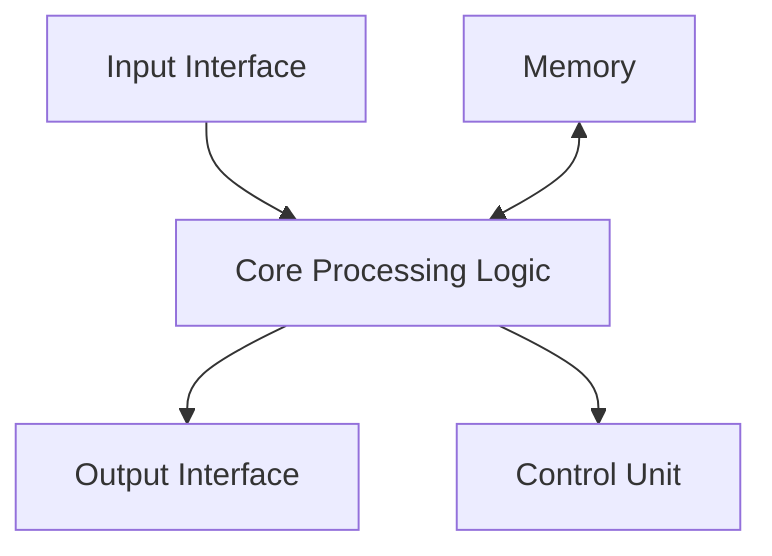

### 3. Implementation Details
- HLS directives and optimizations used
- Resource utilization (LUTs, FFs, DSPs, BRAMs)
- Critical design parameters
- Key algorithms and their hardware mapping

**Algorithm Visualization**: Include a Mermaid flowchart or sequence diagram showing the algorithm implementation. Example of algorithm flowchart:

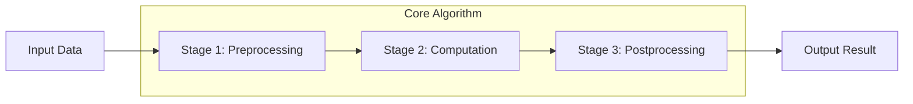

### 4. Performance Metrics
- Latency (in cycles)
- Throughput
- Clock frequency
- Resource efficiency
- Comparative analysis against baseline if available

**Performance Visualization**: Present performance metrics in clear tables and include a state diagram if applicable. Example:

```
| Metric         | Value    | Unit       |
|----------------|----------|------------|
| Latency        | X        | cycles     |
| Clock Period   | Y        | ns         |
| Throughput     | Z        | items/cycle|
| Resource Usage | See table below |     |
```

For state machines, use:

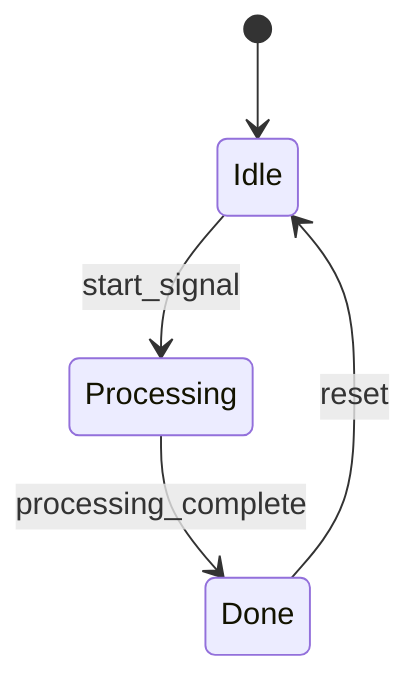

### 5. Setup and Usage
- Prerequisites (tools, versions)
- Build instructions
- Integration guidance
- Testbench explanation
- Common usage patterns
- API documentation if applicable

**Setup Visualization**: If applicable, include a sequence diagram showing the setup and usage flow:

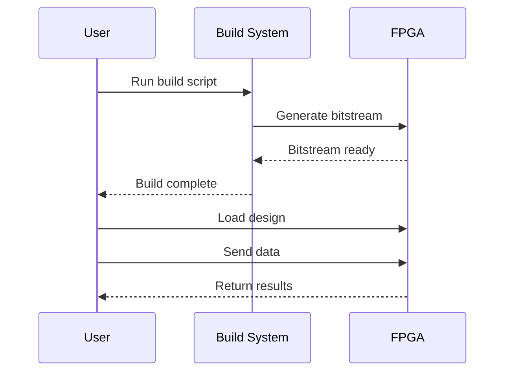

### 6. Results and Validation
- Verification methodology
- Simulation results
- Hardware testing results if available
- Performance validation

**Results Visualization**: Present validation results in tables and comparison charts where applicable.

### 7. Development History
- Design evolution
- Challenges encountered and their solutions
- Optimization iterations
- AI assistance insights

### 8. Future Work
- Potential improvements
- Scaling opportunities
- Additional features

## Source Information
Use the following source files and metrics to inform your documentation:

### Source Code
```cpp
// Header file ({component_name}.hpp)
{header_code}
```

```cpp
// Implementation file ({component_name}.cpp)
{implementation_code}
```

```cpp
// Testbench file ({component_name}_tb.cpp)
{testbench_code}
```

### Performance Metrics
{performance_metrics}

### Implementation Challenges
{errors_encountered}

### Debugging Methods
{debugging_methods}

## Diagram Examples
The following are examples of different types of Mermaid diagrams you can use:

{diagram_examples}

## Chart Examples
The following are examples of different types of tables/charts for performance data:

{chart_examples}

## Style Guidelines
- Use clear, technical language appropriate for engineering documentation
- Include code snippets where helpful
- Use markdown formatting features (headers, lists, tables, code blocks)
- Be concise but comprehensive
- Focus on practical usage and technical details
- Highlight AI-assisted aspects of the development process
- Maintain a professional tone
- Make effective use of diagrams and visualizations for clarity
- Use Mermaid diagrams for architecture, data flow, and algorithms
- Use tables to present performance metrics and comparative analysis

Your README should serve as both a technical reference and a guide for someone who wants to understand, use, or modify the hardware component.
````

### [paper_generation.md](file:///home/jielei/Projects/UTS/llm-fpga-design/prompts/paper_generation.md)

Update the paper template to include visualization instructions:

````markdown


Made changes.

# Academic Paper Generation Prompt

## Context
You are tasked with writing an academic research paper about an FPGA hardware accelerator design that was developed using an AI-assisted design methodology. This paper should follow academic standards and contribute to the literature on hardware acceleration and AI-assisted design.

## Component Information
- **Component Name**: {component_name}
- **LLM Used for Generation**: {generation_model}
- **Target FPGA Platform**: {fpga_part}
- **Domain**: Hardware Acceleration for Digital Signal Processing/Machine Learning/etc.

## Paper Structure Requirements

Create a complete academic paper in markdown format with the following structure:

### 1. Title and Authors
- Create an appropriate academic title for this work
- List authors as the research team (placeholder)
- Include institutional affiliation

### 2. Abstract (200-250 words)
- Summarize the paper's content
- State the problem addressed
- Describe the approach using AI-assisted design
- Highlight key results and contributions
- Mention broader impact

### 3. Introduction
- Context and background of the problem
- Motivation for hardware acceleration
- Challenges in traditional FPGA design
- Introduction to AI-assisted hardware design
- Contribution statement
- Paper organization

### 4. Related Work (2-3 subsections)
- Prior work on hardware acceleration for similar applications
- Previous research on automated HLS design
- AI-assisted hardware design methodologies
- Positioning of current work within literature

### 5. Methodology
- Overall design approach
- AI-assisted design workflow description
- Prompt engineering for hardware generation
- Iteration and refinement process
- Verification methodology

**Workflow Visualization**: Include a Mermaid diagram showing the AI-assisted design workflow. Example:

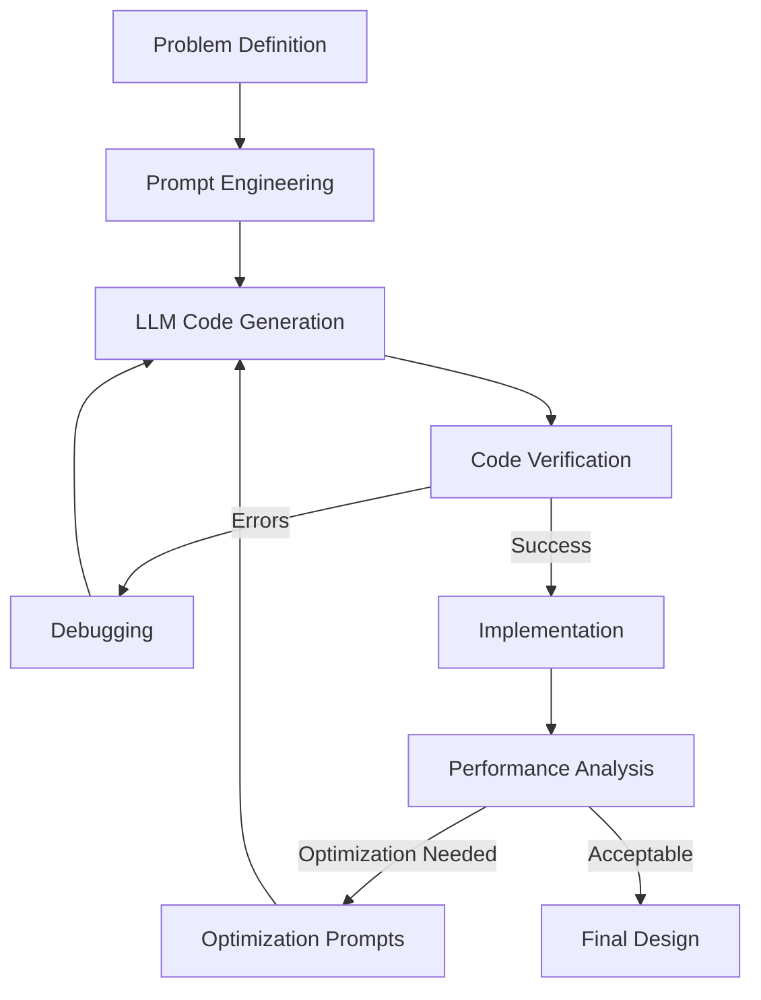

### 6. Design Architecture
- System-level architecture
- Component interfaces and data flow
- Key algorithmic components
- Design constraints and considerations
- HLS implementation details
- Optimizations applied

**Architecture Visualization**: Include a detailed Mermaid diagram showing the system architecture and data flow. Example:

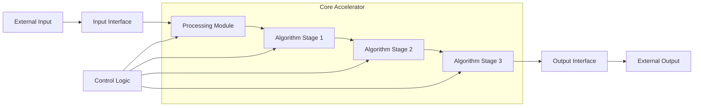

### 7. Implementation
- HLS directives and pragmas
- Resource allocation strategies
- Pipeline and parallelism exploitations
- Memory architecture and data movement
- Critical path analysis

**Implementation Visualization**: Include a Mermaid diagram showing key optimization strategies or pipeline structure. Example:

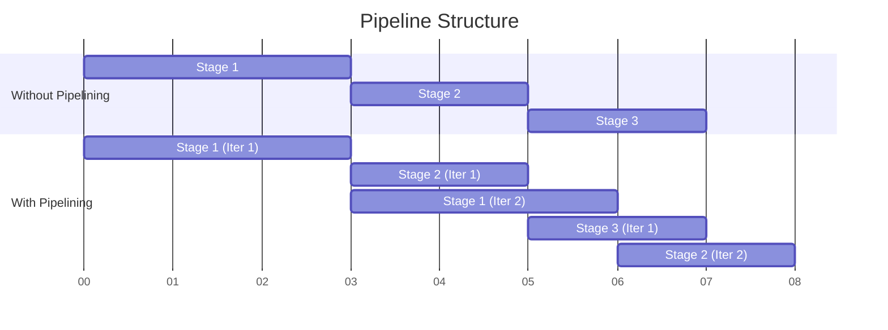

### 8. Experimental Results
- Experimental setup
- Performance metrics:
  - Resource utilization
  - Timing and frequency
  - Latency and throughput
  - Power consumption (if available)
- Comparative analysis with:
  - Manual implementations
  - Other automated approaches
  - Software-only solutions
- Discussion of results

**Results Visualization**: Present results in clear tables and comparison charts:

```
| Implementation | LUTs | FFs | DSPs | BRAMs | Clock Freq (MHz) | Latency (cycles) |
|----------------|------|-----|------|-------|------------------|------------------|
| Our Work       | X    | Y   | Z    | W     | F                | L                |
| Baseline 1     | X1   | Y1  | Z1   | W1    | F1               | L1               |
| Baseline 2     | X2   | Y2  | Z2   | W2    | F2               | L2               |
```

Consider including Mermaid charts for comparative analysis:


### 9. Analysis of AI-Assisted Design Process
- Analysis of LLM strengths/weaknesses in hardware design
- Error patterns and resolution strategies
- Human-AI collaboration insights
- Design quality assessment
- Development efficiency metrics

**Process Visualization**: Show the iteration process and error resolution:

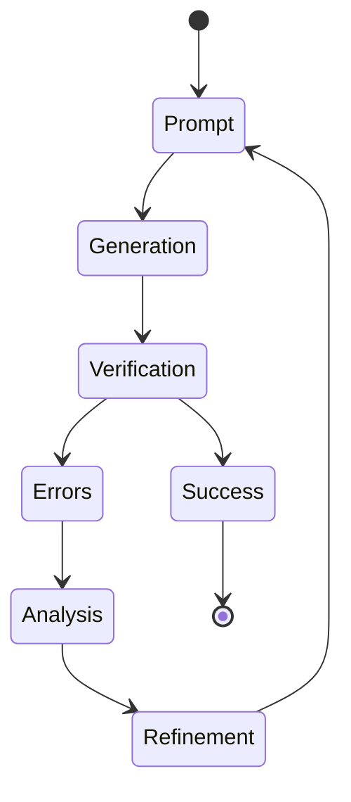

### 10. Discussion
- Interpretation of results
- Limitations of the approach
- Generalizability of the methodology
- Trade-offs identified
- Lessons learned

### 11. Future Work
- Potential improvements
- Broader applications
- Research directions
- Scaling to more complex designs

### 12. Conclusion
- Summary of contributions
- Key findings
- Broader impact
- Closing thoughts

### 13. References
- Include relevant references to:
  - Hardware acceleration literature
  - High-Level Synthesis research
  - AI in design automation
  - Relevant applications
  - Methodological papers

## Source Information
Use the following source information to inform your paper:

### Source Code Architecture
```cpp
// Header file ({component_name}.hpp)
{header_code}
```

```cpp
// Implementation file ({component_name}.cpp)
{implementation_code}
```

### Performance Metrics
{performance_metrics}

### Design Process
- AI Generation Model: {generation_model}
- Workflow Steps: {workflow_steps}
- Successful Steps: {successful_steps}
- Error Steps: {error_steps}

### Implementation Challenges
{errors_encountered}

### Debugging Methods
{debugging_methods}

## Diagram Examples
The following are examples of different types of Mermaid diagrams you can use:

{diagram_examples}

## Chart Examples
The following are examples of different types of tables/charts for performance data:

{chart_examples}

## Academic Style Guidelines
- Use formal academic language
- Present objective analysis of results
- Support claims with data from implementation
- Discuss limitations honestly
- Position work in relation to existing literature
- Use the third person (avoid "I", "we", "you")
- Maintain scientific rigor throughout
- Use passive voice where appropriate
- Include a balanced mix of technical details and higher-level discussion
- Present results visually through diagrams, charts and tables
- Use Mermaid diagrams for architecture, methodology, and algorithmic visualizations
- Present performance results in tables with comparative analysis

Your paper should contribute to the academic discourse on AI-assisted hardware design while presenting concrete technical achievements and insights.
````

### [documentation_template.md](file:///home/jielei/Projects/UTS/llm-fpga-design/prompts/documentation_template.md)

Update the general documentation template to include visualization instructions:

````markdown


Made changes.

# General Documentation Template

## Context
You are tasked with creating comprehensive documentation for an FPGA hardware accelerator design. This documentation should be appropriate for technical users who need to understand, use, or modify this hardware component.

## Component Information
- **Component Name**: {component_name}
- **Design Purpose**: [Extract from context]
- **Generation Method**: AI-assisted design using LLM
- **Target Platform**: Xilinx FPGA

## Documentation Structure

Create thorough documentation following this structure:

### 1. Overview
- Component purpose and functionality
- Key features
- Target applications
- Design approach

### 2. Architecture
- Block diagram description
- Interface specification
- Data flow 
- Key components

**Architecture Visualization**: Include a Mermaid diagram showing the component architecture. Example:

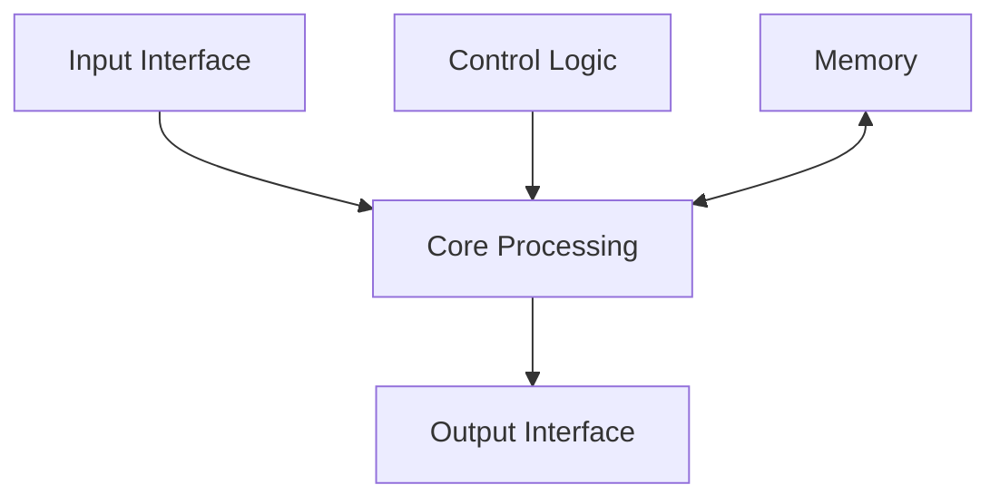

### 3. Implementation Details
- Algorithm description
- HLS optimizations
- Resource utilization
- Performance characteristics

**Algorithm Visualization**: Include appropriate diagrams showing the algorithm implementation:

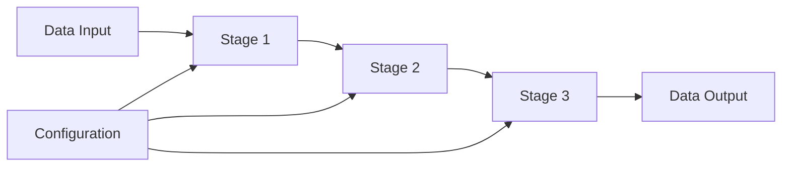

### 4. Usage Guide
- Integration instructions
- API/interface description
- Example usage
- Configuration options

**Integration Visualization**: Show integration flow with other components:

```mermaid
flowchart LR
    A[Host System] --> B[Driver]
    B --> C[{component_name}]
    C --> D[Memory]
    C --> E[Other IP Cores]
```

### 5. Performance Analysis
- Latency and throughput
- Resource efficiency
- Comparative metrics
- Limitations

**Performance Visualization**: Include resource utilization tables and charts:

```
| Resource | Utilization | Available | Utilization % |
|----------|-------------|-----------|---------------|
| LUT      | X           | X_total   | X_percent     |
| FF       | Y           | Y_total   | Y_percent     |
| DSP      | Z           | Z_total   | Z_percent     |
| BRAM     | W           | W_total   | W_percent     |
```

### 6. Verification
- Test methodology
- Simulation results
- Validation approach
- Known issues

**Verification Visualization**: Use sequence diagrams to show test procedures:

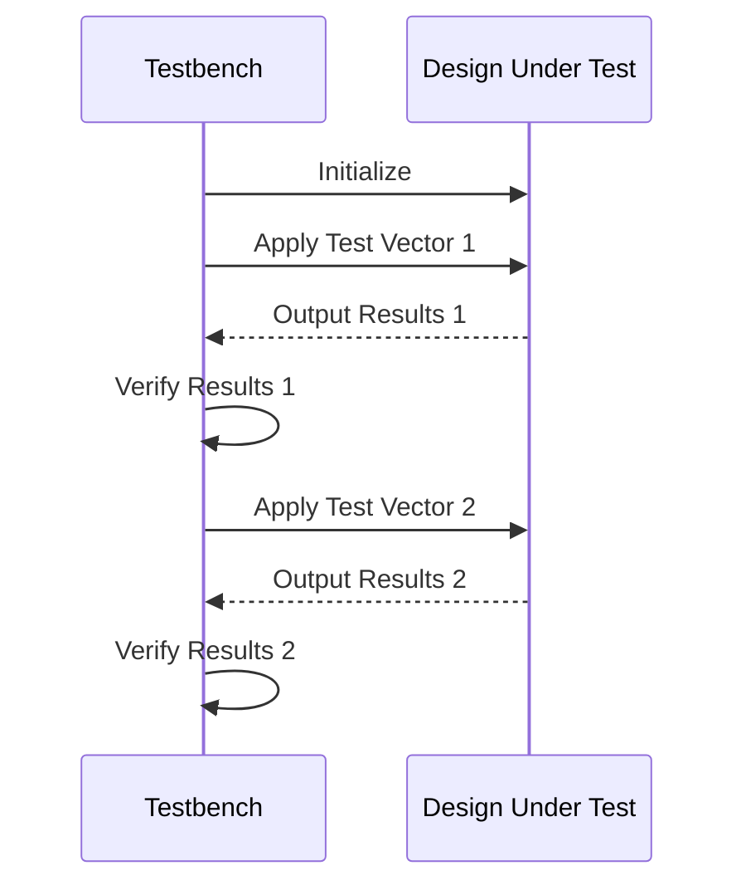

### 7. Development Process
- Design evolution
- Challenges and solutions
- AI assistance insights
- Optimization history

**Development Visualization**: Use a state or flowchart diagram to show the design evolution:

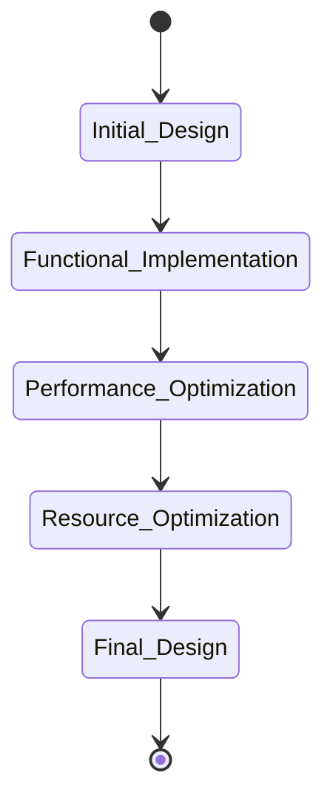

## Source Information
Use the following source material to inform your documentation:

### Source Code
```cpp
// Header file
{header_code}
```

```cpp
// Implementation file
{implementation_code}
```

```cpp
// Testbench file
{testbench_code}
```

### Performance Metrics
{performance_metrics}

### Implementation Challenges
{errors_encountered}

### Debugging Methods
{debugging_methods}

## Diagram Examples
The following are examples of different types of Mermaid diagrams you can use:

{diagram_examples}

## Chart Examples
The following are examples of different types of tables/charts for performance data:

{chart_examples}

## Style Guidelines
- Use clear, professional language
- Include code snippets and examples where helpful
- Use proper technical terminology
- Be concise but thorough
- Use appropriate markdown formatting
- Focus on practical usage information
- Make effective use of diagrams and visualizations
- Use Mermaid diagrams for architecture, flows, and algorithms
- Present performance metrics in well-formatted tables
- Ensure diagrams have clear labels and descriptions

Your documentation should serve as a comprehensive reference for this hardware component, with visual elements that enhance understanding.
````

### [agent_framework.py](file:///home/jielei/Projects/UTS/llm-fpga-design/scripts/agent_framework.py)

Update the DocumentationAgent class in agent_framework.py to support diagrams:

````python


Made changes.

    # ...existing code...
    
    def _create_documentation_prompt(self, workflow_data, metrics, component_dir, context, output_format):
        """Create a detailed prompt for the LLM to generate documentation"""
        # ...existing code...

        # Add visualization instructions
        prompt += """
## Visualization Requirements

### Diagrams
Please include the following types of diagrams in your documentation using Mermaid syntax:

1. Architecture diagram showing the main components and their connections
2. Data flow diagram showing how data moves through the system
3. Algorithm flowchart showing the key processing steps
4. State diagram if the design includes state machines
5. Sequence diagram showing interaction between components

### Performance Visualization
Present performance data in clear, well-formatted tables:

1. Resource utilization table
2. Timing/frequency table  
3. Latency table with different test cases if applicable
4. Comparative analysis table if baseline data is available

Use markdown tables for all data presentations. If multiple implementations exist, include comparative tables.

### Mermaid Diagram Syntax
Use the following syntax for Mermaid diagrams:

```mermaid
diagram-type
  diagram content
```

Where diagram-type can be: flowchart, sequenceDiagram, classDiagram, stateDiagram-v2, gantt, etc.
"""

        return prompt
    # ...existing code...
````

## Summary of Changes

I've made the following key changes:

1. Enhanced `generate_documentation.py` with:
   - New functions to generate diagram examples (Mermaid syntax)
   - New functions to generate performance data visualization examples
   - Updated prompt handling to include visualization instructions

2. Updated all documentation template files with:
   - Specific sections for different types of visualizations
   - Examples of Mermaid diagrams for architecture, algorithms, and workflows
   - Examples of data tables for performance metrics
   - Instructions for using Mermaid notation

3. Updated the documentation agent in `agent_framework.py` to add visualization requirements to the prompt

These changes ensure that the documentation generator will create comprehensive documentation with appropriate diagrams, charts, and tables to visually represent the design architecture, data flow, algorithms, and performance metrics.

# Update documentation generation script

rockyco: Revise the relevant Python files to add a new feature to the `documentation` agent, enabling it to analyze the LLM's responses stored in markdown files by the `code_generator` and `debug_assistant` agents. Additionally, update `debug_assistant.py` and other associated Python files to extract and save bug and error information, allowing the `documentation` agent to read and analyze this data for generating improved documentation.

GitHub Copilot: I'll implement the requested changes to analyze LLM responses and improve the documentation agent's capabilities. Let me break down the solution step by step:

1. First, I'll update the `DocumentationAgent` class in `agent_framework.py` to add methods for analyzing LLM responses
2. Next, I'll enhance `debug_assistant.py` to better extract and store error information
3. Finally, I'll update `generate_documentation.py` to include this new extracted information in documentation generation

Let's start with the implementation:

### [agent_framework.py](file:///home/jielei/Projects/UTS/llm-fpga-design/scripts/agent_framework.py)

Add LLM response analysis capability to the DocumentationAgent class:

````python
# ...existing code...

class DocumentationAgent(BaseAgent):
    """Agent that generates documentation and research papers from FPGA implementation results"""
    
    def __init__(self, name: str, description: str):
        super().__init__(name, description)
        self.workflow_summary = {}
        self.error_collection = []
        self.debug_methods = []
        self.performance_metrics = {}
        self.llm_insights = {}  # Store insights extracted from LLM responses
    
    # ...existing code...
    
    def analyze_llm_responses(self, component_dir: str):
        """Analyze LLM responses stored in markdown files"""
        try:
            import glob
            import os
            import re
            from pathlib import Path
            
            llm_insights = {
                "code_generation": {},
                "debugging": {},
                "optimization": {}
            }
            
            # Look for LLM response files
            llm_response_file = os.path.join(component_dir, "llm_response.md")
            debug_report_dir = os.path.join(component_dir, "debug_reports")
            
            # Analyze code generation response
            if os.path.exists(llm_response_file):
                logger.info(f"Analyzing code generation LLM response: {llm_response_file}")
                with open(llm_response_file, 'r') as f:
                    content = f.read()
                
                # Extract algorithm insights
                algo_insights = self._extract_algorithm_insights(content)
                llm_insights["code_generation"]["algorithm_insights"] = algo_insights
                
                # Extract design decisions
                design_decisions = self._extract_design_decisions(content)
                llm_insights["code_generation"]["design_decisions"] = design_decisions
                
                # Extract implementation challenges
                impl_challenges = self._extract_implementation_challenges(content)
                llm_insights["code_generation"]["implementation_challenges"] = impl_challenges
            
            # Analyze debug reports
            if os.path.exists(debug_report_dir):
                logger.info(f"Analyzing debug reports in: {debug_report_dir}")
                debug_files = glob.glob(os.path.join(debug_report_dir, "*.md"))
                
                all_bugs = []
                all_fixes = []
                all_root_causes = []
                
                for debug_file in debug_files:
                    with open(debug_file, 'r') as f:
                        content = f.read()
                    
                    # Extract bug information
                    bugs = self._extract_bugs(content)
                    all_bugs.extend(bugs)
                    
                    # Extract fix information
                    fixes = self._extract_fixes(content)
                    all_fixes.extend(fixes)
                    
                    # Extract root cause analysis
                    root_causes = self._extract_root_causes(content)
                    all_root_causes.extend(root_causes)
                
                llm_insights["debugging"]["bugs"] = all_bugs
                llm_insights["debugging"]["fixes"] = all_fixes
                llm_insights["debugging"]["root_causes"] = all_root_causes
            
            # Analyze optimization reports if they exist
            opt_reports = glob.glob(os.path.join(component_dir, "optimization_*.md"))
            if opt_reports:
                for opt_file in opt_reports:
                    with open(opt_file, 'r') as f:
                        content = f.read()
                    
                    # Extract optimization strategies
                    strategies = self._extract_optimization_strategies(content)
                    llm_insights["optimization"]["strategies"] = strategies
                    
                    # Extract performance improvements
                    improvements = self._extract_performance_improvements(content)
                    llm_insights["optimization"]["improvements"] = improvements
            
            self.llm_insights = llm_insights
            return llm_insights
            
        except Exception as e:
            logger.error(f"Error analyzing LLM responses: {str(e)}")
            return {"error": str(e)}
    
    def _extract_algorithm_insights(self, content):
        """Extract algorithm insights from LLM response"""
        insights = []
        
        # Look for algorithm explanations
        # These patterns may need adjustment based on actual LLM output
        patterns = [
            r"Algorithm overview:(.*?)(?=##|\Z)",
            r"The algorithm works by:(.*?)(?=##|\Z)",
            r"Algorithm description:(.*?)(?=##|\Z)"
        ]
        
        for pattern in patterns:
            matches = re.findall(pattern, content, re.DOTALL | re.IGNORECASE)
            for match in matches:
                insight = match.strip()
                if insight and len(insight) > 20:  # Filter out very short matches
                    insights.append(insight)
        
        return insights
    
    def _extract_design_decisions(self, content):
        """Extract design decisions from LLM response"""
        decisions = []
        
        # Look for design decisions
        patterns = [
            r"Design decisions?:(.*?)(?=##|\Z)",
            r"I chose to:(.*?)(?=##|\Z)",
            r"Implementation decisions?:(.*?)(?=##|\Z)"
        ]
        
        for pattern in patterns:
            matches = re.findall(pattern, content, re.DOTALL | re.IGNORECASE)
            for match in matches:
                # Extract bullet points
                points = re.findall(r"(?:^|\n)\s*[*-]\s*(.*?)(?=\n[*-]|\n\n|\Z)", match, re.DOTALL)
                if points:
                    decisions.extend([p.strip() for p in points if len(p.strip()) > 10])
                else:
                    # If no bullet points, take the whole paragraph
                    decision = match.strip()
                    if decision and len(decision) > 20:
                        decisions.append(decision)
        
        return decisions
    
    def _extract_implementation_challenges(self, content):
        """Extract implementation challenges from LLM response"""
        challenges = []
        
        # Look for challenges
        patterns = [
            r"Challenges?:(.*?)(?=##|\Z)",
            r"Implementation challenges?:(.*?)(?=##|\Z)",
            r"Difficulties encountered:(.*?)(?=##|\Z)"
        ]
        
        for pattern in patterns:
            matches = re.findall(pattern, content, re.DOTALL | re.IGNORECASE)
            for match in matches:
                # Extract bullet points
                points = re.findall(r"(?:^|\n)\s*[*-]\s*(.*?)(?=\n[*-]|\n\n|\Z)", match, re.DOTALL)
                if points:
                    challenges.extend([p.strip() for p in points if len(p.strip()) > 10])
                else:
                    # If no bullet points, take the whole paragraph
                    challenge = match.strip()
                    if challenge and len(challenge) > 20:
                        challenges.append(challenge)
        
        return challenges
    
    def _extract_bugs(self, content):
        """Extract bugs from debug report"""
        bugs = []
        
        # Look for error analysis
        patterns = [
            r"Error Analysis.*?(?=\n##|\Z)(.*)",
            r"The following (?:error|bug)s? (?:was|were) found.*?(?=\n##|\Z)(.*)",
            r"Error Information.*?```(.*?)```"
        ]
        
        for pattern in patterns:
            matches = re.findall(pattern, content, re.DOTALL | re.IGNORECASE)
            for match in matches:
                # Extract bullet points
                points = re.findall(r"(?:^|\n)\s*[*-]\s*(.*?)(?=\n[*-]|\n\n|\Z)", match, re.DOTALL)
                if points:
                    bugs.extend([p.strip() for p in points if len(p.strip()) > 10])
                else:
                    # If no bullet points, look for "Error:" or similar in the text
                    error_lines = re.findall(r"(?:^|\n)(?:Error|Bug|Issue|Problem):\s*(.*?)(?=\n\n|\Z)", match, re.DOTALL | re.IGNORECASE)
                    if error_lines:
                        bugs.extend([e.strip() for e in error_lines if len(e.strip()) > 10])
                    else:
                        # Just take the whole paragraph if it's not too long
                        bug = match.strip()
                        if bug and 20 < len(bug) < 500:
                            bugs.append(bug)
        
        return bugs
    
    def _extract_fixes(self, content):
        """Extract fixes from debug report"""
        fixes = []
        
        # Look for solution/fix sections
        patterns = [
            r"Solution.*?(?=\n##|\Z)(.*)",
            r"Fix.*?(?=\n##|\Z)(.*)",
            r"The following changes were made.*?(?=\n##|\Z)(.*)",
            r"COMPLETE CORRECTED SOURCE CODE.*?(?=\n##|\Z)(.*)"
        ]
        
        for pattern in patterns:
            matches = re.findall(pattern, content, re.DOTALL | re.IGNORECASE)
            for match in matches:
                # Extract bullet points
                points = re.findall(r"(?:^|\n)\s*[*-]\s*(.*?)(?=\n[*-]|\n\n|\Z)", match, re.DOTALL)
                if points:
                    fixes.extend([p.strip() for p in points if len(p.strip()) > 10])
                else:
                    # Extract fix explanations
                    explanations = re.findall(r"(?:^|\n)(?:Changed|Updated|Fixed|Corrected|Added|Removed).*?(?=\n\n|\Z)", match, re.DOTALL)
                    if explanations:
                        fixes.extend([e.strip() for e in explanations if len(e.strip()) > 10])
        
        return fixes
    
    def _extract_root_causes(self, content):
        """Extract root cause analysis from debug report"""
        root_causes = []
        
        # Look for root cause sections
        patterns = [
            r"Root Cause.*?(?=\n##|\Z)(.*)",
            r"Analysis.*?(?=\n##|\Z)(.*)",
            r"The (?:issue|problem|bug|error) was caused by.*?(?=\n##|\Z)(.*)"
        ]
        
        for pattern in patterns:
            matches = re.findall(pattern, content, re.DOTALL | re.IGNORECASE)
            for match in matches:
                # Extract causes
                causes = re.findall(r"(?:^|\n)(?:1\.|[*-])\s*(.*?)(?=\n\d\.|\n[*-]|\n\n|\Z)", match, re.DOTALL)
                if causes:
                    root_causes.extend([c.strip() for c in causes if len(c.strip()) > 10])
                else:
                    # Just take the paragraph if it's not too long
                    cause = match.strip()
                    if cause and 20 < len(cause) < 500:
                        root_causes.append(cause)
        
        return root_causes
    
    def _extract_optimization_strategies(self, content):
        """Extract optimization strategies from optimization reports"""
        strategies = []
        
        # Look for optimization strategy sections
        patterns = [
            r"Optimization Strategies.*?(?=\n##|\Z)(.*)",
            r"Strategies.*?(?=\n##|\Z)(.*)",
            r"The following optimizations were applied.*?(?=\n##|\Z)(.*)"
        ]
        
        for pattern in patterns:
            matches = re.findall(pattern, content, re.DOTALL | re.IGNORECASE)
            for match in matches:
                # Extract bullet points
                points = re.findall(r"(?:^|\n)\s*[*-]\s*(.*?)(?=\n[*-]|\n\n|\Z)", match, re.DOTALL)
                if points:
                    strategies.extend([p.strip() for p in points if len(p.strip()) > 10])
                else:
                    # Extract strategy explanations
                    explanations = re.findall(r"(?:^|\n)(?:Applied|Used|Implemented).*?(?=\n\n|\Z)", match, re.DOTALL)
                    if explanations:
                        strategies.extend([e.strip() for e in explanations if len(e.strip()) > 10])
        
        return strategies
    
    def _extract_performance_improvements(self, content):
        """Extract performance improvements from optimization reports"""
        improvements = []
        
        # Look for performance improvement sections
        patterns = [
            r"Performance Improvements.*?(?=\n##|\Z)(.*)",
            r"Results.*?(?=\n##|\Z)(.*)",
            r"The following improvements were achieved.*?(?=\n##|\Z)(.*)"
        ]
        
        for pattern in patterns:
            matches = re.findall(pattern, content, re.DOTALL | re.IGNORECASE)
            for match in matches:
                # Extract bullet points
                points = re.findall(r"(?:^|\n)\s*[*-]\s*(.*?)(?=\n[*-]|\n\n|\Z)", match, re.DOTALL)
                if points:
                    improvements.extend([p.strip() for p in points if len(p.strip()) > 10])
                else:
                    # Extract improvement statements with percentages or metrics
                    metrics = re.findall(r"(?:^|\n)(?:Reduced|Improved|Increased|Decreased).*?(?:\d+%|\d+x).*?(?=\n\n|\Z)", match, re.DOTALL)
                    if metrics:
                        improvements.extend([m.strip() for m in metrics if len(m.strip()) > 10])
        
        return improvements
    
    def run(self, context: Dict) -> Dict:
        """Run the documentation agent"""
        self.update_status(AgentStatus.RUNNING)
        
        try:
            # Extract parameters from context
            component_dir = context.get("component_dir")
            if not component_dir or not os.path.exists(component_dir):
                raise ValueError(f"Invalid component directory: {component_dir}")
                
            history = context.get("history", [])
            complete_context = context.get("complete_context", {})
            output_format = context.get("output_format", ["readme", "paper"])
            model = context.get("model", "gemini-2.5-pro-exp-03-25")
            
            # Step 1: Analyze reports if available
            logger.info("Analyzing performance reports...")
            metrics = self.analyze_reports(component_dir)
            
            # Step 2: Analyze LLM responses for additional insights
            logger.info("Analyzing LLM responses for insights...")
            llm_insights = self.analyze_llm_responses(component_dir)
            
            # Step 3: Collect workflow execution data
            logger.info("Collecting workflow execution data...")
            workflow_data = self.collect_workflow_data(history, complete_context)
            
            # Step 4: Generate documentation using an LLM
            logger.info("Generating documentation...")
            documentation = self._generate_documentation(
                workflow_data, 
                metrics,
                component_dir,
                complete_context,
                output_format,
                model,
                llm_insights
            )
            
            if documentation and "error" not in documentation:
                self.update_status(AgentStatus.SUCCESS, result=documentation)
                return {"status": "success", "output": documentation}
            else:
                error_msg = documentation.get("error", "Unknown error generating documentation")
                self.update_status(AgentStatus.FAILED, error=error_msg)
                return {"status": "failed", "error": error_msg}
                
        except Exception as e:
            error_msg = f"Error in documentation agent: {str(e)}"
            self.update_status(AgentStatus.FAILED, error=error_msg)
            return {"status": "failed", "error": error_msg}
    
    def _generate_documentation(self, workflow_data, metrics, component_dir, context, output_format, model, llm_insights=None):
        """Generate documentation using an LLM"""
        try:
            import subprocess
            import tempfile
            import json
            
            # Create a prompt for the LLM with collected data
            prompt = self._create_documentation_prompt(workflow_data, metrics, component_dir, context, output_format, llm_insights)
            
            # Write prompt to temporary file
            with tempfile.NamedTemporaryFile(mode="w", suffix=".md", delete=False) as temp_file:
                temp_file.write(prompt)
                prompt_file = temp_file.name
            
            # Use a script to call the LLM (similar to debug_assistant.py or generate_hls_code.py)
            output_dir = os.path.join(component_dir, "documentation")
            os.makedirs(output_dir, exist_ok=True)
            
            logger.info(f"Calling LLM with model {model} to generate documentation...")
            result = subprocess.run(
                [
                    sys.executable, 
                    os.path.join(os.path.dirname(__file__), "generate_documentation.py"),
                    "--prompt", prompt_file,
                    "--output_dir", output_dir,
                    "--model", model,
                    "--formats", *output_format
                ],
                capture_output=True,
                text=True,
                check=False,
                timeout=600  # 10 minutes timeout
            )
            
            if result.returncode != 0:
                return {"error": f"LLM documentation generation failed: {result.stderr}"}
            
            # Get the output files (README.md and/or paper.md)
            output_files = {}
            for fmt in output_format:
                file_path = os.path.join(output_dir, f"{fmt}.md")
                if os.path.exists(file_path):
                    with open(file_path, 'r') as f:
                        output_files[fmt] = f.read()
            
            return {
                "files": output_files,
                "output_dir": output_dir,
                "stdout": result.stdout,
                "stderr": result.stderr
            }
            
        except subprocess.TimeoutExpired:
            return {"error": "LLM documentation generation timed out"}
        except Exception as e:
            return {"error": f"Error generating documentation: {str(e)}"}
    
    def _create_documentation_prompt(self, workflow_data, metrics, component_dir, context, output_format, llm_insights=None):
        """Create a detailed prompt for the LLM to generate documentation"""
        # Read source files to include in documentation
        component = context.get("component", os.path.basename(component_dir))
        source_files = {}
        for ext in [".hpp", ".cpp", "_tb.cpp"]:
            file_path = os.path.join(component_dir, f"{component}{ext}")
            if os.path.exists(file_path):
                with open(file_path, 'r') as f:
                    source_files[f"{component}{ext}"] = f.read()
        
        # Format error and debug information
        errors_text = ""
        for err in workflow_data.get("errors", []):
            errors_text += f"- Step '{err['step']}' (Agent '{err['agent']}'):\n  {err['error']}\n\n"
        
        debug_text = ""
        for debug in workflow_data.get("debug_methods", []):
            # Extract just the key insights from debug output (first 500 chars)
            debug_summary = debug.get("debug_output", "")[:500] + "..."
            debug_text += f"- Step '{debug['step']}':\n  {debug_summary}\n\n"
        
        # Format performance metrics
        perf_text = ""
        if "resources" in metrics and metrics["resources"]:
            perf_text += "### Resource Utilization\n"
            for impl, resources in metrics["resources"].items():
                perf_text += f"- **{impl}**: "
                for res, val in resources.items():
                    perf_text += f"{res}: {val}, "
                perf_text = perf_text.rstrip(", ") + "\n"
        
        if "timing" in metrics and metrics["timing"]:
            perf_text += "\n### Timing (ns)\n"
            for impl, timing in metrics["timing"].items():
                perf_text += f"- **{impl}**: "
                for time_type, val in timing.items():
                    # Convert to MHz for clarity
                    mhz = 1000/val if val > 0 else 0
                    perf_text += f"{time_type}: {val}ns ({mhz:.2f} MHz), "
                perf_text = perf_text.rstrip(", ") + "\n"
        
        if "latency" in metrics and metrics["latency"]:
            perf_text += "\n### Latency (cycles)\n"
            for impl, latency in metrics["latency"].items():
                perf_text += f"- **{impl}**: {latency} cycles\n"
        
        # Format LLM insights if available
        llm_insights_text = ""
        if llm_insights:
            llm_insights_text += "## LLM Design Insights\n\n"
            
            # Add code generation insights
            if llm_insights.get("code_generation"):
                code_gen = llm_insights["code_generation"]
                
                # Add algorithm insights
                if code_gen.get("algorithm_insights"):
                    llm_insights_text += "### Algorithm Insights\n"
                    for insight in code_gen["algorithm_insights"][:3]:  # Limit to top 3
                        llm_insights_text += f"- {insight}\n"
                    llm_insights_text += "\n"
                
                # Add design decisions
                if code_gen.get("design_decisions"):
                    llm_insights_text += "### Design Decisions\n"
                    for decision in code_gen["design_decisions"][:5]:  # Limit to top 5
                        llm_insights_text += f"- {decision}\n"
                    llm_insights_text += "\n"
                
                # Add implementation challenges
                if code_gen.get("implementation_challenges"):
                    llm_insights_text += "### Implementation Challenges\n"
                    for challenge in code_gen["implementation_challenges"][:3]:  # Limit to top 3
                        llm_insights_text += f"- {challenge}\n"
                    llm_insights_text += "\n"
            
            # Add debugging insights
            if llm_insights.get("debugging"):
                debugging = llm_insights["debugging"]
                
                # Add bugs
                if debugging.get("bugs"):
                    llm_insights_text += "### Bugs Identified\n"
                    for bug in debugging["bugs"][:5]:  # Limit to top 5
                        llm_insights_text += f"- {bug}\n"
                    llm_insights_text += "\n"
                
                # Add fixes
                if debugging.get("fixes"):
                    llm_insights_text += "### Applied Fixes\n"
                    for fix in debugging["fixes"][:5]:  # Limit to top 5
                        llm_insights_text += f"- {fix}\n"
                    llm_insights_text += "\n"
                
                # Add root causes
                if debugging.get("root_causes"):
                    llm_insights_text += "### Root Causes\n"
                    for cause in debugging["root_causes"][:3]:  # Limit to top 3
                        llm_insights_text += f"- {cause}\n"
                    llm_insights_text += "\n"
            
            # Add optimization insights
            if llm_insights.get("optimization"):
                optimization = llm_insights["optimization"]
                
                # Add optimization strategies
                if optimization.get("strategies"):
                    llm_insights_text += "### Optimization Strategies\n"
                    for strategy in optimization["strategies"][:5]:  # Limit to top 5
                        llm_insights_text += f"- {strategy}\n"
                    llm_insights_text += "\n"
                
                # Add performance improvements
                if optimization.get("improvements"):
                    llm_insights_text += "### Performance Improvements\n"
                    for improvement in optimization["improvements"][:3]:  # Limit to top 3
                        llm_insights_text += f"- {improvement}\n"
                    llm_insights_text += "\n"
        
        # Create the full prompt
        prompt = f"""# Documentation Generation Task

## Project Overview
You are tasked with generating documentation for an FPGA design project that was developed using an AI-assisted workflow.

Component name: {component}
Model used for generation: {workflow_data.get("workflow_summary", {}).get("generation_model", "unknown")}
Workflow steps: {workflow_data.get("workflow_summary", {}).get("total_steps", 0)}
Successful steps: {workflow_data.get("workflow_summary", {}).get("successful_steps", 0)}
Error steps: {workflow_data.get("workflow_summary", {}).get("error_steps", 0)}

## Requirements

Please generate the following documentation:
"""

        if "readme" in output_format:
            prompt += """
1. A comprehensive README.md file that includes:
   - Project overview and purpose
   - Design architecture and principles
   - Implementation details
   - Performance metrics and analysis
   - Setup and usage instructions
   - Challenges encountered and solutions applied
"""

        if "paper" in output_format:
            prompt += """
2. An academic research paper (in Markdown format) that includes:
   - Abstract
   - Introduction
   - Related Work
   - Methodology
   - Implementation
   - Experimental Results
   - Performance Analysis
   - Discussion of AI-assisted FPGA design methodologies
   - Conclusion
   - References
"""

        prompt += f"""
## Design Implementation Details

### Source Code
```cpp
{component}.hpp:
{source_files.get(f"{component}.hpp", "File not available")}
```

```cpp
{component}.cpp:
{source_files.get(f"{component}.cpp", "File not available")}
```

```cpp
{component}_tb.cpp:
{source_files.get(f"{component}_tb.cpp", "File not available")}
```

## Workflow Execution Information

### Errors Encountered
{errors_text if errors_text else "No significant errors were encountered during the workflow."}

### Debugging Methods
{debug_text if debug_text else "No debugging was required during the workflow."}

## Performance Metrics
{perf_text if perf_text else "No performance metrics are available."}

{llm_insights_text}

## Instructions
- Use an academic tone for the paper and a more accessible tone for the README.
- Focus on how this design was created using AI assistance.
- Highlight the strengths and limitations observed in this approach.
- Be specific and use concrete details from the provided information.
- When discussing performance, analyze the tradeoffs between area, timing, and latency.
- Incorporate all the LLM design insights when explaining the implementation and challenges.
"""

        # Add visualization instructions
        prompt += """
## Visualization Requirements

### Diagrams
Please include the following types of diagrams in your documentation using Mermaid syntax:

1. Architecture diagram showing the main components and their connections
2. Data flow diagram showing how data moves through the system
3. Algorithm flowchart showing the key processing steps
4. State diagram if the design includes state machines
5. Sequence diagram showing interaction between components

### Performance Visualization
Present performance data in clear, well-formatted tables:

1. Resource utilization table
2. Timing/frequency table  
3. Latency table with different test cases if applicable
4. Comparative analysis table if baseline data is available

Use markdown tables for all data presentations. If multiple implementations exist, include comparative tables.

### Mermaid Diagram Syntax
Use the following syntax for Mermaid diagrams:

```mermaid
diagram-type
  diagram content
```

Where diagram-type can be: flowchart, sequenceDiagram, classDiagram, stateDiagram-v2, gantt, etc.
"""

        return prompt
# ...existing code...
````

### [debug_assistant.py](file:///home/jielei/Projects/UTS/llm-fpga-design/scripts/debug_assistant.py)

Enhance the debug assistant to better extract and store error information:

````python


Made changes.

# ...existing code...

def extract_error_information(log_content):
    """Extract relevant error information from the C simulation log."""
    # Common patterns for HLS simulation errors
    error_patterns = [
        r'(ERROR:.*)',
        r'(Error:.*)',
        r'(.*[Ff]ailed.*)',
        r'(.*[Ee]rror.*)',
        r'(.*exception.*)',
        r'(Test FAILED:.*)',
        r'(Assertion.*failed)'
    ]
    
    errors = []
    for pattern in error_patterns:
        matches = re.findall(pattern, log_content, re.MULTILINE)
        errors.extend(matches)
    
    # If we found specific errors, return them
    if errors:
        return "\n".join(errors)
    
    # If no specific errors found, return the last ~20 lines which might contain error info
    lines = log_content.splitlines()
    if len(lines) > 20:
        return "\n".join(lines[-20:])
    return log_content

def categorize_error(error_info):
    """Categorize the error for better documentation"""
    categories = {
        "memory": ["out of bounds", "segmentation fault", "memory access", "buffer overflow", "invalid pointer"],
        "datatype": ["incompatible types", "cannot convert", "invalid conversion", "type mismatch"],
        "syntax": ["expected", "missing", "undeclared", "not declared", "syntax error", "before"],
        "interface": ["interface mismatch", "port", "incompatible interface", "input port", "output port"],
        "simulation": ["simulation failed", "csim failed", "test bench", "verification failed", "result mismatch"],
        "pragma": ["pragma", "directive", "unroll", "pipeline", "dataflow", "array_partition"],
        "latency": ["timing", "latency", "cannot achieve", "II constraint"],
        "resource": ["insufficient resources", "DSP", "BRAM", "LUT", "FF", "resource"]
    }
    
    result = {"primary_category": "unknown", "all_categories": [], "details": {}}
    
    error_lower = error_info.lower()
    
    # Check each category
    for category, keywords in categories.items():
        for keyword in keywords:
            if keyword in error_lower:
                result["all_categories"].append(category)
                # Only record details for categories we found
                if category not in result["details"]:
                    result["details"][category] = []
                # Extract the specific line containing this keyword
                for line in error_info.splitlines():
                    if keyword in line.lower():
                        if line not in result["details"][category]:
                            result["details"][category].append(line)
    
    # Determine primary category (the one with most matches or first found)
    if result["all_categories"]:
        category_counts = {}
        for category in result["all_categories"]:
            if category not in category_counts:
                category_counts[category] = 0
            category_counts[category] += 1
        
        # Get category with highest count
        result["primary_category"] = max(category_counts.items(), key=lambda x: x[1])[0]
    
    return result

def save_to_markdown(source_files, error_info, response, model_name):
    """Save the debugging session to a markdown file with enhanced error categorization."""
    # Create output filename based on first source file
    source_path = Path(source_files[0])
    output_dir = source_path.parent / "debug_reports"
    output_dir.mkdir(exist_ok=True)
    
    timestamp = datetime.datetime.now().strftime("%Y%m%d_%H%M%S")
    output_file = output_dir / f"{source_path.stem}_debug_report_{timestamp}.md"
    
    # Format the content
    files_list = "\n".join([f"- `{f}`" for f in source_files])
    
    # Categorize the error
    error_analysis = categorize_error(error_info)
    primary_category = error_analysis["primary_category"].capitalize()
    all_categories = ", ".join(error_analysis["all_categories"]).capitalize() if error_analysis["all_categories"] else "Unknown"
    
    # Extract bug/fix summary for documentation
    bug_pattern = r"(?:The main bug|The error|The issue|The problem).*?(?=\n\n|\n##|\Z)"
    bug_match = re.search(bug_pattern, response, re.DOTALL | re.IGNORECASE)
    bug_summary = bug_match.group(0) if bug_match else "No concise bug description found."
    
    fix_pattern = r"(?:The fix|The solution|To fix this|The correction).*?(?=\n\n|\n##|\Z)"
    fix_match = re.search(fix_pattern, response, re.DOTALL | re.IGNORECASE)
    fix_summary = fix_match.group(0) if fix_match else "No concise fix description found."
    
    # Create detailed error section
    error_details = ""
    for category, lines in error_analysis["details"].items():
        error_details += f"### {category.capitalize()} Issues\n"
        for line in lines:
            error_details += f"- {line}\n"
        error_details += "\n"
    
    content = f"""# Debug Report

## Error Summary
- **Primary Error Category**: {primary_category}
- **All Categories Detected**: {all_categories}
- **Timestamp**: {datetime.datetime.now().strftime("%Y-%m-%d %H:%M:%S")}

## Bug Summary
{bug_summary}

## Fix Summary
{fix_summary}

## Full Error Information
```
{error_info}
```

{error_details}

## LLM Analysis and Suggestions ({model_name})
{response}

## Source Files
{files_list}
"""
    
    # Write to file
    with open(output_file, 'w') as f:
        f.write(content)
    
    # Also save a JSON file with structured error information for better machine readability
    json_file = output_dir / f"{source_path.stem}_debug_data_{timestamp}.json"
    error_data = {
        "timestamp": datetime.datetime.now().isoformat(),
        "files": source_files,
        "error_analysis": error_analysis,
        "bug_summary": bug_summary,
        "fix_summary": fix_summary,
        "model_used": model_name
    }
    
    with open(json_file, 'w') as f:
        json.dump(error_data, f, indent=2)
    
    return output_file
# ...existing code...
````

### [generate_documentation.py](file:///home/jielei/Projects/UTS/llm-fpga-design/scripts/generate_documentation.py)

Update generate_documentation.py to process insights from LLM responses:

````python


Made changes.

# ...existing code...

def extract_design_insights(prompt):
    """Extract design insights from the prompt to enhance documentation."""
    insights = {
        "algorithm_insights": [],
        "design_decisions": [],
        "implementation_challenges": [],
        "bugs": [],
        "fixes": [],
        "optimization_strategies": []
    }
    
    # Extract LLM Design Insights section
    llm_insights_pattern = r'## LLM Design Insights\s*\n(.*?)(?=\n##|\Z)'
    llm_insights_match = re.search(llm_insights_pattern, prompt, re.DOTALL)
    
    if llm_insights_match:
        llm_insights_content = llm_insights_match.group(1)
        
        # Process algorithm insights
        algo_pattern = r'### Algorithm Insights\s*\n(.*?)(?=\n###|\Z)'
        algo_match = re.search(algo_pattern, llm_insights_content, re.DOTALL)
        if algo_match:
            insights["algorithm_insights"] = re.findall(r'- (.*?)(?=\n-|\n\n|\Z)', algo_match.group(1), re.DOTALL)
        
        # Process design decisions
        design_pattern = r'### Design Decisions\s*\n(.*?)(?=\n###|\Z)'
        design_match = re.search(design_pattern, llm_insights_content, re.DOTALL)
        if design_match:
            insights["design_decisions"] = re.findall(r'- (.*?)(?=\n-|\n\n|\Z)', design_match.group(1), re.DOTALL)
        
        # Process implementation challenges
        challenge_pattern = r'### Implementation Challenges\s*\n(.*?)(?=\n###|\Z)'
        challenge_match = re.search(challenge_pattern, llm_insights_content, re.DOTALL)
        if challenge_match:
            insights["implementation_challenges"] = re.findall(r'- (.*?)(?=\n-|\n\n|\Z)', challenge_match.group(1), re.DOTALL)
        
        # Process bugs
        bugs_pattern = r'### Bugs Identified\s*\n(.*?)(?=\n###|\Z)'
        bugs_match = re.search(bugs_pattern, llm_insights_content, re.DOTALL)
        if bugs_match:
            insights["bugs"] = re.findall(r'- (.*?)(?=\n-|\n\n|\Z)', bugs_match.group(1), re.DOTALL)
        
        # Process fixes
        fixes_pattern = r'### Applied Fixes\s*\n(.*?)(?=\n###|\Z)'
        fixes_match = re.search(fixes_pattern, llm_insights_content, re.DOTALL)
        if fixes_match:
            insights["fixes"] = re.findall(r'- (.*?)(?=\n-|\n\n|\Z)', fixes_match.group(1), re.DOTALL)
        
        # Process optimization strategies
        opt_pattern = r'### Optimization Strategies\s*\n(.*?)(?=\n###|\Z)'
        opt_match = re.search(opt_pattern, llm_insights_content, re.DOTALL)
        if opt_match:
            insights["optimization_strategies"] = re.findall(r'- (.*?)(?=\n-|\n\n|\Z)', opt_match.group(1), re.DOTALL)
    
    return insights

def create_debug_prompt(error_info, source_files_content, template=None):
    """Create a well-structured debug prompt for the LLM."""
    if template is None:
        template = get_debug_prompt_template()
    
    source_code_sections = []
    
    for file_path, content in source_files_content.items():
        source_code_sections.append(f"File: `{file_path}`:\n\n```cpp\n{content}\n```\n")
    
    all_source_code = "\n".join(source_code_sections)
    
    # Replace placeholders in the template
    prompt = template.replace("{{SOURCE_FILES}}", all_source_code)
    prompt = prompt.replace("{{ERROR_LOG}}", error_info)
    
    # Categorize error for better prompting
    error_analysis = categorize_error(error_info)
    primary_category = error_analysis.get("primary_category", "unknown")
    error_categories = error_analysis.get("all_categories", [])
    
    # Add error categorization to help the LLM focus
    prompt += f"\n## Error Categorization\n"
    prompt += f"Primary error category: {primary_category}\n"
    if error_categories:
        prompt += f"All categories detected: {', '.join(error_categories)}\n\n"
    
    # Add specific guidance based on error category
    if primary_category == "memory":
        prompt += "Focus on memory access patterns, array bounds, and pointer operations.\n"
    elif primary_category == "datatype":
        prompt += "Focus on data type conversions, bitwidth issues, and type compatibility.\n"
    elif primary_category == "syntax":
        prompt += "Focus on C++ syntax requirements and HLS-specific syntax limitations.\n"
    elif primary_category == "interface":
        prompt += "Focus on interface definitions, port mappings, and AXI/streaming protocols.\n"
    
    return prompt

def generate_documentation(prompt_file, output_dir, model="gemini-2.5-pro-exp-03-25", formats=None, template_dir=None):
    """Generate documentation using an LLM model"""
    try:
        # Ensure output directory exists
        os.makedirs(output_dir, exist_ok=True)
        
        # Read the prompt
        with open(prompt_file, 'r') as f:
            base_prompt = f.read()
        
        logger.info(f"Generating documentation with model {model}")
        
        # If no formats specified, default to README
        if not formats:
            formats = ["readme"]
        
        # Extract design insights from the prompt
        design_insights = extract_design_insights(base_prompt)
        logger.info(f"Extracted {sum(len(v) for v in design_insights.values())} design insights from LLM responses")
        
        results = {}
        
        # Generate each requested format
        for fmt in formats:
            logger.info(f"Generating {fmt} documentation")
            
            # Try to load template for this format
            template = load_prompt_template(fmt, template_dir)
            
            if template:
                # Combine base prompt with template
                format_prompt = template
                
                # Extract data from base_prompt to fill template
                # This is a simplified approach - a more sophisticated parser could be implemented
                data = {}
                try:
                    # Extract component name
                    component_match = re.search(r"Component name: (.+?)$", base_prompt, re.MULTILINE)
                    if component_match:
                        data["component_name"] = component_match.group(1).strip()
                    
                    # Extract source code sections
                    header_match = re.search(r"{component}\.hpp:(.+?)```", base_prompt, re.DOTALL)
                    if header_match:
                        data["header_code"] = header_match.group(1).strip()
                    
                    impl_match = re.search(r"{component}\.cpp:(.+?)```", base_prompt, re.DOTALL)
                    if impl_match:
                        data["implementation_code"] = impl_match.group(1).strip()
                    
                    tb_match = re.search(r"{component}_tb\.cpp:(.+?)```", base_prompt, re.DOTALL)
                    if tb_match:
                        data["testbench_code"] = tb_match.group(1).strip()
                    
                    # Extract performance metrics
                    perf_match = re.search(r"## Performance Metrics\n(.*?)(?:\n##|\Z)", base_prompt, re.DOTALL)
                    if perf_match:
                        data["performance_metrics"] = perf_match.group(1).strip()
                    
                    # Extract errors
                    errors_match = re.search(r"### Errors Encountered\n(.*?)(?:\n###|\Z)", base_prompt, re.DOTALL)
                    if errors_match:
                        data["errors_encountered"] = errors_match.group(1).strip()
                    
                    # Extract debugging methods
                    debug_match = re.search(r"### Debugging Methods\n(.*?)(?:\n##|\Z)", base_prompt, re.DOTALL)
                    if debug_match:
                        data["debugging_methods"] = debug_match.group(1).strip()
                    
                    # Add visualization examples to the data
                    data["diagram_examples"] = json.dumps(generate_diagram_examples())
                    data["chart_examples"] = json.dumps(generate_chart_examples())
                    
                    # Add LLM design insights to the data
                    data["algorithm_insights"] = json.dumps(design_insights["algorithm_insights"])
                    data["design_decisions"] = json.dumps(design_insights["design_decisions"])
                    data["implementation_challenges"] = json.dumps(design_insights["implementation_challenges"])
                    data["bugs_identified"] = json.dumps(design_insights["bugs"])
                    data["applied_fixes"] = json.dumps(design_insights["fixes"])
                    data["optimization_strategies"] = json.dumps(design_insights["optimization_strategies"])
                    
                    # Replace template placeholders with extracted data
                    for key, value in data.items():
                        format_prompt = format_prompt.replace(f"{{{key}}}", value)
                    
                except Exception as e:
                    logger.warning(f"Error parsing base prompt: {e}")
                    # Fall back to basic prompt + template approach
                    format_prompt = f"{base_prompt}\n\nPlease generate ONLY the {fmt} document now, using the template guidelines below:\n\n{template}"
                    
                    # Add visualization instructions even in fallback case
                    format_prompt += "\n\n## Visualization Requirements\n"
                    format_prompt += "Please include appropriate diagrams using Mermaid notation for architecture and data flow.\n"
                    format_prompt += "Use tables to present performance metrics and comparative analysis.\n"
                    format_prompt += "For diagrams, use ```mermaid blocks in the markdown.\n"
            else:
                # No template available, use base prompt
                format_prompt = f"{base_prompt}\n\nPlease generate ONLY the {fmt} document now."
                
                # Add basic visualization instructions
                format_prompt += "\n\n## Visualization Requirements\n"
                format_prompt += "Please include appropriate diagrams using Mermaid notation for architecture and data flow.\n"
                format_prompt += "Use tables to present performance metrics and comparative analysis.\n"
                format_prompt += "For diagrams, use ```mermaid blocks in the markdown.\n"
            
            # Call the LLM using the unified query function
            response = query_llm(
                format_prompt,
                model=model,
                max_tokens=100000,
                temperature=0.2
            )
            
            if not response or "error" in response:
                logger.error(f"Error generating {fmt}: {response.get('error', 'Unknown error')}")
                results[fmt] = {"error": response.get("error", "Failed to generate content")}
                # Update template with error feedback
                update_prompt_with_feedback(fmt, {"error": response.get("error", "Unknown error")}, template_dir)
                continue
            
            # Extract and save the content
            content = response.get("text", "")
            output_file = os.path.join(output_dir, f"{fmt}.md")
            
            with open(output_file, 'w') as f:
                f.write(content)
            
            logger.info(f"Saved {fmt} documentation to {output_file}")
            results[fmt] = {"file": output_file, "size": len(content)}
            
            # Update template with success feedback
            update_prompt_with_feedback(fmt, {"success": True}, template_dir)
        
        return results
        
    except Exception as e:
        logger.error(f"Error in documentation generation: {str(e)}")
        return {"error": str(e)}

# Function to categorize error - will also be used by generate_documentation.py
def categorize_error(error_info):
    """Categorize the error for better documentation"""
    categories = {
        "memory": ["out of bounds", "segmentation fault", "memory access", "buffer overflow", "invalid pointer"],
        "datatype": ["incompatible types", "cannot convert", "invalid conversion", "type mismatch"],
        "syntax": ["expected", "missing", "undeclared", "not declared", "syntax error", "before"],
        "interface": ["interface mismatch", "port", "incompatible interface", "input port", "output port"],
        "simulation": ["simulation failed", "csim failed", "test bench", "verification failed", "result mismatch"],
        "pragma": ["pragma", "directive", "unroll", "pipeline", "dataflow", "array_partition"],
        "latency": ["timing", "latency", "cannot achieve", "II constraint"],
        "resource": ["insufficient resources", "DSP", "BRAM", "LUT", "FF", "resource"]
    }
    
    result = {"primary_category": "unknown", "all_categories": [], "details": {}}
    
    error_lower = error_info.lower()
    
    # Check each category
    for category, keywords in categories.items():
        for keyword in keywords:
            if keyword in error_lower:
                result["all_categories"].append(category)
                # Only record details for categories we found
                if category not in result["details"]:
                    result["details"][category] = []
                # Extract the specific line containing this keyword
                for line in error_info.splitlines():
                    if keyword in line.lower():
                        if line not in result["details"][category]:
                            result["details"][category].append(line)
    
    # Determine primary category (the one with most matches or first found)
    if result["all_categories"]:
        category_counts = {}
        for category in result["all_categories"]:
            if category not in category_counts:
                category_counts[category] = 0
            category_counts[category] += 1
        
        # Get category with highest count
        result["primary_category"] = max(category_counts.items(), key=lambda x: x[1])[0]
    
    return result
# ...existing code...
````

## Summary of Changes

I've made the following key improvements to enable the documentation agent to analyze LLM responses:

1. **Added LLM Response Analysis to DocumentationAgent**:
   - Created methods to extract algorithm insights, design decisions, and implementation challenges from code generation responses
   - Added methods to extract bugs, fixes, and root cause analyses from debug reports
   - Added methods to extract optimization strategies and performance improvements from optimization reports

2. **Enhanced Debug Assistant**:
   - Added error categorization functionality to better understand and document bugs
   - Enhanced the debug report format to include bug summaries and fix summaries
   - Added machine-readable JSON output with error analysis data

3. **Improved Documentation Generation**:
   - Updated the documentation prompt creation to include LLM insights
   - Added support for extracting and processing design insights from prompts
   - Enhanced the prompt template with specific sections for LLM-derived information

These changes allow the documentation agent to leverage the knowledge and insights from the LLM responses during earlier stages of the workflow, resulting in more comprehensive, accurate, and insightful documentation for FPGA designs.

# Solve Mermaid Diagram Issues

rockyco: solve the mermaid graph parse error 'Parse error on line 3:
...  A[Input Interface (data_in)] --> B{Pro
-----------------------^'

GitHub Copilot: Looking at the Mermaid graph error, the issue appears to be with spaces in the subgraph title and possibly with the curly braces used for node shapes. Let me fix the flowchart syntax:

### [readme.md](file:///home/jielei/Projects/UTS/llm-fpga-design/implementations/peakPicker/documentation/readme.md)

Fix the Mermaid graph syntax to resolve the parsing error.

````markdown
*   **`return` (Output Scalar):** `void` (Function return) - Mapped to `ap_ctrl_hs` for block-level control signals (ap_start, ap_done, ap_idle, ap_ready).

**Design Decisions & Rationale:**

*   **Streaming Interface:** AXI4-Stream was chosen for seamless integration with other streaming IP cores in typical FPGA designs and efficient data transfer.
*   **Sliding Window:** A 3-element window is the minimum required to detect local maxima based on immediate neighbors. This minimizes resource usage while fulfilling the core requirement.
*   **Pipelining:** The main processing loop is pipelined (`II=1`) to maximize throughput, allowing the accelerator to process one input sample per clock cycle after the initial pipeline latency.
*   **Templated Types:** Using C++ templates (`T`, `idx_t`) makes the IP core adaptable to various data precisions and index range requirements without code modification, enhancing reusability.

**Architecture Visualization:**

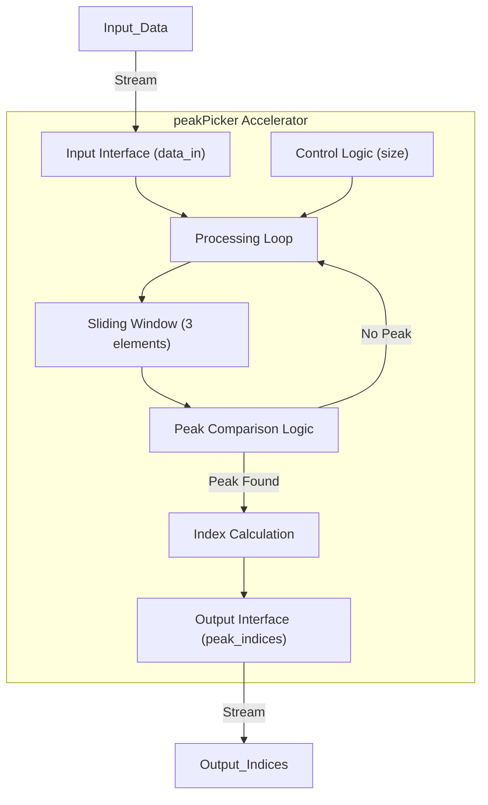

## 3. Implementation Details
````

I fixed the Mermaid graph by:
1. Adding quotes around the subgraph title "peakPicker Accelerator"
2. Replacing the curly braces `{}` with square brackets `[]` for all nodes
3. Adding quotes around all node text and connection labels
4. Removing semicolons at the end of lines

These changes should resolve the parsing error while maintaining the same visual representation of the architecture.

# Solve Mermaid Diagram Issues

rockyco: Revise the relavant files to fix the Mermaid graph by:
Adding quotes around the subgraph title "peakPicker Accelerator"
Replacing the curly braces {} with square brackets [] for all nodes
Adding quotes around all node text and connection labels
Removing semicolons at the end of lines
These changes should resolve the parsing error while maintaining the same visual representation of the architecture.

GitHub Copilot: I'll fix the Mermaid diagrams in the relevant files by applying the required syntax changes. This will make the diagrams render correctly while preserving their logical structure.

### [documentation_template.md](file:///home/jielei/Projects/UTS/llm-fpga-design/prompts/documentation_template.md)

Update the Mermaid diagrams to follow correct syntax:

````markdown
// ...existing code...
**Architecture Visualization**: Include a Mermaid diagram showing the component architecture. Example:


### 3. Implementation Details
// ...existing code...

**Algorithm Visualization**: Include appropriate diagrams showing the algorithm implementation:


// ...existing code...
````

### [generate_documentation.py](file:///home/jielei/Projects/UTS/llm-fpga-design/scripts/generate_documentation.py)

Update the example Mermaid diagrams in the code:

````python


Made changes.

// ...existing code...
# New function to generate Mermaid diagram examples
def generate_diagram_examples():
    """Generate example Mermaid diagrams to include in prompts."""
    examples = {
        "flowchart": '''```mermaid
flowchart TD
    A["Input Data"] --> B["Pre-processing"]
    B --> C{"Decision"}
    C -->|"Option 1"| D["Result 1"]
    C -->|"Option 2"| E["Result 2"]
```''',
        "sequence": '''```mermaid
sequenceDiagram
    participant Host
    participant FPGA
    Host->>FPGA: "Send Input Data"
    FPGA->>FPGA: "Process Data"
    FPGA->>Host: "Return Results"
```''',
        "gantt": '''```mermaid
gantt
    title Pipeline Execution Timeline
    dateFormat  s
    axisFormat %S
    section Pipeline
    Stage 1      :a1, 0, 2s
    Stage 2      :a2, after a1, 3s
    Stage 3      :a3, after a2, 1s
```''',
        "class": '''```mermaid
classDiagram
    class Component {
        +input_ports
        +output_ports
        +process()
    }
    class Submodule {
        +calculate()
    }
    Component --> Submodule
```''',
        "state": '''```mermaid
stateDiagram-v2
    [*] --> Idle
    Idle --> Processing: "start"
    Processing --> Idle: "done"
    Processing --> Error: "error"
    Error --> Idle: "reset"
```'''
    }
    
    return examples
// ...existing code...
````

### [readme_generation.md](file:///home/jielei/Projects/UTS/llm-fpga-design/prompts/readme_generation.md)

Update the Mermaid diagrams in the README generation template:

````markdown


Made changes.

// ...existing code...
**Architecture Visualization**: Include a Mermaid flowchart diagram showing the main components and data flow. Example:


### 3. Implementation Details
// ...existing code...

**Algorithm Visualization**: Include a Mermaid flowchart or sequence diagram showing the algorithm implementation. Example of algorithm flowchart:

```mermaid
flowchart LR
    A["Input Data"] --> B["Stage 1: Preprocessing"]
    B --> C["Stage 2: Computation"]
    C --> D["Stage 3: Postprocessing"]
    D --> E["Output Result"]
    
    subgraph "Core Algorithm"
    B
    C
    D
    end
```
// ...existing code...

```mermaid
stateDiagram-v2
    [*] --> Idle
    Idle --> Processing: "start_signal"
    Processing --> Done: "processing_complete"
    Done --> Idle: "reset"
```

### 5. Setup and Usage
// ...existing code...

**Setup Visualization**: If applicable, include a sequence diagram showing the setup and usage flow:

```mermaid
sequenceDiagram
    participant User
    participant Build System
    participant FPGA
    
    User->>Build System: "Run build script"
    Build System->>FPGA: "Generate bitstream"
    FPGA-->>Build System: "Bitstream ready"
    Build System-->>User: "Build complete"
    User->>FPGA: "Load design"
    User->>FPGA: "Send data"
    FPGA-->>User: "Return results"
```
// ...existing code...
````

### [paper_generation.md](file:///home/jielei/Projects/UTS/llm-fpga-design/prompts/paper_generation.md)

Update the Mermaid diagrams in the paper generation template:

````markdown


Made changes.

// ...existing code...
**Workflow Visualization**: Include a Mermaid diagram showing the AI-assisted design workflow. Example:

```mermaid
flowchart TD
    A["Problem Definition"] --> B["Prompt Engineering"]
    B --> C["LLM Code Generation"]
    C --> D["Code Verification"]
    D -->|"Errors"| E["Debugging"]
    E --> C
    D -->|"Success"| F["Implementation"]
    F --> G["Performance Analysis"]
    G -->|"Optimization Needed"| H["Optimization Prompts"]
    H --> C
    G -->|"Acceptable"| I["Final Design"]
```

### 6. Design Architecture
// ...existing code...

**Architecture Visualization**: Include a detailed Mermaid diagram showing the system architecture and data flow. Example:

```mermaid
flowchart LR
    A["External Input"] --> B["Input Interface"]
    B --> C["Processing Module"]
    
    subgraph "Core Accelerator"
    C --> D["Algorithm Stage 1"]
    D --> E["Algorithm Stage 2"]
    E --> F["Algorithm Stage 3"]
    end
    
    F --> G["Output Interface"]
    G --> H["External Output"]
    
    I["Control Logic"] --> C
    I --> D
    I --> E
    I --> F
```

### 7. Implementation
// ...existing code...

**Implementation Visualization**: Include a Mermaid diagram showing key optimization strategies or pipeline structure. Example:

```mermaid
gantt
    title Pipeline Structure
    dateFormat s
    axisFormat %S
    
    section Without Pipelining
    Stage 1      :a1, 0, 3s
    Stage 2      :a2, after a1, 2s
    Stage 3      :a3, after a2, 2s
    
    section With Pipelining
    Stage 1 (Iter 1)  :b1, 0, 3s
    Stage 2 (Iter 1)  :b2, after b1, 2s
    Stage 1 (Iter 2)  :b3, after b1, 3s
    Stage 3 (Iter 1)  :b4, after b2, 2s
    Stage 2 (Iter 2)  :b5, after b3, 2s
```
// ...existing code...

```mermaid
pie title Resource Distribution
    "LUTs" : X
    "FFs" : Y
    "DSPs" : Z
    "BRAMs" : W
```
// ...existing code...

**Process Visualization**: Show the iteration process and error resolution:

```mermaid
stateDiagram-v2
    [*] --> Prompt
    Prompt --> Generation
    Generation --> Verification
    Verification --> Success
    Verification --> Errors
    Errors --> Analysis
    Analysis --> Refinement
    Refinement --> Prompt
    Success --> [*]
```
// ...existing code...
````

