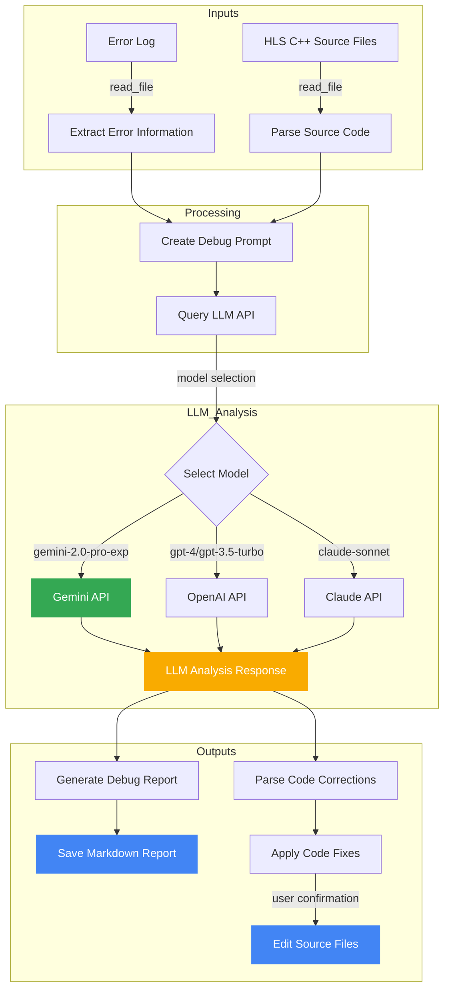

# HLS Debug Automation With LLM Analysis

I've created a Mermaid flowchart that visually represents how the debug assistant uses LLMs (particularly Gemini) to automatically analyze and fix HLS simulation errors.

## Mermaid Graph

## Explanation of the Graph

The flowchart illustrates the end-to-end process of the HLS debug assistant:

1. **Inputs Section**:
   - The process begins with two key inputs: the HLS C++ simulation error log and the source code files
   - These files are read into the system using the `read_file` function

2. **Processing Section**:
   - Error information is extracted from the log file using pattern matching (`extract_error_information`)
   - Source code is parsed and organized
   - These elements are combined to create a comprehensive debug prompt for the LLM that includes both the errors and code context

3. **LLM Analysis Section**:
   - The debug prompt is sent to an LLM API based on the model selection
   - The system supports three LLM services (highlighted in the graph):
     - Google's Gemini models (primary, highlighted in green)
     - OpenAI's GPT models
     - Anthropic's Claude models
   - The LLM processes the prompt and returns an analysis with suggested fixes

4. **Outputs Section**:
   - The LLM response is processed in two ways:
     - A comprehensive debug report is generated and saved as a Markdown file
     - Code corrections are parsed from the LLM response
   - The user can optionally apply the suggested fixes to the source files after confirmation

The key advantage of this approach is automation of the debugging process through AI assistance, particularly leveraging Gemini's capabilities to understand HLS code contexts and simulation errors, then provide targeted fixes with explanations of the underlying issues.