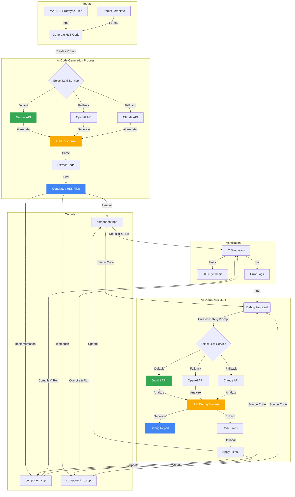

# LLM-Based HLS Code Generation and Debugging Workflow

I've created a Mermaid flowchart that illustrates how AI (particularly Google's Gemini API) is used to automate HLS C++ code generation from MATLAB prototypes and provide debugging assistance.

## Mermaid Graph

## Explanation of the Graph

The flowchart visualizes the complete workflow for automating HLS C++ code generation and debugging using AI, particularly Google's Gemini API:

### 1. Input Stage
- The process begins with MATLAB prototype files containing the reference algorithms
- A prompt template provides the structure for the LLM request
- These inputs are fed into the code generation system

### 2. AI Code Generation Process
- The system creates a comprehensive prompt by combining the MATLAB code with the template
- It then selects an LLM service (Gemini API by default, with OpenAI and Claude as alternatives)
- The LLM generates a response containing the translated HLS C++ implementation
- The system parses this response to extract separate code blocks for different file types

### 3. Output Stage
- Three main files are generated:
  - A header file (.hpp) containing declarations
  - An implementation file (.cpp) with the core HLS code
  - A testbench file (_tb.cpp) for simulation and verification

### 4. Verification Stage
- The generated files are compiled and run through C simulation
- If simulation passes, the code can proceed to HLS synthesis
- If simulation fails, error logs are generated

### 5. AI Debug Assistant
- When errors occur, the debug assistant takes the error logs and source files as input
- It creates a specialized debug prompt describing the errors and code context
- This prompt is sent to the LLM service (again prioritizing Gemini)
- The LLM analyzes the errors and suggests specific code fixes
- The system generates a debug report and extracts actionable code fixes
- These fixes can optionally be applied to update the source files

The workflow demonstrates how modern AI, particularly Google's Gemini API, can dramatically accelerate FPGA development by automating both the initial translation from MATLAB to HLS C++ and the subsequent debugging process. This approach leverages large language models' ability to understand both algorithmic concepts and implementation details across different programming languages.