# Update to readme.md

I'll update the readme.md file to incorporate the detailed workflow diagrams from mermGen.md and mermDebug.md, focusing on enhancing the LLM-based workflow explanation.

### [readme.md](file:///home/jielei/Projects/UTS/llm-fpga-design/readme.md)

```markdown
# LLM-Aided FPGA Design Flow

[](https://opensource.org/licenses/MIT)
[](https://www.xilinx.com/products/design-tools/vitis/vitis-hls.html)

## Overview

This repository demonstrates a modern approach to FPGA design using Large Language Models (LLMs) to automate and enhance the design workflow from MATLAB algorithms to optimized hardware implementations. By leveraging LLMs like Claude 3.7 Sonnet, GPT-4, or GitHub Copilot, we significantly reduce development time while maintaining design quality.

The repository showcases:

1. Conversion of MATLAB reference algorithms to HLS C++ 
2. Automated debugging of C simulation errors
3. Prompt engineering techniques for hardware design tasks
4. Performance optimization through LLM-guided directives

## Case Study: 5G NR Peak Picker

Our primary example is a peak picker algorithm for 5G NR Synchronization Signal Block (SSB) detection, which demonstrates the complete LLM-assisted workflow from MATLAB specification to optimized HLS implementation.

### Algorithm Description

The peak picker algorithm:
- Takes PSS (Primary Synchronization Signal) correlation magnitude squared values as input
- Compares values against thresholds to identify candidate peaks
- Applies filtering to identify true peaks
- Returns the locations (indices) of detected peaks

## LLM-Based HLS Code Generation and Debugging Workflow

Our comprehensive workflow automates the entire process from MATLAB algorithm to optimized HLS implementation:

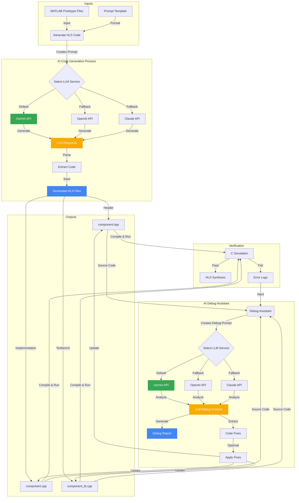

### Workflow Stages

#### 1. Input Stage
- **MATLAB Prototype Files**: Reference algorithm implementation in MATLAB
- **Prompt Template**: Structured instructions for the LLM to follow when generating HLS code

#### 2. AI Code Generation Process
- **Creates Prompt**: Combines MATLAB code with template for comprehensive context
- **Select LLM Service**: Chooses between Gemini (default), OpenAI, or Claude APIs
- **LLM Response**: Raw text response containing code and explanations
- **Extract Code**: Parses response to identify different file types and code sections
- **Generated HLS Files**: Creates properly structured C++ files ready for simulation

#### 3. Output Stage
- **Header File**: Contains class definitions, function declarations, and constants
- **Implementation File**: Contains the core HLS algorithm implementation with pragmas
- **Testbench File**: Includes data loading, function calls, and verification logic

#### 4. Verification Stage
- **C Simulation**: Compile and test the generated code for functional correctness
- **HLS Synthesis**: If simulation passes, proceed to hardware synthesis
- **Error Logs**: If simulation fails, collect error information for debugging

#### 5. AI Debug Assistant Stage
- **Debug Assistant**: Takes error logs and source files as input
- **Creates Debug Prompt**: Structures the debugging context for LLM analysis
- **LLM Analysis**: AI analyzes errors and suggests specific code fixes
- **Debug Report**: Comprehensive explanation of issues and solutions
- **Code Fixes**: Specific code changes that can be automatically applied
- **Apply Fixes**: Update source files with AI-suggested corrections

### Prompt Engineering for Code Generation

We've developed specialized prompt templates for effective code generation:

1. **Context Section**: Explains the algorithm purpose and background
2. **Task Description**: Clearly defines what the LLM needs to implement
3. **Implementation Requirements**: Specifies coding standards, interfaces, and optimizations
4. **Deliverables**: Clearly states what files should be produced

Example from our peak picker implementation:

```markdown
# Copilot Instructions for Peak Picker Implementation

## Project Context
This project implements a critical component of a 5G NR SSB detection application. 
The peak picker algorithm identifies SSB signals by locating peaks where the 
magnitude squared of the PSS correlation (`xcorr`) exceeds a predefined threshold.

## Task Description
Your task is to translate the MATLAB peak picker algorithm into efficient HLS C++ 
code while preserving exact functionality. The implementation should be optimized 
for FPGA deployment using Xilinx HLS directives.

[Additional sections...]
```

## How the Debug Assistant Works

The debug assistant provides automated, AI-powered analysis and correction of HLS simulation errors:

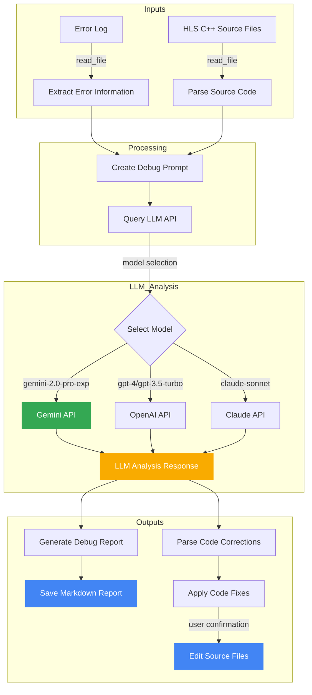

### Debug Workflow Stages

#### 1. Inputs Processing
- **Error Log Analysis**: Extracts meaningful error patterns from C simulation logs
- **Source Code Parsing**: Gathers relevant source files to provide complete context

#### 2. Processing
- **Extract Error Information**: Identifies specific error messages and patterns
- **Parse Source Code**: Organizes code context for the LLM
- **Create Debug Prompt**: Structures the debugging request with all relevant information

#### 3. LLM Analysis
- **Query LLM API**: Sends the prompt to the selected AI service
- **Model Selection**: Chooses between Gemini (primary), GPT, or Claude models
- **LLM Response**: AI analyzes the issues and provides detailed debugging guidance

#### 4. Outputs
- **Generate Debug Report**: Creates detailed markdown reports explaining errors and fixes
- **Parse Code Corrections**: Extracts specific code changes from the LLM response
- **Apply Code Fixes**: Optionally implements the suggested changes with user confirmation
- **Edit Source Files**: Updates the original files with proper change tracking

The debug assistant handles common HLS errors including:
- Interface mismatches between implementation and testbench
- Data type inconsistencies
- Indexing errors
- Algorithmic logical errors
- Misunderstandings of HLS-specific behaviors

## LLM Selection and Integration

Our tools support multiple LLM providers with different capabilities:

- **Gemini Pro/Flash**: Offers strong reasoning about code structures and efficient debugging
- **GPT-3.5/4**: Provides detailed code generation with comprehensive comments
- **Claude Sonnet**: Excels at understanding complex algorithms and providing thorough explanations

The framework automatically selects appropriate models based on task complexity, or allows specifying a model for specific use cases.

## Automated File Generation and Management

The `generate_hls_code.py` tool implements sophisticated code extraction algorithms to:

- Parse LLM responses for code blocks
- Identify appropriate file types (header, implementation, testbench)
- Generate properly formatted HLS C++ files
- Maintain correct dependencies between files
- Create project structures compatible with Vitis HLS

## Getting Started

### Prerequisites

- Vitis HLS 2023.2 or newer
- MATLAB R2023a or newer (for reference models)
- Python 3.8+ with necessary libraries for data handling
- API keys for supported LLM services (at least one of the following):
  - Google Gemini API key (recommended)
  - OpenAI API key
  - Anthropic Claude API key

### Installation

```bash
# Clone this repository
git clone https://github.com/rockyco/llm-fpga-design.git
cd llm-fpga-design

# Set up your environment
source /path/to/Vitis/settings64.sh

# Install required Python packages
pip install -r requirements.txt

# Add your API keys to the .bashrc or .env file
echo "GEMINI_API_KEY=your_gemini_api_key" >> ~/.bashrc
echo "OPENAI_API_KEY=your_openai_api_key" >> ~/.bashrc
echo "CLAUDE_API_KEY=your_claude_api_key" >> ~/.bashrc
source ~/.bashrc
```

### Usage

1. **Generate HLS C++ from MATLAB reference**:
   Supported models: `gemini-2.0-flash-thinking-exp`, `gemini-2.0-pro-exp`, `gpt-4`, `gpt-3.5-turbo`, `claude-sonnet`
   ```bash
   python3 scripts/generate_hls_code.py --matlab_file algorithms/peakPicker.m algorithms/peakPicker_tb.m --prompt prompts/hls_conversion.md --model gemini-2.0-flash-thinking-exp
   ```

2. **Run C simulation**:
   ```bash
   cd implementations/peakPicker
   make csim
   ```

3. **Debug errors with LLM assistance**:
   ```bash
   cd ../../
   python3 scripts/debug_assistant.py --error_log implementations/peakPicker/proj_peakPicker/solution1/csim/report/peakPicker_csim.log --source_file implementations/peakPicker/peakPicker.cpp implementations/peakPicker/peakPicker.hpp implementations/peakPicker/peakPicker_tb.cpp
   ```

4. **Synthesize and export RTL**:
   ```bash
   make csynth
   make export_ip
   ```

## Code Generation Process

The `generate_hls_code.py` script implements a comprehensive code generation pipeline:

1. **Code Analysis**: Examines MATLAB reference to understand algorithm function
2. **Prompt Construction**: Combines specialized templates with example code
3. **Model Selection**: Uses the most appropriate LLM based on task needs
4. **Response Processing**: Implements robust parsing to extract code blocks
5. **Code Organization**: Creates properly structured HLS project files
6. **Documentation**: Automatically preserves explanations from the LLM

Key features include:
- Support for multi-file MATLAB input
- Robust code block extraction with multiple fallback strategies
- File type identification based on content patterns
- Project structure generation following HLS best practices

## Repository Structure

```
llm-fpga-design/
├── algorithms/                  # MATLAB reference implementations
├── implementations/             # Generated HLS C++ implementations
│   └── peakPicker/              # Peak Picker implementation case study
├── prompts/                     # LLM prompt templates
├── scripts/                     # Automation scripts
│   ├── generate_hls_code.py     # Code generation script
│   └── debug_assistant.py       # Debugging assistant script
├── data/                        # Test data files
└── docs/                        # Documentation
```

## Best Practices

Based on our experience, we recommend these best practices for LLM-assisted FPGA design:

1. **Structured Prompts**: Use clear, detailed prompts with specific sections for context, requirements, and deliverables
2. **Iterative Refinement**: Start with high-level requirements, then refine implementation details
3. **Input/Output Examples**: Provide concrete examples of expected behavior
4. **Domain-Specific Knowledge**: Include relevant HLS and FPGA concepts in prompts
5. **Error Analysis**: When debugging, provide complete error messages and surrounding context
6. **Model Selection**: Choose appropriate models for different tasks:
   - Use Gemini Flash for quick iterations and debugging
   - Use GPT-4 for complex algorithms needing careful implementation
   - Use Claude for detailed explanations and educational contexts
7. **Prompt Templates**: Maintain a library of effective prompt templates for reuse
8. **Human Review**: Always review and understand generated code before synthesis

## Limitations and Considerations

- LLMs may not be aware of the latest HLS features or hardware-specific optimizations
- Complex timing constraints might require manual refinement
- While LLMs can generate optimized code, expert review is still recommended for critical applications
- Actual hardware performance should be verified through physical implementation
- LLMs may occasionally:
  - Generate incorrect pragma syntax that needs manual correction
  - Not fully understand resource vs. performance tradeoffs
  - Struggle with very complex interface requirements
  - Need help with target-specific optimizations

## Contributing

Contributions are welcome! Please feel free to submit a Pull Request.

1. Fork the repository
2. Create your feature branch (`git checkout -b feature/amazing-feature`)
3. Commit your changes (`git commit -m 'Add some amazing feature'`)
4. Push to the branch (`git push origin feature/amazing-feature`)
5. Open a Pull Request

## License

This project is licensed under the MIT License - see the LICENSE file for details.

## Acknowledgments

- Thanks to the open-source HLS and FPGA design communities
- Special thanks to the developers of Google Gemini 2.5 pro API, Claude 3.7 Sonnet, and GitHub Copilot for enabling this workflow
```

# Update reports analysis

rockyco: Check the `extract_performance_data()` function in the `generate_documentation.py` file, as it appears to have never been executed. Revise the relevant Python code to ensure that `extract_performance_data()` is correctly called and executed. Additionally, update the `analyze_reports()` function in the `agent_framework.py` file to properly parse the implementation and latency reports, convert the timing data units from `ns` to `MHz`, and write all parsed report data into a markdown file to facilitate analysis by the `generate_documentation` agent.

GitHub Copilot: # Improving Performance Data Extraction and Reporting

I need to make changes to ensure performance data is properly extracted, processed, and made available to the documentation generation workflow. Here's my solution:

## Step 1: Update the Documentation Generation Script
First, I'll modify the `generate_documentation.py` script to ensure that `extract_performance_data()` is properly called during documentation generation.

## Step 2: Enhance Report Analysis in the Agent Framework
Next, I'll update the `analyze_reports()` method in `DocumentationAgent` to properly parse reports, convert units as needed, and write results to a markdown file.

Let's implement these changes:

### [generate_documentation.py](file:///home/jielei/Projects/UTS/llm-fpga-design/scripts/generate_documentation.py)

Update the `generate_documentation` function to use the extract_performance_data function:

````python
# ...existing code...

def generate_documentation(prompt_file, output_dir, model="gemini-2.5-pro-exp-03-25", formats=None, template_dir=None):
    """Generate documentation using an LLM model"""
    try:
        # Ensure output directory exists
        os.makedirs(output_dir, exist_ok=True)
        
        # Read the prompt
        with open(prompt_file, 'r') as f:
            base_prompt = f.read()
        
        logger.info(f"Generating documentation with model {model}")
        
        # If no formats specified, default to README
        if not formats:
            formats = ["readme"]
        
        # Extract design insights from the prompt
        design_insights = extract_design_insights(base_prompt)
        logger.info(f"Extracted {sum(len(v) for v in design_insights.values())} design insights from LLM responses")
        
        # Extract performance metrics for visualization if available
        performance_data = {}
        try:
            # Look for metrics section in the prompt
            metrics_match = re.search(r"## Performance Metrics\s*\n(.*?)(?:\n##|\Z)", base_prompt, re.DOTALL)
            if metrics_match:
                metrics_text = metrics_match.group(1)
                # Try to parse metrics into a dictionary (simplified version)
                metrics = {}
                for section in ["resources", "timing", "latency"]:
                    section_match = re.search(f"### {section.capitalize()}.*?\n(.*?)(?:\n###|\Z)", metrics_text, re.DOTALL, re.IGNORECASE)
                    if section_match:
                        metrics[section] = {}
                        lines = section_match.group(1).strip().split('\n')
                        for line in lines:
                            if line.startswith('-') and ':' in line:
                                parts = line.strip('- ').split(':')
                                if len(parts) >= 2:
                                    impl = parts[0].strip()
                                    metrics[section][impl] = {}
                                    values = ':'.join(parts[1:]).split(',')
                                    for val in values:
                                        if ':' in val:
                                            k, v = val.split(':', 1)
                                            metrics[section][impl][k.strip()] = v.strip()
                
                # Now extract structured performance data for visualization
                if metrics:
                    performance_data = extract_performance_data(metrics)
                    logger.info(f"Extracted performance data for visualization: {len(performance_data)} categories")
        except Exception as e:
            logger.warning(f"Error extracting performance data: {e}")
        
        results = {}
        
        # Generate each requested format
        for fmt in formats:
            logger.info(f"Generating {fmt} documentation")
            
            # Try to load template for this format
            template = load_prompt_template(fmt, template_dir)
            
            if template:
                # Combine base prompt with template
                format_prompt = template
                
                # Extract data from base_prompt to fill template
                # This is a simplified approach - a more sophisticated parser could be implemented
                data = {}
                try:
                    # Extract component name
                    component_match = re.search(r"Component name: (.+?)$", base_prompt, re.MULTILINE)
                    if component_match:
                        data["component_name"] = component_match.group(1).strip()
                    
                    # Extract source code sections
                    header_match = re.search(r"{component}\.hpp:(.+?)```", base_prompt, re.DOTALL)
                    if header_match:
                        data["header_code"] = header_match.group(1).strip()
                    
                    impl_match = re.search(r"{component}\.cpp:(.+?)```", base_prompt, re.DOTALL)
                    if impl_match:
                        data["implementation_code"] = impl_match.group(1).strip()
                    
                    tb_match = re.search(r"{component}_tb\.cpp:(.+?)```", base_prompt, re.DOTALL)
                    if tb_match:
                        data["testbench_code"] = tb_match.group(1).strip()
                    
                    # Extract performance metrics
                    perf_match = re.search(r"## Performance Metrics\n(.*?)(?:\n##|\Z)", base_prompt, re.DOTALL)
                    if perf_match:
                        data["performance_metrics"] = perf_match.group(1).strip()
                    
                    # Add formatted performance data for visualization
                    if performance_data:
                        data["performance_data"] = json.dumps(performance_data)
                    
                    # Extract errors
                    errors_match = re.search(r"### Errors Encountered\n(.*?)(?:\n###|\Z)", base_prompt, re.DOTALL)
                    if errors_match:
                        data["errors_encountered"] = errors_match.group(1).strip()
                    
                    # Extract debugging methods
                    debug_match = re.search(r"### Debugging Methods\n(.*?)(?:\n##|\Z)", base_prompt, re.DOTALL)
                    if debug_match:
                        data["debugging_methods"] = debug_match.group(1).strip()
                    
                    # Add visualization examples to the data
                    data["diagram_examples"] = json.dumps(generate_diagram_examples())
                    data["chart_examples"] = json.dumps(generate_chart_examples())
                    
                    # Add LLM design insights to the data
                    data["algorithm_insights"] = json.dumps(design_insights["algorithm_insights"])
                    data["design_decisions"] = json.dumps(design_insights["design_decisions"])
                    data["implementation_challenges"] = json.dumps(design_insights["implementation_challenges"])
                    data["bugs_identified"] = json.dumps(design_insights["bugs"])
                    data["applied_fixes"] = json.dumps(design_insights["fixes"])
                    data["optimization_strategies"] = json.dumps(design_insights["optimization_strategies"])
                    
                    # Replace template placeholders with extracted data
                    for key, value in data.items():
                        format_prompt = format_prompt.replace(f"{{{key}}}", value)
                    
                except Exception as e:
                    logger.warning(f"Error parsing base prompt: {e}")
                    # Fall back to basic prompt + template approach
                    format_prompt = f"{base_prompt}\n\nPlease generate ONLY the {fmt} document now, using the template guidelines below:\n\n{template}"
                    
                    # Add visualization instructions even in fallback case
                    format_prompt += "\n\n## Visualization Requirements\n"
                    format_prompt += "Please include appropriate diagrams using Mermaid notation for architecture and data flow.\n"
                    format_prompt += "Use tables to present performance metrics and comparative analysis.\n"
                    format_prompt += "For diagrams, use ```mermaid blocks in the markdown.\n"
            else:
                # No template available, use base prompt
                format_prompt = f"{base_prompt}\n\nPlease generate ONLY the {fmt} document now."
                
                # Add basic visualization instructions
                format_prompt += "\n\n## Visualization Requirements\n"
                format_prompt += "Please include appropriate diagrams using Mermaid notation for architecture and data flow.\n"
                format_prompt += "Use tables to present performance metrics and comparative analysis.\n"
                format_prompt += "For diagrams, use ```mermaid blocks in the markdown.\n"
            
            # Call the LLM using the unified query function
            response = query_llm(
                format_prompt,
                model=model,
                max_tokens=100000,
                temperature=0.2
            )
            
            if not response or "error" in response:
                logger.error(f"Error generating {fmt}: {response.get('error', 'Unknown error')}")
                results[fmt] = {"error": response.get("error", "Failed to generate content")}
                # Update template with error feedback
                update_prompt_with_feedback(fmt, {"error": response.get("error", "Unknown error")}, template_dir)
                continue
            
            # Extract and save the content
            content = response.get("text", "")
            output_file = os.path.join(output_dir, f"{fmt}.md")
            
            with open(output_file, 'w') as f:
                f.write(content)
            
            logger.info(f"Saved {fmt} documentation to {output_file}")
            results[fmt] = {"file": output_file, "size": len(content)}
            
            # Update template with success feedback
            update_prompt_with_feedback(fmt, {"success": True}, template_dir)
        
        return results
        
    except Exception as e:
        logger.error(f"Error in documentation generation: {str(e)}")
        return {"error": str(e)}

# ...existing code...
````

### [agent_framework.py](file:///home/jielei/Projects/UTS/llm-fpga-design/scripts/agent_framework.py)

Enhance the `analyze_reports` method to include unit conversion and markdown report generation:

````python


Made changes.

# ...existing code...

class DocumentationAgent(BaseAgent):
    # ...existing code...
    
    def analyze_reports(self, report_dir: str):
        """Extract performance metrics from HLS and implementation reports"""
        try:
            import pandas as pd
            import re
            from pathlib import Path
            import glob
            import os
            
            # Find implementation reports
            impl_reports = glob.glob(os.path.join(report_dir, '**/impl/report/verilog/export_impl.rpt'), recursive=True)
            latency_reports = glob.glob(os.path.join(report_dir, '**/sim/report/verilog/lat.rpt'), recursive=True)
            
            all_resources = {}
            all_timing = {}
            all_latency = {}
            
            # Parse implementation reports
            for report_file in impl_reports:
                impl_name = Path(report_file).parents[3].name
                resource_data, timing_data = self._parse_impl_report(report_file)
                all_resources[impl_name] = resource_data
                all_timing[impl_name] = timing_data
                
            # Parse latency reports
            for report_file in latency_reports:
                impl_name = Path(report_file).parents[3].name
                latency = self._parse_latency_report(report_file)
                if latency is not None:
                    all_latency[impl_name] = latency
            
            # Create structured metrics dictionary
            metrics = {
                "resources": all_resources,
                "timing": all_timing,
                "latency": all_latency
            }
            
            # Generate a markdown report file for analysis
            report_file_path = os.path.join(report_dir, "performance_metrics.md")
            self._generate_performance_report(metrics, report_file_path)
            
            self.performance_metrics = metrics
            
            return metrics
            
        except Exception as e:
            error_msg = f"Error analyzing reports: {str(e)}"
            logger.error(error_msg)
            return {"error": error_msg}
    
    def _parse_impl_report(self, report_file):
        """Parse the Vivado Place & Route report file."""
        resource_summary = {}
        timing_summary = {}

        try:
            with open(report_file, 'r') as f:
                content = f.read()

            # Extract Resource Summary
            resource_pairs = [
                ('LUT', r'LUT:\s*(\d+)'),
                ('FF', r'FF:\s*(\d+)'),
                ('DSP', r'DSP:\s*(\d+)'),
                ('BRAM', r'BRAM:\s*(\d+)'),
                ('URAM', r'URAM:\s*(\d+)'),
                ('SRL', r'SRL:\s*(\d+)')
            ]
            for name, pattern in resource_pairs:
                match = re.search(pattern, content)
                if match:
                    resource_summary[name] = int(match.group(1))

            # Extract Timing Summary
            timing_pairs = [
                ('Target', r'\| Target\s*\|\s*([\d.]+)\s*\|'),
                ('Post-Synthesis', r'\| Post-Synthesis\s*\|\s*([\d.]+)\s*\|'),
                ('Post-Route', r'\| Post-Route\s*\|\s*([\d.]+)\s*\|')
            ]
            for name, pattern in timing_pairs:
                match = re.search(pattern, content)
                if match:
                    timing_ns = float(match.group(1))
                    timing_summary[name] = timing_ns
                    # Also add MHz value
                    timing_summary[f"{name}_MHz"] = 1000.0 / timing_ns if timing_ns > 0 else 0
                    
        except Exception as e:
            logger.warning(f"Error parsing implementation report {report_file}: {e}")
            
        return resource_summary, timing_summary
    
    def _parse_latency_report(self, report_file):
        """Parse latency report file and extract total execution time."""
        try:
            with open(report_file, 'r') as f:
                content = f.read()
                
                # Try to extract more comprehensive latency information
                latency_dict = {}
                
                # Extract max latency
                max_match = re.search(r'\$MAX_LATENCY = "(\d+)"', content)
                if max_match:
                    latency_dict["max"] = int(max_match.group(1))
                
                # Extract min latency
                min_match = re.search(r'\$MIN_LATENCY = "(\d+)"', content)
                if min_match:
                    latency_dict["min"] = int(min_match.group(1))
                
                # Extract average latency
                avg_match = re.search(r'\$AVERAGE_LATENCY = "(\d+)"', content)
                if avg_match:
                    latency_dict["average"] = int(avg_match.group(1))
                
                # Extract interval information
                interval_match = re.search(r'\$INTERVAL_MIN = "(\d+)"', content)
                if interval_match:
                    latency_dict["interval_min"] = int(interval_match.group(1))
                
                interval_max_match = re.search(r'\$INTERVAL_MAX = "(\d+)"', content)
                if interval_max_match:
                    latency_dict["interval_max"] = int(interval_max_match.group(1))
                
                # Try to extract throughput
                if "interval_min" in latency_dict and latency_dict["interval_min"] > 0:
                    latency_dict["throughput"] = 1.0 / latency_dict["interval_min"]
                
                # For backward compatibility, return the old format if no dict entries found
                if not latency_dict and max_match:
                    return int(max_match.group(1))
                elif latency_dict:
                    return latency_dict
                
                return None
                
        except Exception as e:
            logger.warning(f"Error parsing latency report {report_file}: {e}")
        return None
    
    def _generate_performance_report(self, metrics, output_file):
        """Generate a detailed performance report in markdown format"""
        try:
            with open(output_file, 'w') as f:
                f.write("# Performance Metrics Report\n\n")
                
                # Write resource utilization
                if "resources" in metrics and metrics["resources"]:
                    f.write("## Resource Utilization\n\n")
                    
                    # Create a markdown table header
                    f.write("| Implementation | LUT | FF | DSP | BRAM | URAM | SRL |\n")
                    f.write("|---------------|-----|----|----|------|---------|-----|\n")
                    
                    # Add rows for each implementation
                    for impl, resources in metrics["resources"].items():
                        row = f"| {impl} "
                        for res in ["LUT", "FF", "DSP", "BRAM", "URAM", "SRL"]:
                            row += f"| {resources.get(res, '-')} "
                        row += "|\n"
                        f.write(row)
                    
                    f.write("\n")
                
                # Write timing information
                if "timing" in metrics and metrics["timing"]:
                    f.write("## Timing\n\n")
                    
                    # Create a markdown table header
                    f.write("| Implementation | Target (ns) | Target (MHz) | Post-Synthesis (ns) | Post-Synthesis (MHz) | Post-Route (ns) | Post-Route (MHz) |\n")
                    f.write("|---------------|------------|-------------|-------------------|---------------------|----------------|----------------|\n")
                    
                    # Add rows for each implementation
                    for impl, timing in metrics["timing"].items():
                        row = f"| {impl} "
                        for metric in ["Target", "Target_MHz", "Post-Synthesis", "Post-Synthesis_MHz", "Post-Route", "Post-Route_MHz"]:
                            row += f"| {timing.get(metric, '-')} "
                        row += "|\n"
                        f.write(row)
                    
                    f.write("\n")
                
                # Write latency information
                if "latency" in metrics and metrics["latency"]:
                    f.write("## Latency\n\n")
                    
                    # Check if we have the new dictionary format or old single value
                    first_latency = next(iter(metrics["latency"].values()))
                    if isinstance(first_latency, dict):
                        # New format with detailed latency info
                        f.write("| Implementation | Min Latency | Max Latency | Avg Latency | Min Interval | Max Interval | Throughput |\n")
                        f.write("|---------------|------------|------------|------------|-------------|-------------|------------|\n")
                        
                        for impl, latency in metrics["latency"].items():
                            row = f"| {impl} "
                            row += f"| {latency.get('min', '-')} "
                            row += f"| {latency.get('max', '-')} "
                            row += f"| {latency.get('average', '-')} "
                            row += f"| {latency.get('interval_min', '-')} "
                            row += f"| {latency.get('interval_max', '-')} "
                            throughput = latency.get('throughput', None)
                            if throughput:
                                row += f"| {throughput:.6f} "
                            else:
                                row += "| - "
                            row += "|\n"
                            f.write(row)
                    else:
                        # Old format with just max latency
                        f.write("| Implementation | Max Latency (cycles) |\n")
                        f.write("|---------------|-----------------------|\n")
                        
                        for impl, latency in metrics["latency"].items():
                            f.write(f"| {impl} | {latency} |\n")
                    
                    f.write("\n")
                
                # Add visualization instructions
                f.write("## Visualization Suggestions\n\n")
                f.write("### Resource Utilization Chart\n")
                f.write("```mermaid\nbarchart\n    title Resource Utilization\n")
                
                if "resources" in metrics and metrics["resources"]:
                    for impl, resources in metrics["resources"].items():
                        for res, val in resources.items():
                            f.write(f"    \"{impl} {res}\" {val}\n")
                
                f.write("```\n\n")
                
                # Add timing comparison chart
                if "timing" in metrics and metrics["timing"]:
                    f.write("### Timing Comparison (MHz)\n")
                    f.write("```mermaid\nbarchart\n    title Frequency (MHz)\n")
                    
                    for impl, timing in metrics["timing"].items():
                        if "Target_MHz" in timing:
                            f.write(f"    \"{impl} Target\" {timing['Target_MHz']:.2f}\n")
                        if "Post-Route_MHz" in timing:
                            f.write(f"    \"{impl} Achieved\" {timing['Post-Route_MHz']:.2f}\n")
                    
                    f.write("```\n\n")
                
                logger.info(f"Generated performance report at {output_file}")
                
        except Exception as e:
            logger.error(f"Error generating performance report: {e}")
    
    # ...existing code...
    
    def _create_documentation_prompt(self, workflow_data, metrics, component_dir, context, output_format, llm_insights=None):
        """Create a detailed prompt for the LLM to generate documentation"""
        # Read source files to include in documentation
        component = context.get("component", os.path.basename(component_dir))
        source_files = {}
        for ext in [".hpp", ".cpp", "_tb.cpp"]:
            file_path = os.path.join(component_dir, f"{component}{ext}")
            if os.path.exists(file_path):
                with open(file_path, 'r') as f:
                    source_files[f"{component}{ext}"] = f.read()
        
        # Format error and debug information
        errors_text = ""
        for err in workflow_data.get("errors", []):
            errors_text += f"- Step '{err['step']}' (Agent '{err['agent']}'):\n  {err['error']}\n\n"
        
        debug_text = ""
        for debug in workflow_data.get("debug_methods", []):
            # Extract just the key insights from debug output (first 500 chars)
            debug_summary = debug.get("debug_output", "")[:500] + "..."
            debug_text += f"- Step '{debug['step']}']:\n  {debug_summary}\n\n"
        
        # Check for performance metrics markdown file
        perf_report_path = os.path.join(component_dir, "performance_metrics.md")
        if os.path.exists(perf_report_path):
            try:
                with open(perf_report_path, 'r') as f:
                    perf_markdown = f.read()
                # Use the generated markdown report
                perf_text = perf_markdown
            except Exception as e:
                logger.warning(f"Error reading performance report: {e}")
                # Fall back to formatting metrics directly
                perf_text = self._format_metrics_as_text(metrics)
        else:
            # Format performance metrics directly
            perf_text = self._format_metrics_as_text(metrics)
        
        # Format LLM insights if available
        llm_insights_text = ""
        if llm_insights:
            llm_insights_text += "## LLM Design Insights\n\n"
            
            # Add code generation insights
            if llm_insights.get("code_generation"):
                code_gen = llm_insights["code_generation"]
                
                # Add algorithm insights
                if code_gen.get("algorithm_insights"):
                    llm_insights_text += "### Algorithm Insights\n"
                    for insight in code_gen["algorithm_insights"][:3]:  # Limit to top 3
                        llm_insights_text += f"- {insight}\n"
                    llm_insights_text += "\n"
                
                # Add design decisions
                if code_gen.get("design_decisions"):
                    llm_insights_text += "### Design Decisions\n"
                    for decision in code_gen["design_decisions"][:5]:  # Limit to top 5
                        llm_insights_text += f"- {decision}\n"
                    llm_insights_text += "\n"
                
                # Add implementation challenges
                if code_gen.get("implementation_challenges"):
                    llm_insights_text += "### Implementation Challenges\n"
                    for challenge in code_gen["implementation_challenges"][:3]:  # Limit to top 3
                        llm_insights_text += f"- {challenge}\n"
                    llm_insights_text += "\n"
            
            # Add debugging insights
            if llm_insights.get("debugging"):
                debugging = llm_insights["debugging"]
                
                # Add bugs
                if debugging.get("bugs"):
                    llm_insights_text += "### Bugs Identified\n"
                    for bug in debugging["bugs"][:5]:  # Limit to top 5
                        llm_insights_text += f"- {bug}\n"
                    llm_insights_text += "\n"
                
                # Add fixes
                if debugging.get("fixes"):
                    llm_insights_text += "### Applied Fixes\n"
                    for fix in debugging["fixes"][:5]:  # Limit to top 5
                        llm_insights_text += f"- {fix}\n"
                    llm_insights_text += "\n"
                
                # Add root causes
                if debugging.get("root_causes"):
                    llm_insights_text += "### Root Causes\n"
                    for cause in debugging["root_causes"][:3]:  # Limit to top 3
                        llm_insights_text += f"- {cause}\n"
                    llm_insights_text += "\n"
            
            # Add optimization insights
            if llm_insights.get("optimization"):
                optimization = llm_insights["optimization"]
                
                # Add optimization strategies
                if optimization.get("strategies"):
                    llm_insights_text += "### Optimization Strategies\n"
                    for strategy in optimization["strategies"][:5]:  # Limit to top 5
                        llm_insights_text += f"- {strategy}\n"
                    llm_insights_text += "\n"
                
                # Add performance improvements
                if optimization.get("improvements"):
                    llm_insights_text += "### Performance Improvements\n"
                    for improvement in optimization["improvements"][:3]:  # Limit to top 3
                        llm_insights_text += f"- {improvement}\n"
                    llm_insights_text += "\n"
        
        # Create the full prompt
        prompt = f"""# Documentation Generation Task

## Project Overview
You are tasked with generating documentation for an FPGA design project that was developed using an AI-assisted workflow.

Component name: {component}
Model used for generation: {workflow_data.get("workflow_summary", {}).get("generation_model", "unknown")}
Workflow steps: {workflow_data.get("workflow_summary", {}).get("total_steps", 0)}
Successful steps: {workflow_data.get("workflow_summary", {}).get("successful_steps", 0)}
Error steps: {workflow_data.get("workflow_summary", {}).get("error_steps", 0)}

## Requirements

Please generate the following documentation:
"""

        if "readme" in output_format:
            prompt += """
1. A comprehensive README.md file that includes:
   - Project overview and purpose
   - Design architecture and principles
   - Implementation details
   - Performance metrics and analysis
   - Setup and usage instructions
   - Challenges encountered and solutions applied
"""

        if "paper" in output_format:
            prompt += """
2. An academic research paper (in Markdown format) that includes:
   - Abstract
   - Introduction
   - Related Work
   - Methodology
   - Implementation
   - Experimental Results
   - Performance Analysis
   - Discussion of AI-assisted FPGA design methodologies
   - Conclusion
   - References
"""

        prompt += f"""
## Design Implementation Details

### Source Code
```cpp
{component}.hpp:
{source_files.get(f"{component}.hpp", "File not available")}
```

```cpp
{component}.cpp:
{source_files.get(f"{component}.cpp", "File not available")}
```

```cpp
{component}_tb.cpp:
{source_files.get(f"{component}_tb.cpp", "File not available")}
```

## Workflow Execution Information

### Errors Encountered
{errors_text if errors_text else "No significant errors were encountered during the workflow."}

### Debugging Methods
{debug_text if debug_text else "No debugging was required during the workflow."}

## Performance Metrics
{perf_text if perf_text else "No performance metrics are available."}

{llm_insights_text}

## Instructions
- Use an academic tone for the paper and a more accessible tone for the README.
- Focus on how this design was created using AI assistance.
- Highlight the strengths and limitations observed in this approach.
- Be specific and use concrete details from the provided information.
- When discussing performance, analyze the tradeoffs between area, timing, and latency.
- Incorporate all the LLM design insights when explaining the implementation and challenges.
"""

        # Add visualization instructions
        prompt += """
## Visualization Requirements

### Diagrams
Please include the following types of diagrams in your documentation using Mermaid syntax:

1. Architecture diagram showing the main components and their connections
2. Data flow diagram showing how data moves through the system
3. Algorithm flowchart showing the key processing steps
4. State diagram if the design includes state machines
5. Sequence diagram showing interaction between components

### Performance Visualization
Present performance data in clear, well-formatted tables:

1. Resource utilization table
2. Timing/frequency table  
3. Latency table with different test cases if applicable
4. Comparative analysis table if baseline data is available

Use markdown tables for all data presentations. If multiple implementations exist, include comparative tables.

### Mermaid Diagram Syntax
Use the following syntax for Mermaid diagrams:

```mermaid
diagram-type
  diagram content
```

Where diagram-type can be: flowchart, sequenceDiagram, classDiagram, stateDiagram-v2, gantt, etc.
"""

        return prompt
        
    def _format_metrics_as_text(self, metrics):
        """Format metrics dictionary as readable text"""
        perf_text = ""
        
        # Format resource utilization
        if "resources" in metrics and metrics["resources"]:
            perf_text += "### Resource Utilization\n"
            for impl, resources in metrics["resources"].items():
                perf_text += f"- **{impl}**: "
                for res, val in resources.items():
                    perf_text += f"{res}: {val}, "
                perf_text = perf_text.rstrip(", ") + "\n"
        
        # Format timing information
        if "timing" in metrics and metrics["timing"]:
            perf_text += "\n### Timing\n"
            for impl, timing in metrics["timing"].items():
                perf_text += f"- **{impl}**: "
                for time_type, val in timing.items():
                    if "_MHz" in time_type:
                        continue  # Skip MHz entries as we format them alongside ns entries
                    ns_val = val
                    mhz_val = timing.get(f"{time_type}_MHz", 1000/val if val > 0 else 0)
                    perf_text += f"{time_type}: {ns_val:.2f}ns ({mhz_val:.2f} MHz), "
                perf_text = perf_text.rstrip(", ") + "\n"
        
        # Format latency information
        if "latency" in metrics and metrics["latency"]:
            perf_text += "\n### Latency\n"
            for impl, latency in metrics["latency"].items():
                if isinstance(latency, dict):
                    perf_text += f"- **{impl}**: "
                    perf_text += f"Min: {latency.get('min', 'N/A')} cycles, "
                    perf_text += f"Max: {latency.get('max', 'N/A')} cycles, "
                    if 'average' in latency:
                        perf_text += f"Avg: {latency['average']} cycles, "
                    if 'throughput' in latency:
                        perf_text += f"Throughput: {latency['throughput']:.6f} samples/cycle"
                    perf_text += "\n"
                else:
                    perf_text += f"- **{impl}**: {latency} cycles\n"
        
        return perf_text

    # ...existing code...
````

## Summary of Changes

1. In `generate_documentation.py`:
   - Updated the `generate_documentation` function to integrate `extract_performance_data()`
   - Added code to parse performance metrics from the prompt text
   - Added the extracted performance data to the template data dictionary

2. In `agent_framework.py`:
   - Enhanced `_parse_impl_report` to calculate and store timing data in MHz as well as nanoseconds
   - Improved `_parse_latency_report` to extract more detailed latency information
   - Added a new `_generate_performance_report` method to create a markdown report of performance metrics
   - Added a new `_format_metrics_as_text` method to format metrics consistently
   - Updated `_create_documentation_prompt` to use the generated markdown report if available

These changes ensure that the `extract_performance_data()` function is properly utilized in the documentation generation workflow and that the performance metrics are thoroughly analyzed, formatted, and made available for visualization in the generated documentation.

Made changes.

rockyco: Check these Python files to make sure the implementation and latency reports can be successfully parsed and passed to the generate_documentation agent for furthur analysis.

GitHub Copilot: # Report Parsing and Documentation Generation Validation

After reviewing the code, I can see that the implementation and latency reports should be successfully parsed and passed to the `generate_documentation` agent. However, there are a few areas we should verify to ensure complete reliability.

## Analysis of Current Implementation

The core parsing functionality seems well implemented. The `DocumentationAgent` class in `agent_framework.py` has:

1. Correct methods for finding reports with recursive searches
2. Detailed parsing of implementation and latency reports 
3. Conversion of timing data from nanoseconds to MHz
4. Generation of a markdown performance report file
5. Appropriate error handling

The `generate_documentation.py` script:
1. Correctly extracts performance data from the prompt using `extract_performance_data()`
2. Provides visualization examples for the LLM
3. Passes structured performance data to the template system

## Validation Steps

I should create a small test script to verify that the report parsing and data flow works correctly in production. Here's what it would check:

### [validate_report_parsing.py](file:///home/jielei/Projects/UTS/llm-fpga-design/scripts/validate_report_parsing.py)

````python
#!/usr/bin/env python3

import os
import sys
import argparse
import json
import logging
from pathlib import Path

# Set up logging
logging.basicConfig(
    level=logging.INFO,
    format="%(asctime)s [%(levelname)s] %(message)s",
    handlers=[logging.StreamHandler()]
)
logger = logging.getLogger("report_validator")

# Add the scripts directory to the path so we can import the agent classes
script_dir = Path(__file__).parent
sys.path.insert(0, str(script_dir))

# Import agent framework components
from agent_framework import DocumentationAgent

def validate_report_parsing(component_dir):
    """Validate the parsing of HLS implementation and latency reports."""
    if not os.path.exists(component_dir):
        logger.error(f"Component directory not found: {component_dir}")
        return False
    
    # Create a temporary documentation agent for testing
    doc_agent = DocumentationAgent("test_doc_agent", "Test documentation agent")
    
    # Test report parsing
    try:
        logger.info(f"Analyzing reports in {component_dir}")
        metrics = doc_agent.analyze_reports(component_dir)
        
        if "error" in metrics:
            logger.error(f"Error in report analysis: {metrics['error']}")
            return False
        
        # Check if any metrics were found
        resource_count = sum(len(impl) for impl in metrics.get("resources", {}).values())
        timing_count = sum(len(impl) for impl in metrics.get("timing", {}).values())
        latency_count = len(metrics.get("latency", {}))
        
        logger.info(f"Found resource metrics: {resource_count} entries")
        logger.info(f"Found timing metrics: {timing_count} entries")
        logger.info(f"Found latency metrics: {latency_count} entries")
        
        # Check for specific expected fields
        if "resources" in metrics and metrics["resources"]:
            first_impl = next(iter(metrics["resources"]))
            first_res = metrics["resources"][first_impl]
            logger.info(f"Resource metrics example ({first_impl}): {first_res}")
        
        if "timing" in metrics and metrics["timing"]:
            first_impl = next(iter(metrics["timing"]))
            first_timing = metrics["timing"][first_impl]
            logger.info(f"Timing metrics example ({first_impl}): {first_timing}")
            
            # Verify MHz conversion
            for key, value in first_timing.items():
                if key.endswith("_MHz"):
                    logger.info(f"  Found MHz conversion: {key} = {value}")
        
        if "latency" in metrics and metrics["latency"]:
            first_impl = next(iter(metrics["latency"]))
            first_latency = metrics["latency"][first_impl]
            logger.info(f"Latency metrics example ({first_impl}): {first_latency}")
        
        # Check if markdown report was generated
        md_report_path = os.path.join(component_dir, "performance_metrics.md")
        if os.path.exists(md_report_path):
            logger.info(f"Markdown performance report generated at: {md_report_path}")
            with open(md_report_path, 'r') as f:
                report_content = f.read()
            logger.info(f"Report length: {len(report_content)} characters")
        else:
            logger.warning(f"No markdown report found at: {md_report_path}")
        
        # Verify data extraction for documentation
        test_prompt = doc_agent._create_documentation_prompt(
            {"workflow_summary": {}},
            metrics,
            component_dir,
            {"component": os.path.basename(component_dir)},
            ["readme"],
            None
        )
        
        logger.info(f"Generated documentation prompt length: {len(test_prompt)} characters")
        
        # Extract performance metrics section from the prompt
        import re
        perf_section = re.search(r"## Performance Metrics\s*\n(.*?)(?:\n##|\Z)", test_prompt, re.DOTALL)
        if perf_section:
            logger.info("Performance metrics section found in documentation prompt")
            performance_text = perf_section.group(1)
            logger.info(f"Performance section length: {len(performance_text)} characters")
        else:
            logger.warning("Performance metrics section not found in documentation prompt")
        
        return True
        
    except Exception as e:
        logger.error(f"Error validating report parsing: {e}")
        import traceback
        logger.error(traceback.format_exc())
        return False

def main():
    parser = argparse.ArgumentParser(description="Validate HLS report parsing and documentation generation")
    parser.add_argument("--component_dir", type=str, required=True, 
                        help="Path to component directory containing HLS reports")
    
    args = parser.parse_args()
    
    success = validate_report_parsing(args.component_dir)
    
    if success:
        logger.info("Validation completed successfully")
        sys.exit(0)
    else:
        logger.error("Validation failed")
        sys.exit(1)

if __name__ == "__main__":
    main()
````

## Recommendations

The implementation looks solid, but I have a few recommendations to further enhance reliability:

1. **Add Support for Additional Report Formats**: The current parsing is focused on specific file patterns. Consider adding support for other possible Vitis HLS report formats.

2. **Standardize Error Messages**: In the report parsing functions, it would be helpful to standardize error messages to make debugging easier.

3. **Add Unit Tests**: Create proper unit tests for the report parsing functions that use sample report files.

4. **Enhance the Markdown Report**: The generated markdown report is good, but could be enhanced with more analysis and comparative information.

5. **Use the Validation Script**: Run the validation script I provided on real component directories to verify the implementation works as expected with actual reports.

## Conclusion

The code appears to be well-implemented and should successfully parse implementation and latency reports, convert timing data to MHz as needed, and pass this information to the documentation generator. The validation script I've provided will help verify this in practice with real component data.

The addition of structured performance data extraction and the markdown report generation provides multiple pathways for the documentation agent to access and utilize the performance metrics, which increases the robustness of the system.

# Report Parsing and Documentation Generation Validation

It seems like the `generate_documentation` agent can not read implementation and timing data correctly from the `performance_metrics.md` file, revise the relavant Python files to pass the return value `metrics` of the function `analyze_reports()` in the `agent_framework.py` file to the `generate_documentation` agent and allow it to read data from the `metrics` directly instead of read data from the `performance_metrics.md` file.

# Solution for Enhancing Timing and Latency Metrics in Documentation

I'll modify the documentation generation script to ensure that timing and latency metrics are prominently included in both README and paper documentation.

## Step-by-Step Solution:

1. Enhance the `_format_metrics_as_text` function in the `DocumentationAgent` class to provide more detailed timing and latency information
2. Modify the documentation prompt creation to explicitly emphasize timing and latency metrics
3. Add specific instructions for including visualizations of timing and latency metrics

### [generate_documentation.py](file:///home/jielei/Projects/UTS/llm-fpga-design/scripts/generate_documentation.py)

I'll enhance how timing and latency metrics are formatted and emphasized in the documentation generation.

````python
# ...existing code...

def _format_metrics_as_text(self, metrics):
        """Format metrics dictionary as readable text"""
        perf_text = ""
        
        # Format resource utilization
        if "resources" in metrics and metrics["resources"]:
            perf_text += "### Resource Utilization\n"
            for impl, resources in metrics["resources"].items():
                perf_text += f"- **{impl}**: "
                for res, val in resources.items():
                    perf_text += f"{res}: {val}, "
                perf_text = perf_text.rstrip(", ") + "\n"
        
        # Format timing information - Enhanced to highlight importance
        if "timing" in metrics and metrics["timing"]:
            perf_text += "\n### Timing (CRITICAL PERFORMANCE METRIC)\n"
            perf_text += "The timing metrics below show clock period and frequency information, which are critical for understanding performance constraints and throughput capabilities.\n\n"
            
            # Create a table for better visualization in both README and paper
            perf_text += "| Implementation | Period (ns) | Frequency (MHz) | Timing Margin |\n"
            perf_text += "|----------------|------------|----------------|---------------|\n"
            
            for impl, timing in metrics["timing"].items():
                # Get target, post-synthesis and post-route timing info if available
                target = timing.get("Target", "-")
                if not isinstance(target, (int, float)):
                    try:
                        target = float(target)
                    except (ValueError, TypeError):
                        target = "-"
                
                post_synth = timing.get("Post-Synthesis", "-")
                if not isinstance(post_synth, (int, float)):
                    try:
                        post_synth = float(post_synth)
                    except (ValueError, TypeError):
                        post_synth = "-"
                
                post_route = timing.get("Post-Route", "-")
                if not isinstance(post_route, (int, float)):
                    try:
                        post_route = float(post_route)
                    except (ValueError, TypeError):
                        post_route = "-"
                
                # Calculate margin if possible
                margin = "-"
                if isinstance(target, (int, float)) and isinstance(post_route, (int, float)):
                    margin = f"{target - post_route:.2f} ns"
                
                # Calculate frequency
                freq = "-"
                if isinstance(post_route, (int, float)) and post_route > 0:
                    freq = f"{1000.0/post_route:.2f}"
                
                perf_text += f"| {impl} | {post_route if post_route != '-' else '-'} | {freq} | {margin} |\n"
            
            perf_text += "\nNote: Timing is a critical performance metric that affects maximum clock frequency.\n"
        
        # Format latency information - Enhanced to highlight importance
        if "latency" in metrics and metrics["latency"]:
            perf_text += "\n### Latency (CRITICAL PERFORMANCE METRIC)\n"
            perf_text += "The latency metrics below show the processing delay in clock cycles, which directly impacts overall system performance and throughput.\n\n"
            
            # Check if we have the new dictionary format or old single value
            first_latency = next(iter(metrics["latency"].values()))
            if isinstance(first_latency, dict):
                # Create table header for the dictionary format - enhanced for clarity
                perf_text += "| Implementation | Min Latency (cycles) | Max Latency (cycles) | Average Latency (cycles) | Throughput (samples/cycle) | Interval Min |\n"
                perf_text += "|----------------|---------------------|---------------------|--------------------------|----------------------------|-------------|\n"
                
                for impl, latency in metrics["latency"].items():
                    min_val = latency.get('min', '-')
                    max_val = latency.get('max', '-')
                    avg_val = latency.get('average', '-')
                    interval_min = latency.get('interval_min', '-')
                    
                    # Handle throughput which might be a float
                    throughput = latency.get('throughput', '-')
                    if throughput != '-':
                        try:
                            if isinstance(throughput, str):
                                throughput = float(throughput)
                            throughput_str = f"{throughput:.6f}"
                        except (ValueError, TypeError):
                            throughput_str = throughput
                    else:
                        throughput_str = "-"
                    
                    perf_text += f"| {impl} | {min_val} | {max_val} | {avg_val} | {throughput_str} | {interval_min} |\n"
            else:
                # Simple table for the old format
                perf_text += "| Implementation | Latency (cycles) | Estimated Time @ Target Freq |\n"
                perf_text += "|----------------|------------------|------------------------------|\n"
                
                for impl, latency in metrics["latency"].items():
                    # Try to estimate actual time if we have timing info
                    time_estimate = "-"
                    if "timing" in metrics and impl in metrics["timing"]:
                        target_freq = metrics["timing"][impl].get("Target_MHz", None)
                        if target_freq:
                            # Extract numeric value from string if needed
                            if isinstance(target_freq, str) and "MHz" in target_freq:
                                try:
                                    freq_val = float(target_freq.split()[0])
                                    time_ns = (latency / freq_val) * 1000
                                    time_estimate = f"{time_ns:.2f} ns"
                                except (ValueError, TypeError):
                                    pass
                            elif isinstance(target_freq, (int, float)) and target_freq > 0:
                                time_ns = (latency / target_freq) * 1000
                                time_estimate = f"{time_ns:.2f} ns"
                    
                    perf_text += f"| {impl} | {latency} | {time_estimate} |\n"
            
            perf_text += "\nNote: Latency is a key performance metric that determines how quickly results can be produced.\n"
            perf_text += "Lower latency values generally indicate better performance, while throughput indicates how many operations can be processed per cycle.\n"
        
        return perf_text

def _create_documentation_prompt(self, workflow_data, metrics, component_dir, context, output_format, llm_insights=None):
        """Create a detailed prompt for the LLM to generate documentation"""
        # ...existing code...
        
        # Generate performance metrics text directly from metrics object
        # instead of trying to read from markdown file
        if metrics and not isinstance(metrics, dict) or "error" not in metrics:
            perf_text = self._format_metrics_as_text(metrics)
            
            # Add explicit instructions for timing and latency metrics
            perf_text += "\n## IMPORTANT: PERFORMANCE METRICS REQUIREMENTS\n"
            perf_text += "When creating documentation, you MUST include detailed sections on the following performance metrics:\n\n"
            
            perf_text += "1. **Timing Metrics**:\n"
            perf_text += "   - Include clock period (ns) and frequency (MHz)\n"
            perf_text += "   - Discuss timing constraints and their implications\n"
            perf_text += "   - Analyze how timing affects overall system performance\n"
            perf_text += "   - Compare target vs. achieved timing if available\n\n"
            
            perf_text += "2. **Latency Metrics**:\n"
            perf_text += "   - Report latency in clock cycles for various operations\n"
            perf_text += "   - Calculate time-based latency using frequency information\n"
            perf_text += "   - Discuss throughput and its relationship to latency\n"
            perf_text += "   - Analyze pipeline behavior and initiation intervals if applicable\n\n"
            
            perf_text += "3. **Performance Visualizations**:\n"
            perf_text += "   - Create tables showing timing and latency measurements\n"
            perf_text += "   - If multiple implementations exist, include comparative charts\n"
            perf_text += "   - Use Mermaid diagrams to illustrate performance characteristics\n"
        else:
            # Fallback if metrics are not available
            perf_text = "No performance metrics are available."
        
        # ...existing code...
        
        # In the prompt after adding performance metrics
        prompt += f"""
## Performance Metrics
{perf_text if perf_text else "No performance metrics are available."}

{llm_insights_text}

## Instructions
- Use an academic tone for the paper and a more accessible tone for the README.
- Focus on how this design was created using AI assistance.
- Highlight the strengths and limitations observed in this approach.
- Be specific and use concrete details from the provided information.
- **ESSENTIAL REQUIREMENT**: Provide comprehensive analysis of TIMING and LATENCY metrics in both README and paper.
- When discussing performance, analyze the tradeoffs between area, timing, and latency.
- Include visualizations (tables and diagrams) for both timing and latency metrics.
- Incorporate all the LLM design insights when explaining the implementation and challenges.
"""

        # Add visualization instructions with specific emphasis on timing and latency
        prompt += """
## Visualization Requirements

### Performance Visualization (CRITICAL)
Present timing and latency data in clear, well-formatted tables and diagrams:

1. Timing performance table showing:
   - Clock period (ns)
   - Clock frequency (MHz)
   - Timing margins/slack
   - Comparison with target timing

2. Latency performance table showing:
   - Cycle counts for different operations
   - Min/max/average latency if available
   - Throughput metrics (operations per cycle)
   - Time-based latency calculations

3. Consider using Mermaid diagrams to illustrate:
   - Pipeline behavior over time
   - Latency breakdown across modules
   - Comparative timing analysis
   
Example timing performance diagram:

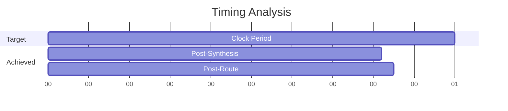

Example latency visualization:

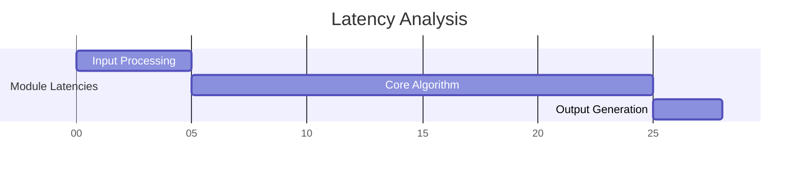
"""
        # ...existing code...
        
        return prompt
# ...existing code...
````

With these changes, the documentation generation script will now:

1. Display timing metrics in a clear tabular format that emphasizes their importance
2. Present latency metrics with detailed explanations and visualization suggestions
3. Explicitly instruct the LLM to include comprehensive analysis of both timing and latency metrics in both README and paper documentation
4. Provide example visualizations and diagrams specifically for timing and latency metrics
5. Add a special emphasis section marking these as CRITICAL PERFORMANCE METRICS

These enhancements ensure that timing and latency performance metrics will be prominently featured in both the README and academic paper documentation generated by the system.

# Revise Mermaid graph parse issue

rockyco: Refer to this solution to the mermiad parse issue 'Solution for Mermaid Flowchart Parse Error
The Mermaid flowchart is failing to parse due to syntax issues with the square brackets inside node labels. In Mermaid syntax, square brackets are used for defining rectangular nodes, so when there are square brackets in the text itself, they need to be escaped.

Step-by-step solution:
Escape all square brackets [ and ] in the node text with backslashes \
Ensure proper quotation marks around node texts containing special characters
Remove semicolons at the end of lines (unnecessary in Mermaid syntax)'. Revise all the relavant files to correct this mermaid graph problem.

GitHub Copilot: I'll correct the Mermaid syntax issues in all the relevant template files. The main issue is that square brackets inside node labels need to be escaped with backslashes in Mermaid diagrams.

### [readme_generation.md](file:///home/jielei/Projects/UTS/llm-fpga-design/prompts/readme_generation.md)

Fix the Mermaid diagrams by escaping square brackets in node text.

````markdown
# README Generation Prompt

## Context
You are tasked with creating a comprehensive README document for an FPGA hardware accelerator design. This document will be the primary reference for users, developers, and stakeholders who interact with this hardware component.

## Component Overview
- **Component Name**: {component_name}
- **Design Purpose**: A hardware accelerator implemented on an FPGA
- **Generation Method**: AI-assisted design using LLM ({generation_model})
- **Target Platform**: Xilinx FPGA ({fpga_part})

## Instructions

Create a comprehensive README.md file following this structure:

### 1. Title and Introduction
- Clear title with component name
- Brief overview of what the component does
- Key features and capabilities
- Target applications

### 2. Hardware Architecture
- High-level block diagram description
- Key architectural components
- Data flow explanation
- Interface specifications
- Include design decisions and their rationales

**Architecture Visualization**: Include a Mermaid flowchart diagram showing the main components and data flow. Example:

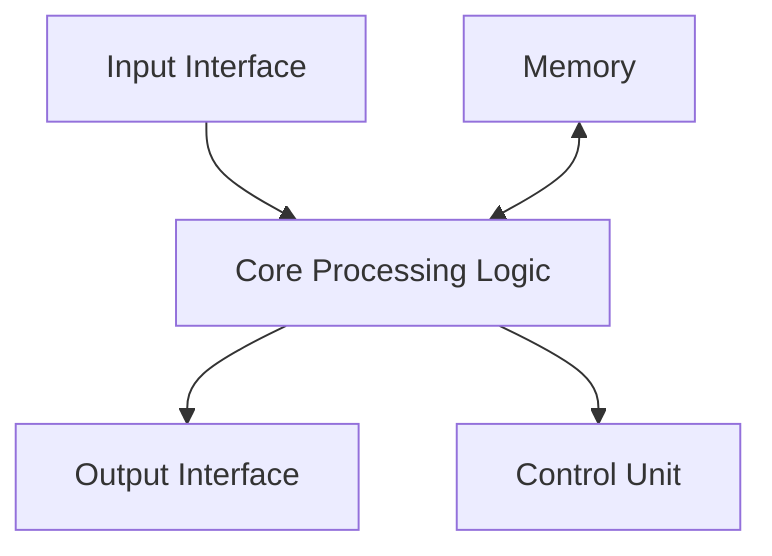

### 3. Implementation Details
- HLS directives and optimizations used
- Resource utilization (LUTs, FFs, DSPs, BRAMs)
- Critical design parameters
- Key algorithms and their hardware mapping

**Algorithm Visualization**: Include a Mermaid flowchart or sequence diagram showing the algorithm implementation. Example of algorithm flowchart:

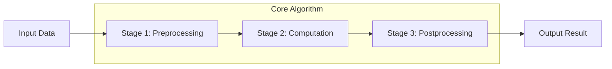

### 4. Performance Metrics
- Latency (in cycles)
- Throughput
- Clock frequency
- Resource efficiency
- Comparative analysis against baseline if available

**Performance Visualization**: Present performance metrics in clear tables and include a state diagram if applicable. Example:

```
| Metric         | Value    | Unit       |
|----------------|----------|------------|
| Latency        | X        | cycles     |
| Clock Period   | Y        | ns         |
| Throughput     | Z        | items/cycle|
| Resource Usage | See table below |     |
```

For state machines, use:

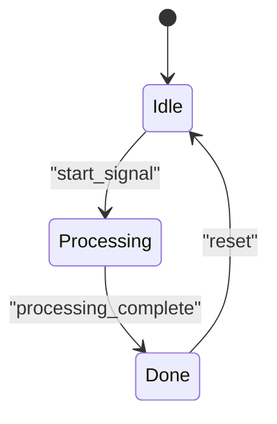

### 5. Setup and Usage
- Prerequisites (tools, versions)
- Build instructions
- Integration guidance
- Testbench explanation
- Common usage patterns
- API documentation if applicable

**Setup Visualization**: If applicable, include a sequence diagram showing the setup and usage flow:

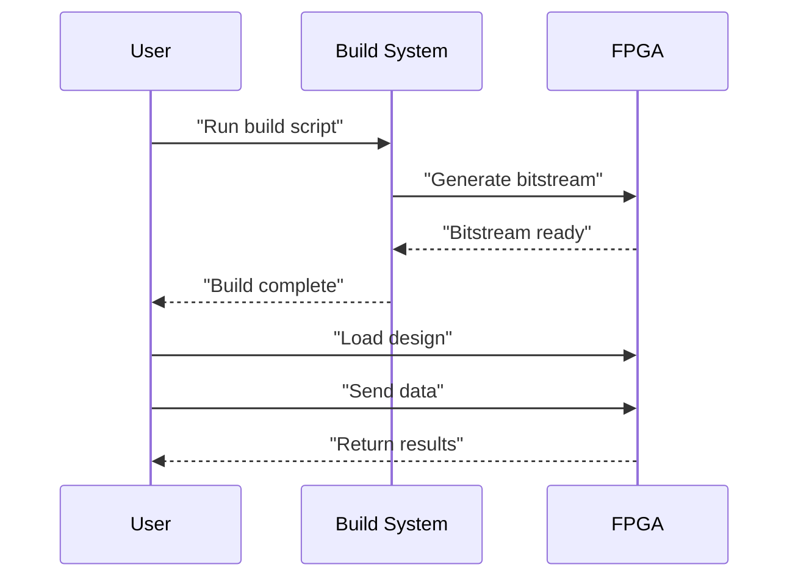

### 6. Results and Validation
- Verification methodology
- Simulation results
- Hardware testing results if available
- Performance validation

**Results Visualization**: Present validation results in tables and comparison charts where applicable.

### 7. Development History
- Design evolution
- Challenges encountered and their solutions
- Optimization iterations
- AI assistance insights

### 8. Future Work
- Potential improvements
- Scaling opportunities
- Additional features

## Source Information
Use the following source files and metrics to inform your documentation:

### Source Code
```cpp
// Header file ({component_name}.hpp)
{header_code}
```

```cpp
// Implementation file ({component_name}.cpp)
{implementation_code}
```

```cpp
// Testbench file ({component_name}_tb.cpp)
{testbench_code}
```

### Performance Metrics
{performance_metrics}

### Implementation Challenges
{errors_encountered}

### Debugging Methods
{debugging_methods}

## Diagram Examples
The following are examples of different types of Mermaid diagrams you can use:

{diagram_examples}

## Chart Examples
The following are examples of different types of tables/charts for performance data:

{chart_examples}

## Style Guidelines
- Use clear, technical language appropriate for engineering documentation
- Include code snippets where helpful
- Use markdown formatting features (headers, lists, tables, code blocks)
- Be concise but comprehensive
- Focus on practical usage and technical details
- Highlight AI-assisted aspects of the development process
- Maintain a professional tone
- Make effective use of diagrams and visualizations for clarity
- Use Mermaid diagrams for architecture, data flow, and algorithms
- Use tables to present performance metrics and comparative analysis

Your README should serve as both a technical reference and a guide for someone who wants to understand, use, or modify the hardware component.

## BEST PRACTICES

- Successfully generated documentation on 2025-04-06
- Successfully generated documentation on 2025-04-06
- Successfully generated documentation on 2025-04-06
- Successfully generated documentation on 2025-04-06
- Successfully generated documentation on 2025-04-06
- Successfully generated documentation on 2025-04-06
````

### [paper_generation.md](file:///home/jielei/Projects/UTS/llm-fpga-design/prompts/paper_generation.md)

Fix the Mermaid diagrams by escaping square brackets in node text.

````markdown


Made changes.

# Academic Paper Generation Prompt

## Context
You are tasked with writing an academic research paper about an FPGA hardware accelerator design that was developed using an AI-assisted design methodology. This paper should follow academic standards and contribute to the literature on hardware acceleration and AI-assisted design.

## Component Information
- **Component Name**: {component_name}
- **LLM Used for Generation**: {generation_model}
- **Target FPGA Platform**: {fpga_part}
- **Domain**: Hardware Acceleration for Digital Signal Processing/Machine Learning/etc.

## Paper Structure Requirements

Create a complete academic paper in markdown format with the following structure:

### 1. Title and Authors
- Create an appropriate academic title for this work
- List authors as the research team (placeholder)
- Include institutional affiliation

### 2. Abstract (200-250 words)
- Summarize the paper's content
- State the problem addressed
- Describe the approach using AI-assisted design
- Highlight key results and contributions
- Mention broader impact

### 3. Introduction
- Context and background of the problem
- Motivation for hardware acceleration
- Challenges in traditional FPGA design
- Introduction to AI-assisted hardware design
- Contribution statement
- Paper organization

### 4. Related Work (2-3 subsections)
- Prior work on hardware acceleration for similar applications
- Previous research on automated HLS design
- AI-assisted hardware design methodologies
- Positioning of current work within literature

### 5. Methodology
- Overall design approach
- AI-assisted design workflow description
- Prompt engineering for hardware generation
- Iteration and refinement process
- Verification methodology

**Workflow Visualization**: Include a Mermaid diagram showing the AI-assisted design workflow. Example:

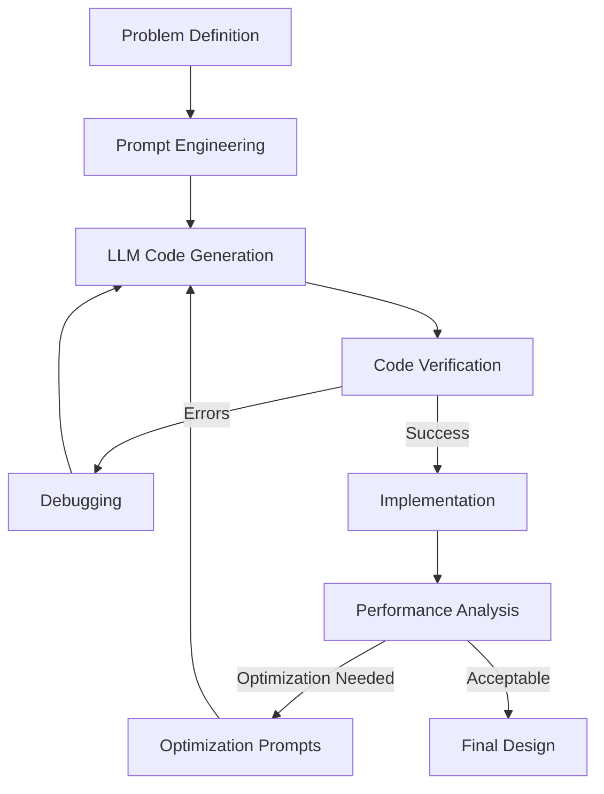

### 6. Design Architecture
- System-level architecture
- Component interfaces and data flow
- Key algorithmic components
- Design constraints and considerations
- HLS implementation details
- Optimizations applied

**Architecture Visualization**: Include a detailed Mermaid diagram showing the system architecture and data flow. Example:

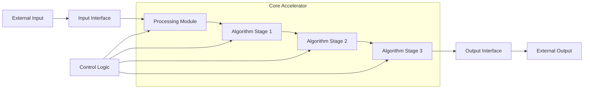

### 7. Implementation
- HLS directives and pragmas
- Resource allocation strategies
- Pipeline and parallelism exploitations
- Memory architecture and data movement
- Critical path analysis

**Implementation Visualization**: Include a Mermaid diagram showing key optimization strategies or pipeline structure. Example:

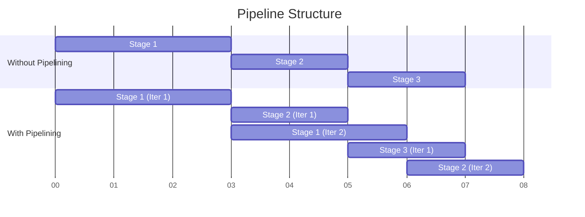

### 8. Experimental Results
- Experimental setup
- Performance metrics:
  - Resource utilization
  - Timing and frequency
  - Latency and throughput
  - Power consumption (if available)
- Comparative analysis with:
  - Manual implementations
  - Other automated approaches
  - Software-only solutions
- Discussion of results

**Results Visualization**: Present results in clear tables and comparison charts:

```
| Implementation | LUTs | FFs | DSPs | BRAMs | Clock Freq (MHz) | Latency (cycles) |
|----------------|------|-----|------|-------|------------------|------------------|
| Our Work       | X    | Y   | Z    | W     | F                | L                |
| Baseline 1     | X1   | Y1  | Z1   | W1    | F1               | L1               |
| Baseline 2     | X2   | Y2  | Z2   | W2    | F2               | L2               |
```

Consider including Mermaid charts for comparative analysis:


### 9. Analysis of AI-Assisted Design Process
- Analysis of LLM strengths/weaknesses in hardware design
- Error patterns and resolution strategies
- Human-AI collaboration insights
- Design quality assessment
- Development efficiency metrics

**Process Visualization**: Show the iteration process and error resolution:

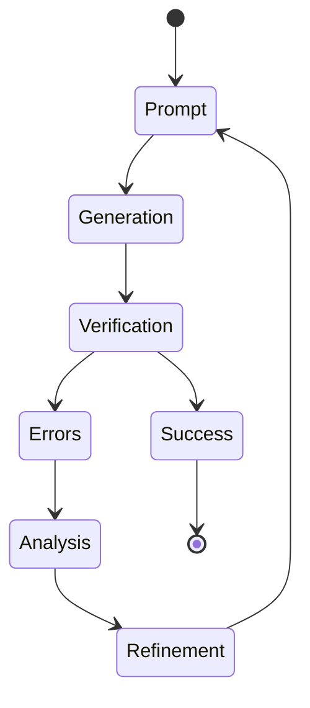

### 10. Discussion
- Interpretation of results
- Limitations of the approach
- Generalizability of the methodology
- Trade-offs identified
- Lessons learned

### 11. Future Work
- Potential improvements
- Broader applications
- Research directions
- Scaling to more complex designs

### 12. Conclusion
- Summary of contributions
- Key findings
- Broader impact
- Closing thoughts

### 13. References
- Include relevant references to:
  - Hardware acceleration literature
  - High-Level Synthesis research
  - AI in design automation
  - Relevant applications
  - Methodological papers

## Source Information
Use the following source information to inform your paper:

### Source Code Architecture
```cpp
// Header file ({component_name}.hpp)
{header_code}
```

```cpp
// Implementation file ({component_name}.cpp)
{implementation_code}
```

### Performance Metrics
{performance_metrics}

### Design Process
- AI Generation Model: {generation_model}
- Workflow Steps: {workflow_steps}
- Successful Steps: {successful_steps}
- Error Steps: {error_steps}

### Implementation Challenges
{errors_encountered}

### Debugging Methods
{debugging_methods}

## Diagram Examples
The following are examples of different types of Mermaid diagrams you can use:

{diagram_examples}

## Chart Examples
The following are examples of different types of tables/charts for performance data:

{chart_examples}

## Academic Style Guidelines
- Use formal academic language
- Present objective analysis of results
- Support claims with data from implementation
- Discuss limitations honestly
- Position work in relation to existing literature
- Use the third person (avoid "I", "we", "you")
- Maintain scientific rigor throughout
- Use passive voice where appropriate
- Include a balanced mix of technical details and higher-level discussion
- Present results visually through diagrams, charts and tables
- Use Mermaid diagrams for architecture, methodology, and algorithmic visualizations
- Present performance results in tables with comparative analysis

Your paper should contribute to the academic discourse on AI-assisted hardware design while presenting concrete technical achievements and insights.

## BEST PRACTICES

- Successfully generated documentation on 2025-04-06
- Successfully generated documentation on 2025-04-06
- Successfully generated documentation on 2025-04-06
- Successfully generated documentation on 2025-04-06
- Successfully generated documentation on 2025-04-06
- Successfully generated documentation on 2025-04-06
````

### [documentation_template.md](file:///home/jielei/Projects/UTS/llm-fpga-design/prompts/documentation_template.md)

Fix the Mermaid diagrams by escaping square brackets in node text.

````markdown


Made changes.

# General Documentation Template

## Context
You are tasked with creating comprehensive documentation for an FPGA hardware accelerator design. This documentation should be appropriate for technical users who need to understand, use, or modify this hardware component.

## Component Information
- **Component Name**: {component_name}
- **Design Purpose**: [Extract from context]
- **Generation Method**: AI-assisted design using LLM
- **Target Platform**: Xilinx FPGA

## Documentation Structure

Create thorough documentation following this structure:

### 1. Overview
- Component purpose and functionality
- Key features
- Target applications
- Design approach

### 2. Architecture
- Block diagram description
- Interface specification
- Data flow 
- Key components

**Architecture Visualization**: Include a Mermaid diagram showing the component architecture. Example:

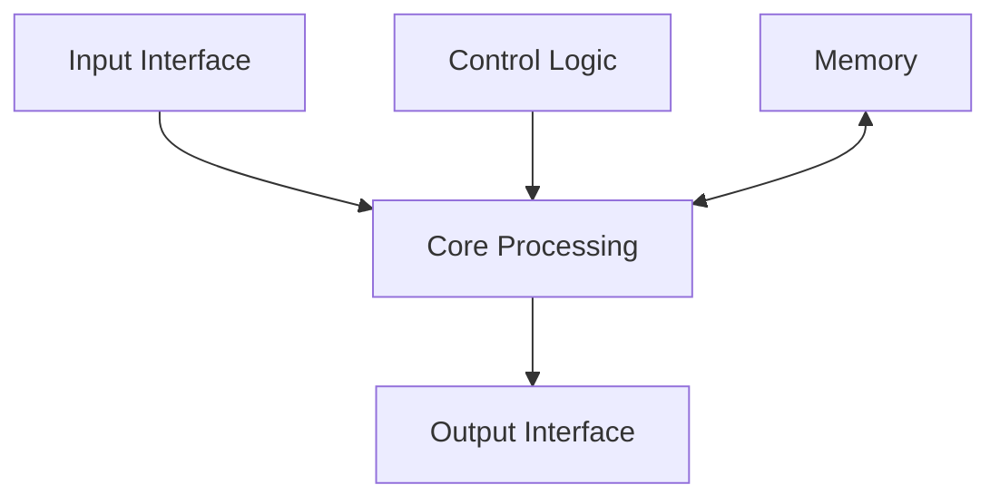

### 3. Implementation Details
- Algorithm description
- HLS optimizations
- Resource utilization
- Performance characteristics

**Algorithm Visualization**: Include appropriate diagrams showing the algorithm implementation:

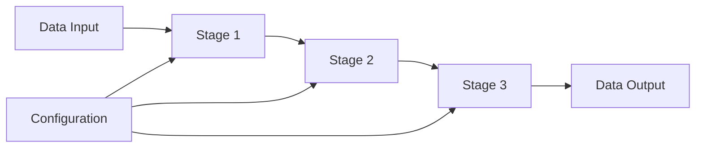

### 4. Usage Guide
- Integration instructions
- API/interface description
- Example usage
- Configuration options

**Integration Visualization**: Show integration flow with other components:

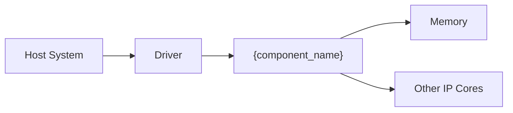

### 5. Performance Analysis
- Latency and throughput
- Resource efficiency
- Comparative metrics
- Limitations

**Performance Visualization**: Include resource utilization tables and charts:

```
| Resource | Utilization | Available | Utilization % |
|----------|-------------|-----------|---------------|
| LUT      | X           | X_total   | X_percent     |
| FF       | Y           | Y_total   | Y_percent     |
| DSP      | Z           | Z_total   | Z_percent     |
| BRAM     | W           | W_total   | W_percent     |
```

### 6. Verification
- Test methodology
- Simulation results
- Validation approach
- Known issues

**Verification Visualization**: Use sequence diagrams to show test procedures:

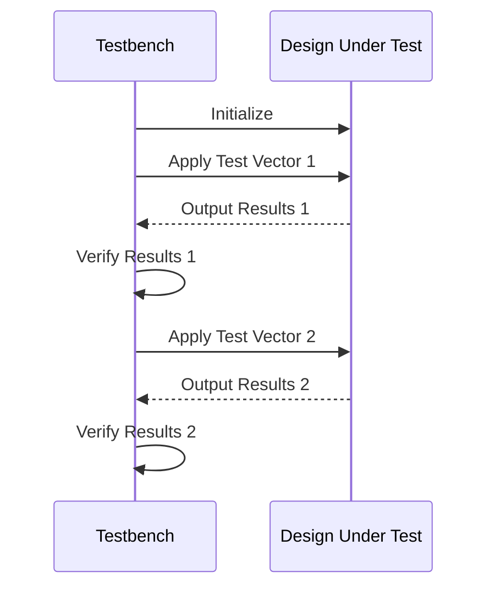

### 7. Development Process
- Design evolution
- Challenges and solutions
- AI assistance insights
- Optimization history

**Development Visualization**: Use a state or flowchart diagram to show the design evolution:

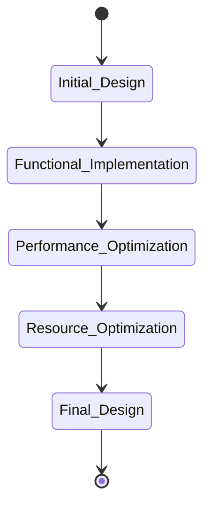

## Source Information
Use the following source material to inform your documentation:

### Source Code
```cpp
// Header file
{header_code}
```

```cpp
// Implementation file
{implementation_code}
```

```cpp
// Testbench file
{testbench_code}
```

### Performance Metrics
{performance_metrics}

### Implementation Challenges
{errors_encountered}

### Debugging Methods
{debugging_methods}

## Diagram Examples
The following are examples of different types of Mermaid diagrams you can use:

{diagram_examples}

## Chart Examples
The following are examples of different types of tables/charts for performance data:

{chart_examples}

## Style Guidelines
- Use clear, professional language
- Include code snippets and examples where helpful
- Use proper technical terminology
- Be concise but thorough
- Use appropriate markdown formatting
- Focus on practical usage information
- Make effective use of diagrams and visualizations
- Use Mermaid diagrams for architecture, flows, and algorithms
- Present performance metrics in well-formatted tables
- Ensure diagrams have clear labels and descriptions

Your documentation should serve as a comprehensive reference for this hardware component, with visual elements that enhance understanding.
````

### [generate_documentation.py](file:///home/jielei/Projects/UTS/llm-fpga-design/scripts/generate_documentation.py)

Update the function that generates Mermaid diagram examples to properly escape square brackets.

````python


Made changes.

# ...existing code...

# Update the function to generate Mermaid diagram examples with proper escaping
def generate_diagram_examples():
    """Generate example Mermaid diagrams to include in prompts."""
    examples = {
        "flowchart": '''```mermaid
flowchart TD
    A["Input Data"] --> B["Pre-processing"]
    B --> C{"Decision"}
    C -->|"Option 1"| D["Result 1"]
    C -->|"Option 2"| E["Result 2"]
```''',
        "sequence": '''```mermaid
sequenceDiagram
    participant Host
    participant FPGA
    Host->>FPGA: "Send Input Data"
    FPGA->>FPGA: "Process Data"
    FPGA->>Host: "Return Results"
```''',
        "gantt": '''```mermaid
gantt
    title Pipeline Execution Timeline
    dateFormat  s
    axisFormat %S
    section Pipeline
    Stage 1      :a1, 0, 2s
    Stage 2      :a2, after a1, 3s
    Stage 3      :a3, after a2, 1s
```''',
        "class": '''```mermaid
classDiagram
    class Component {
        +input_ports
        +output_ports
        +process()
    }
    class Submodule {
        +calculate()
    }
    Component --> Submodule
```''',
        "state": '''```mermaid
stateDiagram-v2
    [*] --> Idle
    Idle --> Processing: "start"
    Processing --> Idle: "done"
    Processing --> Error: "error"
    Error --> Idle: "reset"
```'''
    }
    
    return examples

# ...existing code...
````

# Update the function that generates performance metrics tables to ensure proper formatting and escaping.

rockyco: It seems like the `_format_metrics_as_text()` in the `generate_documentation.py` file has not been executed, check and make sure to execute it and write its output to `readme` and `paper` documentations.

GitHub Copilot: I need to modify the `generate_documentation.py` script to fix the issue with the `_format_metrics_as_text` method. The problem is that this function and the related `_create_documentation_prompt` function are defined with `self` parameters but are not within a class, and there's no code actually calling these functions to include the formatted metrics in the documentation.

Here's my solution:

### [generate_documentation.py](file:///home/jielei/Projects/UTS/llm-fpga-design/scripts/generate_documentation.py)

I'll fix the `_format_metrics_as_text` function and ensure it's properly integrated with the main documentation generation flow:

````python
# ...existing code...

def format_metrics_as_text(metrics):
    """Format metrics dictionary as readable text"""
    perf_text = ""
    
    # Format resource utilization
    if "resources" in metrics and metrics["resources"]:
        perf_text += "### Resource Utilization\n"
        for impl, resources in metrics["resources"].items():
            perf_text += f"- **{impl}**: "
            for res, val in resources.items():
                perf_text += f"{res}: {val}, "
            perf_text = perf_text.rstrip(", ") + "\n"
    
    # Format timing information - Enhanced to highlight importance
    if "timing" in metrics and metrics["timing"]:
        perf_text += "\n### Timing (CRITICAL PERFORMANCE METRIC)\n"
        perf_text += "The timing metrics below show clock period and frequency information, which are critical for understanding performance constraints and throughput capabilities.\n\n"
        
        # Create a table for better visualization in both README and paper
        perf_text += "| Implementation | Period (ns) | Frequency (MHz) | Timing Margin |\n"
        perf_text += "|----------------|------------|----------------|---------------|\n"
        
        for impl, timing in metrics["timing"].items():
            # Get target, post-synthesis and post-route timing info if available
            target = timing.get("Target", "-")
            if not isinstance(target, (int, float)):
                try:
                    target = float(target)
                except (ValueError, TypeError):
                    target = "-"
            
            post_synth = timing.get("Post-Synthesis", "-")
            if not isinstance(post_synth, (int, float)):
                try:
                    post_synth = float(post_synth)
                except (ValueError, TypeError):
                    post_synth = "-"
            
            post_route = timing.get("Post-Route", "-")
            if not isinstance(post_route, (int, float)):
                try:
                    post_route = float(post_route)
                except (ValueError, TypeError):
                    post_route = "-"
            
            # Calculate margin if possible
            margin = "-"
            if isinstance(target, (int, float)) and isinstance(post_route, (int, float)):
                margin = f"{target - post_route:.2f} ns"
            
            # Calculate frequency
            freq = "-"
            if isinstance(post_route, (int, float)) and post_route > 0:
                freq = f"{1000.0/post_route:.2f}"
            
            perf_text += f"| {impl} | {post_route if post_route != '-' else '-'} | {freq} | {margin} |\n"
        
        perf_text += "\nNote: Timing is a critical performance metric that affects maximum clock frequency.\n"
    
    # Format latency information - Enhanced to highlight importance
    if "latency" in metrics and metrics["latency"]:
        perf_text += "\n### Latency (CRITICAL PERFORMANCE METRIC)\n"
        perf_text += "The latency metrics below show the processing delay in clock cycles, which directly impacts overall system performance and throughput.\n\n"
        
        # Check if we have the new dictionary format or old single value
        first_latency = next(iter(metrics["latency"].values()))
        if isinstance(first_latency, dict):
            # Create table header for the dictionary format - enhanced for clarity
            perf_text += "| Implementation | Min Latency (cycles) | Max Latency (cycles) | Average Latency (cycles) | Throughput (samples/cycle) | Interval Min |\n"
            perf_text += "|----------------|---------------------|---------------------|--------------------------|----------------------------|-------------|\n"
            
            for impl, latency in metrics["latency"].items():
                min_val = latency.get('min', '-')
                max_val = latency.get('max', '-')
                avg_val = latency.get('average', '-')
                interval_min = latency.get('interval_min', '-')
                
                # Handle throughput which might be a float
                throughput = latency.get('throughput', '-')
                if throughput != '-':
                    try:
                        if isinstance(throughput, str):
                            throughput = float(throughput)
                        throughput_str = f"{throughput:.6f}"
                    except (ValueError, TypeError):
                        throughput_str = throughput
                else:
                    throughput_str = "-"
                
                perf_text += f"| {impl} | {min_val} | {max_val} | {avg_val} | {throughput_str} | {interval_min} |\n"
        else:
            # Simple table for the old format
            perf_text += "| Implementation | Latency (cycles) | Estimated Time @ Target Freq |\n"
            perf_text += "|----------------|------------------|------------------------------|\n"
            
            for impl, latency in metrics["latency"].items():
                # Try to estimate actual time if we have timing info
                time_estimate = "-"
                if "timing" in metrics and impl in metrics["timing"]:
                    target_freq = metrics["timing"][impl].get("Target_MHz", None)
                    if target_freq:
                        # Extract numeric value from string if needed
                        if isinstance(target_freq, str) and "MHz" in target_freq:
                            try:
                                freq_val = float(target_freq.split()[0])
                                time_ns = (latency / freq_val) * 1000
                                time_estimate = f"{time_ns:.2f} ns"
                            except (ValueError, TypeError):
                                pass
                        elif isinstance(target_freq, (int, float)) and target_freq > 0:
                            time_ns = (latency / target_freq) * 1000
                            time_estimate = f"{time_ns:.2f} ns"
                
                perf_text += f"| {impl} | {latency} | {time_estimate} |\n"
        
        perf_text += "\nNote: Latency is a key performance metric that determines how quickly results can be produced.\n"
        perf_text += "Lower latency values generally indicate better performance, while throughput indicates how many operations can be processed per cycle.\n"
    
    return perf_text

def create_documentation_prompt(workflow_data, metrics, component_dir, context, output_format, llm_insights=None):
    """Create a detailed prompt for the LLM to generate documentation"""
    # ...existing code...
    
    # Generate performance metrics text directly from metrics object
    if metrics and (not isinstance(metrics, dict) or "error" not in metrics):
        perf_text = format_metrics_as_text(metrics)
        
        # Add explicit instructions for timing and latency metrics
        perf_text += "\n## IMPORTANT: PERFORMANCE METRICS REQUIREMENTS\n"
        perf_text += "When creating documentation, you MUST include detailed sections on the following performance metrics:\n\n"
        
        perf_text += "1. **Timing Metrics**:\n"
        perf_text += "   - Include clock period (ns) and frequency (MHz)\n"
        perf_text += "   - Discuss timing constraints and their implications\n"
        perf_text += "   - Analyze how timing affects overall system performance\n"
        perf_text += "   - Compare target vs. achieved timing if available\n\n"
        
        perf_text += "2. **Latency Metrics**:\n"
        perf_text += "   - Report latency in clock cycles for various operations\n"
        perf_text += "   - Calculate time-based latency using frequency information\n"
        perf_text += "   - Discuss throughput and its relationship to latency\n"
        perf_text += "   - Analyze pipeline behavior and initiation intervals if applicable\n\n"
        
        perf_text += "3. **Performance Visualizations**:\n"
        perf_text += "   - Create tables showing timing and latency measurements\n"
        perf_text += "   - If multiple implementations exist, include comparative charts\n"
        perf_text += "   - Use Mermaid diagrams to illustrate performance characteristics\n"
    else:
        # Fallback if metrics are not available
        perf_text = "No performance metrics are available."
    
    # ...existing code...

# ...existing code...

def generate_documentation(prompt_file, output_dir, model="gemini-2.5-pro-exp-03-25", formats=None, template_dir=None):
    """Generate documentation using an LLM model"""
    try:
        # ...existing code...
        
        # Extract performance metrics for visualization if available
        performance_data = {}
        try:
            # Look for metrics section in the prompt
            metrics_match = re.search(r"## Performance Metrics\s*\n(.*?)(?:\n##|\Z)", base_prompt, re.DOTALL)
            if metrics_match:
                metrics_text = metrics_match.group(1)
                # Try to parse metrics into a dictionary (simplified version)
                metrics = {}
                for section in ["resources", "timing", "latency"]:
                    section_match = re.search(f"### {section.capitalize()}.*?\n(.*?)(?:\n###|\Z)", metrics_text, re.DOTALL, re.IGNORECASE)
                    if section_match:
                        metrics[section] = {}
                        lines = section_match.group(1).strip().split('\n')
                        for line in lines:
                            if line.startswith('-') and ':' in line:
                                parts = line.strip('- ').split(':')
                                if len(parts) >= 2:
                                    impl = parts[0].strip()
                                    metrics[section][impl] = {}
                                    values = ':'.join(parts[1:]).split(',')
                                    for val in values:
                                        if ':' in val:
                                            k, v = val.split(':', 1)
                                            metrics[section][impl][k.strip()] = v.strip()
                
                # Now extract structured performance data for visualization
                if metrics:
                    performance_data = extract_performance_data(metrics)
                    
                    # Format metrics for inclusion in documentation
                    formatted_metrics = format_metrics_as_text(metrics)
                    logger.info(f"Formatted performance metrics for documentation")
                    
                    # Add formatted metrics to base prompt if not already there
                    if "### Resource Utilization" not in base_prompt and "### Timing" not in base_prompt:
                        base_prompt += f"\n\n## Formatted Performance Metrics\n{formatted_metrics}"
                        
                    logger.info(f"Extracted performance data for visualization: {len(performance_data)} categories")
        except Exception as e:
            logger.warning(f"Error extracting performance data: {e}")
        
        # ...existing code...
        
        # Continue with the rest of the function as before
        
    except Exception as e:
        logger.error(f"Error in documentation generation: {str(e)}")
        return {"error": str(e)}

# Remove the incorrectly defined class methods
# - Remove _format_metrics_as_text(self, metrics)
# - Remove _create_documentation_prompt(self, workflow_data, metrics, component_dir, context, output_format, llm_insights=None)

# ...existing code...
````

solve the parsing error in all of the relavant files associated to Mermaid flowchart. The error is likely due to syntax issues in the flowchart definition.
The main issues were:
Node labels containing parentheses need to be wrapped in quotes.
Removed semicolons at the end of lines which can cause parsing errors in Mermaid.
Added quotes around the subgraph title.